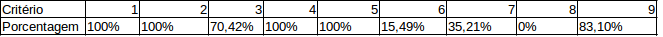
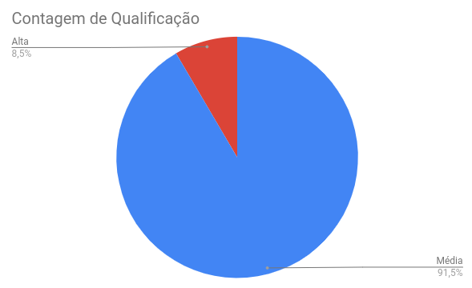

## Versionamento de edições
| Data       | autor               | Descrição                        | Versão |
|------------|---------------------|----------------------------------|--------|
| 04/06/2019 | william elias alves | adição de introdução e objetivos | 0.1    |
| 04/06/2019 | william elias alves | adição de metodologia e resultados | 0.2    |
| 05/06/2019 | william elias alves | adição de resultados e USs refatoradas | 0.3 |
| 05/06/2019 | william elias alves | alteração do padrão de validação para "V" | 0.4 |

###Introdução
Verificação é uma análise de modelos cuja uma tarefa pode ser desempenhado por pessoas como por softwares. Tem como objetivo assegurar que o sistema produzido atenda às especificações estabelecidas.

###Objetivos
Para a realização da verificação, foi utilizado o método de inspeção de Fagan. Esse tipo de abordagem atua na verificação de artefatos de elicitação e sem uma estrutura própria, ou produzidos por Engenheiros de Software/Requisitos, o que o configura, nesse caso, como uma lista de requisitos.

###Metodologia
Para a realização da análise do Backlog do produto com ênfase na verificação, foi escolhida a técnica de inspeção.
Os passos a serem realizados para inspeção são os seguintes:

* **Definição dos critérios de aceitação**: Para que haja um padrão estabelecido de como o conteúdo do backlog do produto deva se parecer;
* **Análise geral das USs**

###Resultados
Após todo processo criativo por trás da verificação por meio da inspeção, os seguintes resultados foram obtidos:

* Criação de 8 critérios de aceitação;

* Verifição das 71 histórias de usuário presentes no backlog do produto.

* Foram refatorados somente as histórias de usuário que tinham como déficit os critérios 3 e 8 simutaneamente.

###Critérios de aceitação 
Para que a US sejam verificadas por meio de inspeção, será necessário responder as seguintes perguntas, com sim ou não:

    1- A US está atrelada a um tema?

    2- O ator está bem definido?

    3- A escrita está clara e em padrão formal?

    4- A US está pontuada?

    5- A US está priorizada com Moscow?

    6- A US apresenta um épico?

    7- A US pertence a alguma sprint?

    8- A US apresenta um rastro claro de sua origem?

###Tabela de avaliação do Backlog v1

**Responsável:** William Elias

**Segundo ponto de vista:** Luís Cláudio

**Critério 3**

Foram anotadas algumas considerações de discordância em relação a análise do critério 3.

|ID|Considerações|
|----|--------|
|009|- A expressão "possuir topicos" não condiz com a devida justificativa para a ação|
|011|- A expressão "possuir topicos" não condiz com a devida justificativa para a ação|
|017|- Redundância na definição da ação e justificativa da mesma|
|018|- Não há clareza na definição da justificativa e a expressão "Ativar/destivar" pode ser substituída|
|019|- Não há clareza na definição da justificativa e a expressão "Ativar/destivar" pode ser substituída|
|020|- Redundância na definição da ação e justificativa da mesma|
|021|- Redundância na definição da ação e justificativa da mesma|
|023|- A expressão "sua" é inadequada e deve ser substituída|
|024|- A expressão "sua" é inadequada e deve ser substituída|
|043|- A definição da ação não está clara|
|044|- A definição da ação não está clara|
|045|- A definição da ação não está clara|
|068|- A expressão "seus" é inadequada e deve ser substituída por "meus"|
|070|- Texto totalmente sem coesão e coerência|
|071|- Texto totalmente sem coesão e coerência|

Nessa tabela estão expressas as condições de conformidade com os critérios estabelecidos, para um critério tido como cumprido utilizou-se a letra "V" e para não cumprido um espaço vazio " ".

<table>
    <tr>
        <td>
            
Backlog do Produto

        </td>
        <td colspan="8">
            
Critérios de verificação

        </td>
        <td> </td>
        <td> </td>
        <td> </td>
        <td> </td>
        <td> </td>
    </tr>
    <tr>
        <td>
            
ID

        </td>
        <td>
            
1

        </td>
        <td>
            
2

        </td>
        <td>
            
3

        </td>
        <td>
            
4

        </td>
        <td>
            
5

        </td>
        <td>
            
6

        </td>
        <td>
            
7

        </td>
        <td>
            
8

        </td>
        <td> </td>
        <td> </td>
        <td> </td>
        <td> </td>
        <td> </td>
    </tr>
    <tr>
        <td>
            
001

        </td>
        <td>
            
V

        </td>
        <td>
            
V

        </td>
        <td> </td>
        <td>
            
V

        </td>
        <td>
            
V

        </td>
        <td> </td>
        <td> </td>
        <td> </td>
        <td> </td>
        <td> </td>
        <td> </td>
        <td> </td>
        <td> </td>
    </tr>
    <tr>
        <td>
            
002

        </td>
        <td>
            
V

        </td>
        <td>
            
V

        </td>
        <td> </td>
        <td>
            
V

        </td>
        <td>
            
V

        </td>
        <td> </td>
        <td> </td>
        <td> </td>
        <td> </td>
        <td> </td>
        <td> </td>
        <td> </td>
        <td> </td>
    </tr>
    <tr>
        <td>
            
003

        </td>
        <td>
            
V

        </td>
        <td>
            
V

        </td>
        <td>
            
V

        </td>
        <td>
            
V

        </td>
        <td>
            
V

        </td>
        <td> </td>
        <td> </td>
        <td> </td>
        <td> </td>
        <td> </td>
        <td> </td>
        <td> </td>
        <td> </td>
    </tr>
    <tr>
        <td>
            
004

        </td>
        <td>
            
V

        </td>
        <td>
            
V

        </td>
        <td>
            
V

        </td>
        <td>
            
V

        </td>
        <td>
            
V

        </td>
        <td>
            
V

        </td>
        <td>
            
V

        </td>
        <td> </td>
        <td> </td>
        <td> </td>
        <td> </td>
        <td> </td>
        <td> </td>
    </tr>
    <tr>
        <td>
            
005

        </td>
        <td>
            
V

        </td>
        <td>
            
V

        </td>
        <td>
            
V

        </td>
        <td>
            
V

        </td>
        <td>
            
V

        </td>
        <td>
            
V

        </td>
        <td>
            
V

        </td>
        <td> </td>
        <td> </td>
        <td> </td>
        <td> </td>
        <td> </td>
        <td> </td>
    </tr>
    <tr>
        <td>
            
006

        </td>
        <td>
            
V

        </td>
        <td>
            
V

        </td>
        <td>
            
V

        </td>
        <td>
            
V

        </td>
        <td>
            
V

        </td>
        <td>
            
V

        </td>
        <td>
            
V

        </td>
        <td> </td>
        <td> </td>
        <td> </td>
        <td> </td>
        <td> </td>
        <td> </td>
    </tr>
    <tr>
        <td>
            
007

        </td>
        <td>
            
V

        </td>
        <td>
            
V

        </td>
        <td>
            
V

        </td>
        <td>
            
V

        </td>
        <td>
            
V

        </td>
        <td> </td>
        <td>
            
V

        </td>
        <td> </td>
        <td> </td>
        <td> </td>
        <td> </td>
        <td> </td>
        <td> </td>
    </tr>
    <tr>
        <td>
            
008

        </td>
        <td>
            
V

        </td>
        <td>
            
V

        </td>
        <td>
            
V

        </td>
        <td>
            
V

        </td>
        <td>
            
V

        </td>
        <td>
            
V

        </td>
        <td>
            
V

        </td>
        <td> </td>
        <td> </td>
        <td> </td>
        <td> </td>
        <td> </td>
        <td> </td>
    </tr>
    <tr>
        <td>
            
009

        </td>
        <td>
            
V

        </td>
        <td>
            
V

        </td>
        <td> </td>
        <td>
            
V

        </td>
        <td>
            
V

        </td>
        <td> </td>
        <td> </td>
        <td> </td>
        <td> </td>
        <td> </td>
        <td> </td>
        <td> </td>
        <td> </td>
    </tr>
    <tr>
        <td>
            
010

        </td>
        <td>
            
V

        </td>
        <td>
            
V

        </td>
        <td>
            
V

        </td>
        <td>
            
V

        </td>
        <td>
            
V

        </td>
        <td> </td>
        <td>
            
V

        </td>
        <td> </td>
        <td> </td>
        <td> </td>
        <td> </td>
        <td> </td>
        <td> </td>
    </tr>
    <tr>
        <td>
            
011

        </td>
        <td>
            
V

        </td>
        <td>
            
V

        </td>
        <td> </td>
        <td>
            
V

        </td>
        <td>
            
V

        </td>
        <td> </td>
        <td> </td>
        <td> </td>
        <td> </td>
        <td> </td>
        <td> </td>
        <td> </td>
        <td> </td>
    </tr>
    <tr>
        <td>
            
012

        </td>
        <td>
            
V

        </td>
        <td>
            
V

        </td>
        <td>
            
V

        </td>
        <td>
            
V

        </td>
        <td>
            
V

        </td>
        <td> </td>
        <td> </td>
        <td> </td>
        <td> </td>
        <td> </td>
        <td> </td>
        <td> </td>
        <td> </td>
    </tr>
    <tr>
        <td>
            
013

        </td>
        <td>
            
V

        </td>
        <td>
            
V

        </td>
        <td>
            
V

        </td>
        <td>
            
V

        </td>
        <td>
            
V

        </td>
        <td> </td>
        <td> </td>
        <td> </td>
        <td> </td>
        <td> </td>
        <td> </td>
        <td> </td>
        <td> </td>
    </tr>
    <tr>
        <td>
            
014

        </td>
        <td>
            
V

        </td>
        <td>
            
V

        </td>
        <td>
            
V

        </td>
        <td>
            
V

        </td>
        <td>
            
V

        </td>
        <td> </td>
        <td> </td>
        <td> </td>
        <td> </td>
        <td> </td>
        <td> </td>
        <td> </td>
        <td> </td>
    </tr>
    <tr>
        <td>
            
015

        </td>
        <td>
            
V

        </td>
        <td>
            
V

        </td>
        <td>
            
V

        </td>
        <td>
            
V

        </td>
        <td>
            
V

        </td>
        <td> </td>
        <td> </td>
        <td> </td>
        <td> </td>
        <td> </td>
        <td> </td>
        <td> </td>
        <td> </td>
    </tr>
    <tr>
        <td>
            
016

        </td>
        <td>
            
V

        </td>
        <td>
            
V

        </td>
        <td>
            
V

        </td>
        <td>
            
V

        </td>
        <td>
            
V

        </td>
        <td> </td>
        <td> </td>
        <td> </td>
        <td> </td>
        <td> </td>
        <td> </td>
        <td> </td>
        <td> </td>
    </tr>
    <tr>
        <td>
            
017

        </td>
        <td>
            
V

        </td>
        <td>
            
V

        </td>
        <td> </td>
        <td>
            
V

        </td>
        <td>
            
V

        </td>
        <td> </td>
        <td> </td>
        <td> </td>
        <td> </td>
        <td> </td>
        <td> </td>
        <td> </td>
        <td> </td>
    </tr>
    <tr>
        <td>
            
018

        </td>
        <td>
            
V

        </td>
        <td>
            
V

        </td>
        <td> </td>
        <td>
            
V

        </td>
        <td>
            
V

        </td>
        <td> </td>
        <td> </td>
        <td> </td>
        <td> </td>
        <td> </td>
        <td> </td>
        <td> </td>
        <td> </td>
    </tr>
    <tr>
        <td>
            
019

        </td>
        <td>
            
V

        </td>
        <td>
            
V

        </td>
        <td> </td>
        <td>
            
V

        </td>
        <td>
            
V

        </td>
        <td>
            
V

        </td>
        <td>
            
V

        </td>
        <td> </td>
        <td> </td>
        <td> </td>
        <td> </td>
        <td> </td>
        <td> </td>
    </tr>
    <tr>
        <td>
            
020

        </td>
        <td>
            
V

        </td>
        <td>
            
V

        </td>
        <td> </td>
        <td>
            
V

        </td>
        <td>
            
V

        </td>
        <td> </td>
        <td> </td>
        <td> </td>
        <td> </td>
        <td> </td>
        <td> </td>
        <td> </td>
        <td> </td>
    </tr>
    <tr>
        <td>
            
021

        </td>
        <td>
            
V

        </td>
        <td>
            
V

        </td>
        <td> </td>
        <td>
            
V

        </td>
        <td>
            
V

        </td>
        <td> </td>
        <td> </td>
        <td> </td>
        <td> </td>
        <td> </td>
        <td> </td>
        <td> </td>
        <td> </td>
    </tr>
    <tr>
        <td>
            
022

        </td>
        <td>
            
V

        </td>
        <td>
            
V

        </td>
        <td> </td>
        <td>
            
V

        </td>
        <td>
            
V

        </td>
        <td> </td>
        <td> </td>
        <td> </td>
        <td> </td>
        <td> </td>
        <td> </td>
        <td> </td>
        <td> </td>
    </tr>
    <tr>
        <td>
            
023

        </td>
        <td>
            
V

        </td>
        <td>
            
V

        </td>
        <td> </td>
        <td>
            
V

        </td>
        <td>
            
V

        </td>
        <td>
            
V

        </td>
        <td>
            
V

        </td>
        <td> </td>
        <td> </td>
        <td> </td>
        <td> </td>
        <td> </td>
        <td> </td>
    </tr>
    <tr>
        <td>
            
024

        </td>
        <td>
            
V

        </td>
        <td>
            
V

        </td>
        <td> </td>
        <td>
            
V

        </td>
        <td>
            
V

        </td>
        <td>
            
V

        </td>
        <td>
            
V

        </td>
        <td> </td>
        <td> </td>
        <td> </td>
        <td> </td>
        <td> </td>
        <td> </td>
    </tr>
    <tr>
        <td>
            
025

        </td>
        <td>
            
V

        </td>
        <td>
            
V

        </td>
        <td>
            
V

        </td>
        <td>
            
V

        </td>
        <td>
            
V

        </td>
        <td> </td>
        <td>
            
V

        </td>
        <td> </td>
        <td> </td>
        <td> </td>
        <td> </td>
        <td> </td>
        <td> </td>
    </tr>
    <tr>
        <td>
            
026

        </td>
        <td>
            
V

        </td>
        <td>
            
V

        </td>
        <td>
            
V

        </td>
        <td>
            
V

        </td>
        <td>
            
V

        </td>
        <td> </td>
        <td>
            
V

        </td>
        <td> </td>
        <td> </td>
        <td> </td>
        <td> </td>
        <td> </td>
        <td> </td>
    </tr>
    <tr>
        <td>
            
027

        </td>
        <td>
            
V

        </td>
        <td>
            
V

        </td>
        <td>
            
V

        </td>
        <td>
            
V

        </td>
        <td>
            
V

        </td>
        <td> </td>
        <td> </td>
        <td> </td>
        <td> </td>
        <td> </td>
        <td> </td>
        <td> </td>
        <td> </td>
    </tr>
    <tr>
        <td>
            
028

        </td>
        <td>
            
V

        </td>
        <td>
            
V

        </td>
        <td>
            
V

        </td>
        <td>
            
V

        </td>
        <td>
            
V

        </td>
        <td> </td>
        <td> </td>
        <td> </td>
        <td> </td>
        <td> </td>
        <td> </td>
        <td> </td>
        <td> </td>
    </tr>
    <tr>
        <td>
            
029

        </td>
        <td>
            
V

        </td>
        <td>
            
V

        </td>
        <td>
            
V

        </td>
        <td>
            
V

        </td>
        <td>
            
V

        </td>
        <td> </td>
        <td>
            
V

        </td>
        <td> </td>
        <td> </td>
        <td> </td>
        <td> </td>
        <td> </td>
        <td> </td>
    </tr>
    <tr>
        <td>
            
030

        </td>
        <td>
            
V

        </td>
        <td>
            
V

        </td>
        <td>
            
V

        </td>
        <td>
            
V

        </td>
        <td>
            
V

        </td>
        <td> </td>
        <td> </td>
        <td> </td>
        <td> </td>
        <td> </td>
        <td> </td>
        <td> </td>
        <td> </td>
    </tr>
    <tr>
        <td>
            
031

        </td>
        <td>
            
V

        </td>
        <td>
            
V

        </td>
        <td>
            
V

        </td>
        <td>
            
V

        </td>
        <td>
            
V

        </td>
        <td> </td>
        <td>
            
V

        </td>
        <td> </td>
        <td> </td>
        <td> </td>
        <td> </td>
        <td> </td>
        <td> </td>
    </tr>
    <tr>
        <td>
            
032

        </td>
        <td>
            
V

        </td>
        <td>
            
V

        </td>
        <td>
            
V

        </td>
        <td>
            
V

        </td>
        <td>
            
V

        </td>
        <td> </td>
        <td>
            
V

        </td>
        <td> </td>
        <td> </td>
        <td> </td>
        <td> </td>
        <td> </td>
        <td> </td>
    </tr>
    <tr>
        <td>
            
033

        </td>
        <td>
            
V

        </td>
        <td>
            
V

        </td>
        <td>
            
V

        </td>
        <td>
            
V

        </td>
        <td>
            
V

        </td>
        <td> </td>
        <td> </td>
        <td> </td>
        <td> </td>
        <td> </td>
        <td> </td>
        <td> </td>
        <td> </td>
    </tr>
    <tr>
        <td>
            
034

        </td>
        <td>
            
V

        </td>
        <td>
            
V

        </td>
        <td>
            
V

        </td>
        <td>
            
V

        </td>
        <td>
            
V

        </td>
        <td> </td>
        <td> </td>
        <td> </td>
        <td> </td>
        <td> </td>
        <td> </td>
        <td> </td>
        <td> </td>
    </tr>
    <tr>
        <td>
            
035

        </td>
        <td>
            
V

        </td>
        <td>
            
V

        </td>
        <td> </td>
        <td>
            
V

        </td>
        <td>
            
V

        </td>
        <td> </td>
        <td> </td>
        <td> </td>
        <td> </td>
        <td> </td>
        <td> </td>
        <td> </td>
        <td> </td>
    </tr>
    <tr>
        <td>
            
036

        </td>
        <td>
            
V

        </td>
        <td>
            
V

        </td>
        <td> </td>
        <td>
            
V

        </td>
        <td>
            
V

        </td>
        <td> </td>
        <td> </td>
        <td> </td>
        <td> </td>
        <td> </td>
        <td> </td>
        <td> </td>
        <td> </td>
    </tr>
    <tr>
        <td>
            
037

        </td>
        <td>
            
V

        </td>
        <td>
            
V

        </td>
        <td> </td>
        <td>
            
V

        </td>
        <td>
            
V

        </td>
        <td> </td>
        <td> </td>
        <td> </td>
        <td> </td>
        <td> </td>
        <td> </td>
        <td> </td>
        <td> </td>
    </tr>
    <tr>
        <td>
            
038

        </td>
        <td>
            
V

        </td>
        <td>
            
V

        </td>
        <td>
            
V

        </td>
        <td>
            
V

        </td>
        <td>
            
V

        </td>
        <td> </td>
        <td> </td>
        <td> </td>
        <td> </td>
        <td> </td>
        <td> </td>
        <td> </td>
        <td> </td>
    </tr>
    <tr>
        <td>
            
039

        </td>
        <td>
            
V

        </td>
        <td>
            
V

        </td>
        <td> </td>
        <td>
            
V

        </td>
        <td>
            
V

        </td>
        <td>
            
V

        </td>
        <td>
            
V

        </td>
        <td> </td>
        <td> </td>
        <td> </td>
        <td> </td>
        <td> </td>
        <td> </td>
    </tr>
    <tr>
        <td>
            
040

        </td>
        <td>
            
V

        </td>
        <td>
            
V

        </td>
        <td> </td>
        <td>
            
V

        </td>
        <td>
            
V

        </td>
        <td> </td>
        <td>
            
V

        </td>
        <td> </td>
        <td> </td>
        <td> </td>
        <td> </td>
        <td> </td>
        <td> </td>
    </tr>
    <tr>
        <td>
            
041

        </td>
        <td>
            
V

        </td>
        <td>
            
V

        </td>
        <td> </td>
        <td>
            
V

        </td>
        <td>
            
V

        </td>
        <td>
            
V

        </td>
        <td>
            
V

        </td>
        <td> </td>
        <td> </td>
        <td> </td>
        <td> </td>
        <td> </td>
        <td> </td>
    </tr>
    <tr>
        <td>
            
042

        </td>
        <td>
            
V

        </td>
        <td>
            
V

        </td>
        <td>
            
V

        </td>
        <td>
            
V

        </td>
        <td>
            
V

        </td>
        <td>
            
V

        </td>
        <td>
            
V

        </td>
        <td> </td>
        <td> </td>
        <td> </td>
        <td> </td>
        <td> </td>
        <td> </td>
    </tr>
    <tr>
        <td>
            
043

        </td>
        <td>
            
V

        </td>
        <td>
            
V

        </td>
        <td> </td>
        <td>
            
V

        </td>
        <td>
            
V

        </td>
        <td> </td>
        <td> </td>
        <td> </td>
        <td> </td>
        <td> </td>
        <td> </td>
        <td> </td>
        <td> </td>
    </tr>
    <tr>
        <td>
            
044

        </td>
        <td>
            
V

        </td>
        <td>
            
V

        </td>
        <td> </td>
        <td>
            
V

        </td>
        <td>
            
V

        </td>
        <td> </td>
        <td> </td>
        <td> </td>
        <td> </td>
        <td> </td>
        <td> </td>
        <td> </td>
        <td> </td>
    </tr>
    <tr>
        <td>
            
045

        </td>
        <td>
            
V

        </td>
        <td>
            
V

        </td>
        <td>
            
V

        </td>
        <td>
            
V

        </td>
        <td>
            
V

        </td>
        <td> </td>
        <td> </td>
        <td> </td>
        <td> </td>
        <td> </td>
        <td> </td>
        <td> </td>
        <td> </td>
    </tr>
    <tr>
        <td>
            
046

        </td>
        <td>
            
V

        </td>
        <td>
            
V

        </td>
        <td>
            
V

        </td>
        <td>
            
V

        </td>
        <td>
            
V

        </td>
        <td> </td>
        <td> </td>
        <td> </td>
        <td> </td>
        <td> </td>
        <td> </td>
        <td> </td>
        <td> </td>
    </tr>
    <tr>
        <td>
            
047

        </td>
        <td>
            
V

        </td>
        <td>
            
V

        </td>
        <td>
            
V

        </td>
        <td>
            
V

        </td>
        <td>
            
V

        </td>
        <td> </td>
        <td> </td>
        <td> </td>
        <td> </td>
        <td> </td>
        <td> </td>
        <td> </td>
        <td> </td>
    </tr>
    <tr>
        <td>
            
048

        </td>
        <td>
            
V

        </td>
        <td>
            
V

        </td>
        <td>
            
V

        </td>
        <td>
            
V

        </td>
        <td>
            
V

        </td>
        <td> </td>
        <td> </td>
        <td> </td>
        <td> </td>
        <td> </td>
        <td> </td>
        <td> </td>
        <td> </td>
    </tr>
    <tr>
        <td>
            
049

        </td>
        <td>
            
V

        </td>
        <td>
            
V

        </td>
        <td>
            
V

        </td>
        <td>
            
V

        </td>
        <td>
            
V

        </td>
        <td> </td>
        <td> </td>
        <td> </td>
        <td> </td>
        <td> </td>
        <td> </td>
        <td> </td>
        <td> </td>
    </tr>
    <tr>
        <td>
            
050

        </td>
        <td>
            
V

        </td>
        <td>
            
V

        </td>
        <td>
            
V

        </td>
        <td>
            
V

        </td>
        <td>
            
V

        </td>
        <td> </td>
        <td> </td>
        <td> </td>
        <td> </td>
        <td> </td>
        <td> </td>
        <td> </td>
        <td> </td>
    </tr>
    <tr>
        <td>
            
051

        </td>
        <td>
            
V

        </td>
        <td>
            
V

        </td>
        <td> </td>
        <td>
            
V

        </td>
        <td>
            
V

        </td>
        <td> </td>
        <td> </td>
        <td> </td>
        <td> </td>
        <td> </td>
        <td> </td>
        <td> </td>
        <td> </td>
    </tr>
    <tr>
        <td>
            
052

        </td>
        <td>
            
V

        </td>
        <td>
            
V

        </td>
        <td> </td>
        <td>
            
V

        </td>
        <td>
            
V

        </td>
        <td> </td>
        <td> </td>
        <td> </td>
        <td> </td>
        <td> </td>
        <td> </td>
        <td> </td>
        <td> </td>
    </tr>
    <tr>
        <td>
            
053

        </td>
        <td>
            
V

        </td>
        <td>
            
V

        </td>
        <td> </td>
        <td>
            
V

        </td>
        <td>
            
V

        </td>
        <td> </td>
        <td> </td>
        <td> </td>
        <td> </td>
        <td> </td>
        <td> </td>
        <td> </td>
        <td> </td>
    </tr>
    <tr>
        <td>
            
054

        </td>
        <td>
            
V

        </td>
        <td>
            
V

        </td>
        <td> </td>
        <td>
            
V

        </td>
        <td>
            
V

        </td>
        <td> </td>
        <td> </td>
        <td> </td>
        <td> </td>
        <td> </td>
        <td> </td>
        <td> </td>
        <td> </td>
    </tr>
    <tr>
        <td>
            
055

        </td>
        <td>
            
V

        </td>
        <td>
            
V

        </td>
        <td>
            
V

        </td>
        <td>
            
V

        </td>
        <td>
            
V

        </td>
        <td>
            
V

        </td>
        <td>
            
V

        </td>
        <td> </td>
        <td> </td>
        <td> </td>
        <td> </td>
        <td> </td>
        <td> </td>
    </tr>
    <tr>
        <td>
            
056

        </td>
        <td>
            
V

        </td>
        <td>
            
V

        </td>
        <td>
            
V

        </td>
        <td>
            
V

        </td>
        <td>
            
V

        </td>
        <td> </td>
        <td>
            
V

        </td>
        <td> </td>
        <td> </td>
        <td> </td>
        <td> </td>
        <td> </td>
        <td> </td>
    </tr>
    <tr>
        <td>
            
057

        </td>
        <td>
            
V

        </td>
        <td>
            
V

        </td>
        <td>
            
V

        </td>
        <td>
            
V

        </td>
        <td>
            
V

        </td>
        <td> </td>
        <td>
            
V

        </td>
        <td> </td>
        <td> </td>
        <td> </td>
        <td> </td>
        <td> </td>
        <td> </td>
    </tr>
    <tr>
        <td>
            
058

        </td>
        <td>
            
V

        </td>
        <td>
            
V

        </td>
        <td>
            
V

        </td>
        <td>
            
V

        </td>
        <td>
            
V

        </td>
        <td> </td>
        <td> </td>
        <td> </td>
        <td> </td>
        <td> </td>
        <td> </td>
        <td> </td>
        <td> </td>
    </tr>
    <tr>
        <td>
            
059

        </td>
        <td>
            
V

        </td>
        <td>
            
V

        </td>
        <td>
            
V

        </td>
        <td>
            
V

        </td>
        <td>
            
V

        </td>
        <td> </td>
        <td>
            
V

        </td>
        <td> </td>
        <td> </td>
        <td> </td>
        <td> </td>
        <td> </td>
        <td> </td>
    </tr>
    <tr>
        <td>
            
060

        </td>
        <td>
            
V

        </td>
        <td>
            
V

        </td>
        <td>
            
V

        </td>
        <td>
            
V

        </td>
        <td>
            
V

        </td>
        <td> </td>
        <td> </td>
        <td> </td>
        <td> </td>
        <td> </td>
        <td> </td>
        <td> </td>
        <td> </td>
    </tr>
    <tr>
        <td>
            
061

        </td>
        <td>
            
V

        </td>
        <td>
            
V

        </td>
        <td>
            
V

        </td>
        <td>
            
V

        </td>
        <td>
            
V

        </td>
        <td> </td>
        <td>
            
V

        </td>
        <td> </td>
        <td> </td>
        <td> </td>
        <td> </td>
        <td> </td>
        <td> </td>
    </tr>
    <tr>
        <td>
            
062

        </td>
        <td>
            
V

        </td>
        <td>
            
V

        </td>
        <td>
            
V

        </td>
        <td>
            
V

        </td>
        <td>
            
V

        </td>
        <td> </td>
        <td> </td>
        <td> </td>
        <td> </td>
        <td> </td>
        <td> </td>
        <td> </td>
        <td> </td>
    </tr>
    <tr>
        <td>
            
063

        </td>
        <td>
            
V

        </td>
        <td>
            
V

        </td>
        <td> </td>
        <td>
            
V

        </td>
        <td>
            
V

        </td>
        <td> </td>
        <td>
            
V

        </td>
        <td> </td>
        <td> </td>
        <td> </td>
        <td> </td>
        <td> </td>
        <td> </td>
    </tr>
    <tr>
        <td>
            
064

        </td>
        <td>
            
V

        </td>
        <td>
            
V

        </td>
        <td>
            
V

        </td>
        <td>
            
V

        </td>
        <td>
            
V

        </td>
        <td> </td>
        <td>
            
V

        </td>
        <td> </td>
        <td> </td>
        <td> </td>
        <td> </td>
        <td> </td>
        <td> </td>
    </tr>
    <tr>
        <td>
            
065

        </td>
        <td>
            
V

        </td>
        <td>
            
V

        </td>
        <td> </td>
        <td>
            
V

        </td>
        <td>
            
V

        </td>
        <td> </td>
        <td> </td>
        <td> </td>
        <td> </td>
        <td> </td>
        <td> </td>
        <td> </td>
        <td> </td>
    </tr>
    <tr>
        <td>
            
066

        </td>
        <td>
            
V

        </td>
        <td>
            
V

        </td>
        <td>
            
V

        </td>
        <td>
            
V

        </td>
        <td>
            
V

        </td>
        <td> </td>
        <td> </td>
        <td> </td>
        <td> </td>
        <td> </td>
        <td> </td>
        <td> </td>
        <td> </td>
    </tr>
    <tr>
        <td>
            
067

        </td>
        <td>
            
V

        </td>
        <td>
            
V

        </td>
        <td>
            
V

        </td>
        <td>
            
V

        </td>
        <td>
            
V

        </td>
        <td> </td>
        <td> </td>
        <td> </td>
        <td> </td>
        <td> </td>
        <td> </td>
        <td> </td>
        <td> </td>
    </tr>
    <tr>
        <td>
            
068

        </td>
        <td>
            
V

        </td>
        <td>
            
V

        </td>
        <td> </td>
        <td>
            
V

        </td>
        <td>
            
V

        </td>
        <td> </td>
        <td> </td>
        <td> </td>
        <td> </td>
        <td> </td>
        <td> </td>
        <td> </td>
        <td> </td>
    </tr>
    <tr>
        <td>
            
069

        </td>
        <td>
            
V

        </td>
        <td>
            
V

        </td>
        <td>
            
V

        </td>
        <td>
            
V

        </td>
        <td>
            
V

        </td>
        <td> </td>
        <td> </td>
        <td> </td>
        <td> </td>
        <td> </td>
        <td> </td>
        <td> </td>
        <td> </td>
    </tr>
    <tr>
        <td>
            
070

        </td>
        <td>
            
V

        </td>
        <td>
            
V

        </td>
        <td> </td>
        <td>
            
V

        </td>
        <td>
            
V

        </td>
        <td> </td>
        <td> </td>
        <td> </td>
        <td> </td>
        <td> </td>
        <td> </td>
        <td> </td>
        <td> </td>
    </tr>
    <tr>
        <td>
            
071

        </td>
        <td>
            
V

        </td>
        <td>
            
V

        </td>
        <td> </td>
        <td>
            
V

        </td>
        <td>
            
V

        </td>
        <td> </td>
        <td>
            
V

        </td>
        <td> </td>
        <td> </td>
        <td> </td>
        <td> </td>
        <td> </td>
        <td> </td>
    </tr>
</table>

***

###Qualidade

Como critérios de qualidade, ficaram estabelecidas as seguintes qualificações:

* Alta qualidade: 7 ou 8 critérios satisfeitos;
* Qualidade média: 4 a 6 critérios satisfeitos;
* Baixa: 2 ou 3 critérios satisfeitos;
* Inadequado: 0 ou 1 critérios satisfeitos.

***

###Análise dos resultados

**Responsável:**William Elias

**Porcentagem de acordo com o critério**

**Gráfico de análise**

###Refatoração das histórias de usuário

**Responsável:**William Elias

**Descrição:**Levando em consideração os déficits de cada história de usuário, ficou resolvido a realização da refatoração de cada história de usuário de acordo com o critério que está em falta, abaixo estão listadas as histórias de usuário refatoradas, isso após descrever o porquê de não está adequada ao critério:

| [US001](../../modelagem/product_backlog#US001)           |                                                                                                                        |
|----------------------------------------------------------|------------------------------------------------------------------------------------------------------------------------|
| **Texto Original:**                                      | Eu, como usuário, desejo acessar glossário MEDIUM para que eu possa visualizar a lista de palavras-chave da plataforma |
| (**Critério 3**)                                         |                                                                                                                        |
| - Há falta de conectivos da linguagem padrão em questão; |                                                                                                                        |
 - A palavra 'plataforma' não explicitando do que se trata e pode ser substituída por 'aplicação Medium';
 - A palavra 'MEDIUM' totalmente em caixa alta pode ser substituída por 'Medium' para se adequar ao léxico a qual pertence.|
|(**Critério 8**)|
- Caso de Uso: Área comum.|
|**Texto Refatorado**|Eu, como usuário, desejo acessar o glossário do Medium para que eu possa visualizar a lista de palavras-chave da aplicação Medium.|

***
***

| [US002](../../modelagem/product_backlog#US002)                                                                                                                      |                                                                                                                                                        |
|---------------------------------------------------------------------------------------------------------------------------------------------------------------------|--------------------------------------------------------------------------------------------------------------------------------------------------------|
| **Texto Original:**                                                                                                                                                 | Eu, como usuário, desejo responder questionário de satisfação para que eu possa contribuir para o feedback de alguns aspectos da área de ajuda do site |
| (**Critério 3**)                                                                                                                                                    |                                                                                                                                                        |
| - Há falta de conectivos da linguagem padrão em questão;                                                                                                            |                                                                                                                                                        |
| - O feedback em questão não é necessariamente destinado a área de ajuda do site, podendo a expressão "área de ajuda do site" ser substituída por "aplicação Medium" |                                                                                                                                                        |
| (**Critério 8**)                                                                                                                                                    |                                                                                                                                                        |
| - Caso de Uso: Área comum.                                                                                                                                          |                                                                                                                                                        |
| **Texto Refatorado**                                                                                                                                                | Eu, como usuário, desejo responder o questionário de satisfação para que eu possa contribuir para o feedback de alguns aspectos da aplicação Medium.     |

***
***

| [US009](../../modelagem/product_backlog#US009)           |                                                                                                                               |
|----------------------------------------------------------|-------------------------------------------------------------------------------------------------------------------------------|
| **texto original:**                                      | Eu, como usuário, desejo selecionar/remover tópicos de interesse para que eu possa possuir tópicos de meu interesse para leitura |
| **Critério 3**                                           |                                                                                                                               |
| - Há falta de conectivos da linguagem padrão em questão; |                                                                                                                               |
 - A expressão "selecionar/remover" pode ser substituida por "selecionar";
 - A expressão "possuir" pode ser substituída por "gerenciar".
 - A expressão "tópicos de meu interesse para leitura" pode ser substituída por "conteúdos que me serão sugeridos para leitura"|
|**Critério 8**| 
 - Brainstorming 2;
 - Introspeção 5;
 - Storytelling: Usuário, Configurando a aplicação|
|**Texto Refatorado**|Eu, como usuário, desejo selecionar alguns tópicos de meu interesse para que eu possa gerenciar conteúdos que me serão sugeridos para leitura|

***
***

| [US011](../../modelagem/product_backlog#US011)           |                                                                                                                                                  |
|----------------------------------------------------------|--------------------------------------------------------------------------------------------------------------------------------------------------|
| **texto original:**                                      | Eu, como usuário, desejo ativar/desativar modo noturno para que eu possa possuir um modo de leitura noturno, o qual facilita a leitura no escuro |
| **Critério 3**                                           |                                                                                                                                                  |
| - Há falta de conectivos da linguagem padrão em questão; |                                                                                                                                                  |
 - A expressão "ativar/desativar" pode ser substituida por "ativar";
 - O artigo "um" em "um modo" pode ser substituído por "o";
 - A expressão "possuir" pode ser substituída por "gerenciar";
 - A expressão "o qual facilita a leitura no escuro" não é necessária.
|**Critério 8**| 
 - Brainstorming 2;
 - Storytelling: Usuário, Configurando a aplicação|
|**Texto Refatorado**|Eu, como usuário, desejo ativar o modo noturno para que eu possa gerenciar o modo de leitura noturno|

***
***

| [US017](../../modelagem/product_backlog#US017)           |                                                                                                                                |
|----------------------------------------------------------|--------------------------------------------------------------------------------------------------------------------------------|
| **texto original:**                                      | Eu, como usuário, desejo selecionar tema do boletim informativo para que eu possa selecionar os temas para o boletim informativo |
| **Critério 3**                                           |                                                                                                                                |
| - Há falta de conectivos da linguagem padrão em questão; |                                                                                                                                |
 - A expressão "possuir" pode ser substituída por "gerenciar".
 - A expressão "selecionar os temas para o boletim informativo" é redundante e pode ser substituída por "receber artigos novos de acordo com o tema escolhido"|
|**Critério 8**| 
 - Brainstorming 2;
 - Introspeção 5;
 - Storytelling: Usuário, Configurando a aplicação|
|**Texto Refatorado**|Eu, como usuário, desejo selecionar o tema do boletim informativo para que eu possa receber artigos novos de acordo com o tema escolhido|

***
***

| [US018](../../modelagem/product_backlog#US018)           |                                                                                                                                                                           |
|----------------------------------------------------------|---------------------------------------------------------------------------------------------------------------------------------------------------------------------------|
| **texto original:**                                      | Eu, como usuário, desejo ativar/desativar recomendações de stories para que eu possa selecionar entre receber ou não recomendações de stories selecionados para o usuário |
| **Critério 3**                                           |                                                                                                                                                                           |
| - Há falta de conectivos da linguagem padrão em questão; |                                                                                                                                                                           |
 - A expressão "ativar/desativar" pode ser substituida por "ativar";
 - A expressão "selecionar entre" não é necessária;
 - A expressão "recomendações de stories selecionados para o usuário" pode ser substituída por "sugestões de artigos populares".
|**Critério 8**| 
 - Brainstorming 2;
 - Storytelling: Usuário, Configurando a aplicação|
|**Texto Refatorado**|Eu, como usuário, desejo ativar as recomendações de stories para que eu possa receber ou não sugestões de artigos populares|

***
***

| [US019](../../modelagem/product_backlog#US019)           |                                                                                                                                            |
|----------------------------------------------------------|--------------------------------------------------------------------------------------------------------------------------------------------|
| **texto original:**                                      | Eu, como usuário, desejo ativar/desativar notificação por e-mail para que eu possa Selecionar entre receber ou não notificações por e-mail |
| **Critério 3**                                           |                                                                                                                                            |
| - Há falta de conectivos da linguagem padrão em questão; |                                                                                                                                            |
 - A expressão "ativar/desativar" pode ser substituida por "ativar";
 - A expressão "selecionar entre" não é necessária;
 - A expressão "notificações por e-mail" pode ser substituída por "mensagens em meu e-mail cadastrado".
|**Critério 8**| 
 - Storytelling: Usuário, Configurando a aplicação|
|**Texto Refatorado**|Eu, como usuário, desejo ativar a notificação por e-mail para que eu possa receber ou não mensagens em meu e-mail cadastrado|

***
***

| [US020]                                                  |                                                                                                                                               |
|----------------------------------------------------------|-----------------------------------------------------------------------------------------------------------------------------------------------|
| **texto original:**                                      | Eu, como usuário, desejo selecionar privacidade de menções para que eu possa selecionar os níveis de privacidade e citação das minhas menções |
| **Critério 3**                                           |                                                                                                                                               |
| - Há falta de conectivos da linguagem padrão em questão; |                                                                                                                                               |
 - A expressão "selecionar" pode ser substituída por "gerenciar";
 - A expressão "privacidade e citação das minhas menções" pode ser substituída por "acesso referentes à citações".
|**Critério 8**| 
 - Storytelling: Usuário, Configurando a aplicação|
|**Texto Refatorado**|Eu, como usuário, desejo gerenciar a privacidade de menções para que eu possa selecionar os níveis acesso referentes à citações|

***
***

| [US021]                                                  |                                                                                |
|----------------------------------------------------------|--------------------------------------------------------------------------------|
| **texto original:**                                      | Eu, como usuário, desejo desativar menções para que eu possa desativar menções |
| **Critério 3**                                           |                                                                                |
| - Há falta de conectivos da linguagem padrão em questão; |                                                                                |
 - A expressão "desativar menções" após "para que eu possa" é redundante e pode ser substituida por "gerir minhas interações com outros usuários";
|**Critério 8**| 
 - Storytelling: Usuário, Configurando a aplicação|
|**Texto Refatorado**|Eu, como usuário, desejo desativar menções a mim para que eu possa gerir minhas interações com outros usuários|

***
***

| [US022]                                                  |                                                                                                                                                                   |
|----------------------------------------------------------|-------------------------------------------------------------------------------------------------------------------------------------------------------------------|
| **texto original:**                                      | Eu, como usuário, desejo mostrar links para facebook e twitter na página de perfil para que eu possa Possuir links para as redes socias na minha página de perfil |
| **Critério 3**                                           |                                                                                                                                                                   |
| - Há falta de conectivos da linguagem padrão em questão; |                                                                                                                                                                   |
 - A expressão "mostrar links para facebook e twitter" é incoerente e pode ser substituida por "exibir links para minhas redes sociais";
 - A expressão "possuir" é desnecessária;
 - A expressão "links para as redes socias na minha página de perfil" pode ser substiuída por "compartilhar minhas leituras".
|**Critério 8**| 
 - Storytelling: Usuário, Configurando a aplicação|
|**Texto Refatorado**|Eu, como usuário, desejo exibir links para minhas redes sociais para que eu possa compartilhar minhas leituras|

***
***

| [US023]                                                  |                                                                                                  |
|----------------------------------------------------------|--------------------------------------------------------------------------------------------------|
| **texto original:**                                      | Eu, como usuário, desejo desativar sua conta para que eu possa desativar a minha conta do Medium |
| **Critério 3**                                           |                                                                                                  |
| - Há falta de conectivos da linguagem padrão em questão; |                                                                                                  |
 - A expressão "desativar a minha conta do Medium" é incoerente e pode ser substituida por "inativar temporariamente minhas ações dentro da aplicação";
 - A expressão "sua" deve ser substituída por "minha";
|**Critério 8**| 
 - Storytelling: Usuário, Configurando a aplicação|
|**Texto Refatorado**|Eu, como usuário, desejo desativar minha conta para que eu possa inativar temporariamente minhas ações dentro da aplicação|

***
***

| [US024]                                                  |                                                                                                              |
|----------------------------------------------------------|--------------------------------------------------------------------------------------------------------------|
| **texto original:**                                      | Eu, como usuário, desejo deletar sua conta para que eu possa excluir definitivamente a minha conta do medium |
| **Critério 3**                                           |                                                                                                              |
| - Há falta de conectivos da linguagem padrão em questão; |                                                                                                              |
 - A expressão "sua" deve ser substituída por "minha";
 - A expressão "excluir definitivamente a minha conta do medium"  pode ser substituída por "excluir definitivamente meus dados da conta do medium";
|**Critério 8**| 
 - Storytelling: Usuário, Configurando a aplicação|
|**Texto Refatorado**|Eu, como usuário, desejo deletar minha conta para que eu possa excluir definitivamente meus dados da conta do medium|

***
***

| [US035]                                                  |                                                                                                                                                                                |
|----------------------------------------------------------|--------------------------------------------------------------------------------------------------------------------------------------------------------------------------------|
| **texto original:**                                      | Eu, como usuário, desejo visualizar claps em suas publicações para que eu possa ver o quão positiva foi a recepção de minha publicação, para que possa melhorar para a próxima |
| **Critério 3**                                           |                                                                                                                                                                                |
| - Há falta de conectivos da linguagem padrão em questão; |                                                                                                                                                                                |
 - A expressão "suas" deve ser substituída por "minhas";
 - A expressão ", para que possa melhorar para a próxima" não é necessária.
|**Critério 8**| 
 - Storytelling: Usuário, Configurando a aplicação|
|**Texto Refatorado**|Eu, como usuário, desejo visualizar claps em minhas publicações para que eu possa ver o quão positiva foi a recepção de minha publicação|

***
***

| [US036]                                                  |                                                                                                                                                                           |
|----------------------------------------------------------|---------------------------------------------------------------------------------------------------------------------------------------------------------------------------|
| **texto original:**                                      | Eu, como usuário, desejo ver seus seguidores para que eu possa encontrar uma pessoa à qual estou procurando, mais facilmente/Ver meu status de popularidade na plataforma |
| **Critério 3**                                           |                                                                                                                                                                           |
| - Há falta de conectivos da linguagem padrão em questão; |                                                                                                                                                                           |
 - A expressão "seus" deve ser substituída por "meus";
 - A expressão ", mais facilmente/Ver"  pode ser substituída por "ou ver";
|**Critério 8**| 
 - Storytelling: Usuário, Configurando a aplicação|
|**Texto Refatorado**|Eu, como usuário, desejo ver meus seguidores para que eu possa encontrar uma pessoa à qual estou procurando ou ver meu status de popularidade na plataforma|

***
***

| [US037]                                                  |                                                       |
|----------------------------------------------------------|-------------------------------------------------------|
| **texto original:**                                      | Eu, como usuário, desejo visualizar artigos populares |
| **Critério 3**                                           |                                                       |
| - Há falta de conectivos da linguagem padrão em questão; |                                                       |
 - Deve-se acrescentar a justificativa da ação.
|**Critério 8**| 
 - Storytelling: Usuário, Configurando a aplicação|
|**Texto Refatorado**|Eu, como usuário, desejo visualizar artigos populares	para que eu  possa ter um direcionamento de leitura com base em leituras frequentes de usuários|

***
***

| [US039]                                                  |                                                                                                                       |
|----------------------------------------------------------|-----------------------------------------------------------------------------------------------------------------------|
| **texto original:**                                      | Eu, como usuário, desejo login via Facebook para que eu possa me conectar a minha conta via integração com o Facebook |
| **Critério 3**                                           |                                                                                                                       |
| - Há falta de conectivos da linguagem padrão em questão; |                                                                                                                       |
 - A expressão "me" é desnecessária;
 - À expressão "login via Facebook" deve-se acrescentar a palavra "realizar";
|**Critério 8**| 
 - Introspecção 2;
 - Storytelling e storybord: login e cadastro;
|**Texto Refatorado**|Eu, como usuário, desejo realizar login via Facebook para que eu  possa conectar a minha conta via integração com o Facebook|

***
***

| [US040]                                                  |                                                                                                                     |
|----------------------------------------------------------|---------------------------------------------------------------------------------------------------------------------|
| **texto original:**                                      | Eu, como usuário, desejo login via Twitter para que eu possa me conectar a minha conta via integração com o Twitter |
| **Critério 3**                                           |                                                                                                                     |
| - Há falta de conectivos da linguagem padrão em questão; |                                                                                                                     |
 - A expressão "me" é desnecessária;
 - À expressão "login via Twitter" deve-se acrescentar a palavra "realizar";
|**Critério 8**| 
 - Introspecção 2;
 - Storytelling e storybord: login e cadastro;
|**Texto Refatorado**|Eu, como usuário, desejo realizar login via Twitter para que eu  possa conectar a minha conta via integração com o Twitter|

***
***

| [US040]                                                  |                                                                                                                   |
|----------------------------------------------------------|-------------------------------------------------------------------------------------------------------------------|
| **texto original:**                                      | Eu, como usuário, desejo login via Google para que eu possa me conectar a minha conta via integração com o Google |
| **Critério 3**                                           |                                                                                                                   |
| - Há falta de conectivos da linguagem padrão em questão; |                                                                                                                   |
 - A expressão "me" é desnecessária;
 - À expressão "login via Google" deve-se acrescentar a palavra "realizar";
|**Critério 8**| 
 - Introspecção 2;
 - Storytelling e storybord: login e cadastro;
|**Texto Refatorado**|Eu, como usuário, desejo realizar login via Google para que eu  possa conectar a minha conta via integração com o Google|

***
***

| [US043]                                                  |                                                                                                                      |
|----------------------------------------------------------|----------------------------------------------------------------------------------------------------------------------|
| **texto original:**                                      | Eu, como usuário, desejo escolher um plano de assinatura para que eu possa encontrar um plano adequado ao meu querer |
| **Critério 3**                                           |                                                                                                                      |
| - Há falta de conectivos da linguagem padrão em questão; |                                                                                                                      |
 - A expressão "escolher um plano de assinatura" pode ser substituída por "visualizar os planos de assinatura disponíveis";
 - A expressão "encontrar um plano adequado ao meu querer" pode ser substituída por "selecionar o plano mais adequado ao meu orçamento";
|**Critério 8**| 
 - Brainstorming 3 |
|**Texto Refatorado**|Eu, como usuário, desejo visualizar os planos de assinatura disponíveis para que eu  possa selecionar o plano mais adequado ao meu orçamento|

***
***

| [US044]                                                  |                                                                                                                                                   |
|----------------------------------------------------------|---------------------------------------------------------------------------------------------------------------------------------------------------|
| **texto original:**                                      | Eu, como usuário, desejo inserir forma de pagamento para que eu possa visualizar as formas de pagamento existentes e selecionar a que me satisfaz |
| **Critério 3**                                           |                                                                                                                                                   |
| - Há falta de conectivos da linguagem padrão em questão; |                                                                                                                                                   |
| - Os conceitos de ação e justificativa estão invertidos. |                                                                                                                                                   |
| **Critério 8**                                           |                                                                                                                                                   |
| - Brainstorming 3                                        |                                                                                                                                                   |
| **Texto Refatorado**                                     | Eu, como usuário, desejo visualizar as formas de pagamento existentes para que eu possa inserir uma forma de pagamento que me satisfaça           |

***
***

| [US051]                                                  |                                                                                                                                                    |
|----------------------------------------------------------|----------------------------------------------------------------------------------------------------------------------------------------------------|
| **texto original:**                                      | Eu, como usuário escritor, desejo aceitar termos do Partner Program para que eu possa concordar com os termos de serviço do Medium Partner Program |
| **Critério 3**                                           |                                                                                                                                                    |
| - Há falta de conectivos da linguagem padrão em questão; |                                                                                                                                                    |
 - A expressão "aceitar termos do Partner Program" pode ser substituída por "visualizar os termos de usuário";
 - A expressão "concordar com os termos de serviço do Medium Partner Program" pode ser substituída por "concordar ou não com os termos de serviço do Medium Partner Program"
|**Critério 8**| 
 - Brainstorming 3 |
|**Texto Refatorado**|Eu, como usuário escritor, desejo visualizar os termos de usuário para que eu  possa concordar ou não com os termos de serviço do Medium Partner Program|

***
***

| [US052]                                                  |                                                                                                                                |
|----------------------------------------------------------|--------------------------------------------------------------------------------------------------------------------------------|
| **texto original:**                                      | Eu, como usuário, desejo configurar conta como internacional para que eu possa configurar minha conta como sendo internacional |
| **Critério 3**                                           |                                                                                                                                |
| - Há falta de conectivos da linguagem padrão em questão; |                                                                                                                                |
 - A expressão "Configurar minha conta como sendo internacional" pode ser substituída por "inserir dados de conta internacional";
 - A palavra "configurar" pode ser substituída por "selecionar";
|**Critério 8**| 
 - Brainstorming 3 |
|**Texto Refatorado**|Eu, como usuário, desejo selecionar minha conta como internacional para que eu  possa inserir dados de conta internacional|

***
***

| [US053]                                                  |                                                                                                                              |
|----------------------------------------------------------|------------------------------------------------------------------------------------------------------------------------------|
| **texto original:**                                      | Eu, como usuário, desejo configurar conta como de empresa para que eu possa Configurar minha conta como sendo de uma empresa |
| **Critério 3**                                           |                                                                                                                              |
| - Há falta de conectivos da linguagem padrão em questão; |                                                                                                                              |
 - A expressão "Configurar minha conta como de uma empresa" pode ser substituída por "inserir dados de conta empresarial";
 - A palavra "configurar" pode ser substituída por "selecionar";
|**Critério 8**| 
 - Brainstorming 3 |
|**Texto Refatorado**|Eu, como usuário, desejo selecionar minha conta como de empresa para que eu  possa inserir dados de conta empresarial|

***
***

| [US054]                                                  |                                                                                                                                             |
|----------------------------------------------------------|---------------------------------------------------------------------------------------------------------------------------------------------|
| **texto original:**                                      | Eu, como usuário, desejo configurar cartão de débito para que eu possa configurar o cartão de débito de acordo com os interesses da empresa |
| **Critério 3**                                           |                                                                                                                                             |
| - Há falta de conectivos da linguagem padrão em questão; |                                                                                                                                             |
 - A expressão "configurar o cartão de débito de acordo com os interesses da empresa" pode ser substituída por "ter um novo método de pagamento";
|**Critério 8**| 
 - Brainstorming 3 |
|**Texto Refatorado**|Eu, como usuário, desejo configurar meu cartão de débito para que eu  possa ter um novo método de pagamento|

***
***

| [US063]                                                  |                                                                                                      |
|----------------------------------------------------------|------------------------------------------------------------------------------------------------------|
| **texto original:**                                      | Eu, como usuário, desejo escrever 'new storie' para que eu possa escrever e publicar novas histórias |
| **Critério 3**                                           |                                                                                                      |
| - Há falta de conectivos da linguagem padrão em questão; |                                                                                                      |
 - A expressão 'new storie' pode ser substituída por "escrever nova história";
 - A expressão "escrever e publicar novas histórias" pode ser substituída por "me expressar ou informar meus leitores"
|**Critério 8**| 
 - Brainstorming 4
 - Introspecção 3
 - Storytelling: New Story |
|**Texto Refatorado**|Eu, como usuário, desejo escrever uma nova história para que eu  possa me expressar ou informar meus leitores|

***
***

| [US065]                                                  |                                                                                                           |
|----------------------------------------------------------|-----------------------------------------------------------------------------------------------------------|
| **texto original:**                                      | Eu, como usuário, desejo aplaudir um texto lido para que eu possa expressar que gostei de um texto que li |
| **Critério 3**                                           |                                                                                                           |
| - Há falta de conectivos da linguagem padrão em questão; |                                                                                                           |
 - A expressão "Expressar que gostei de um texto que li	" pode ser acrescentada com "e tê-lo em meus textos aplaudidos";
|**Critério 8**| 
 - Brainstorming 4
 - Introspecção 3
 - Storytelling: New Story |
|**Texto Refatorado**|Eu, como usuário, desejo aplaudir um texto lido para que eu  possa expressar que gostei de um texto que li e tê-lo em meus textos aplaudidos|

***
***

| [US068]                                                  |                                                                                                                                       |
|----------------------------------------------------------|---------------------------------------------------------------------------------------------------------------------------------------|
| **texto original:**                                      | Eu, como usuário, desejo adicionar texto aos seus favoritos para que eu possa ter um acesso rápido e fácil aos meus textos preferidos |
| **Critério 3**                                           |                                                                                                                                       |
| - Há falta de conectivos da linguagem padrão em questão; |                                                                                                                                       |
 - A expressão "seus" deve ser substituida por "meus";
|**Critério 8**| 
 - Brainstorming 4
 - Introspecção 3
 - Storytelling: New Story |
|**Texto Refatorado**|Eu, como usuário, desejo adicionar texto aos meus favoritos para que eu possa ter um acesso rápido e fácil aos meus textos preferidos|

***
***

| [US070]                                                  |                                                                                                                                                                                        |
|----------------------------------------------------------|----------------------------------------------------------------------------------------------------------------------------------------------------------------------------------------|
| **texto original:**                                      | Eu, como usuário, desejo criar publicação para que eu possa criar um grupo de usuários editores ou escritores, para que eles publiquem textos que vão pertencer a essa nova publicação |
| **Critério 3**                                           |                                                                                                                                                                                        |
| - Há falta de conectivos da linguagem padrão em questão; |                                                                                                                                                                                        |
 - A expressão "criar um grupo de usuários editores ou escritores, para que eles publiquem textos que vão pertencer a essa nova publicação" deve ser substituida por "obter um blog dentro da aplicação Medium";
|**Critério 8**| 
 - Brainstorming 4
 - Introspecção 3
 - Storytelling: New Story |
|**Texto Refatorado**|Eu, como usuário, desejo criar um publicação para que eu possa obter um blog dentro da aplicação Medium|

***
***

| [US071]                                                  |                                                                                                             |
|----------------------------------------------------------|-------------------------------------------------------------------------------------------------------------|
| **texto original:**                                      | Eu, como usuário, desejo visualizar storie para que eu possa receber ou não notificações de medias sociais. |
| **Critério 3**                                           |                                                                                                             |
| - Há falta de conectivos da linguagem padrão em questão; |                                                                                                             |
 - A expressão "receber ou não notificações de medias sociais.	" deve ser substituida por "realizar ou não a leitura de um texto";
|**Critério 8**| 
 - Brainstorming 4
 - Introspecção 3
 - Storytelling: New Story |
|**Texto Refatorado**|Eu, como usuário, desejo visualizar storie para que eu possa realizar ou não a leitura de um texto|