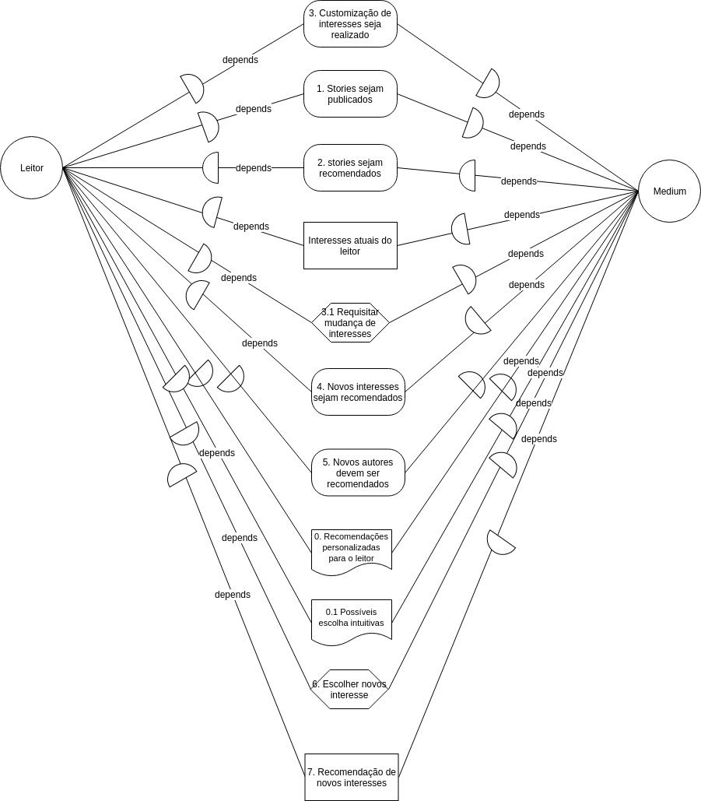
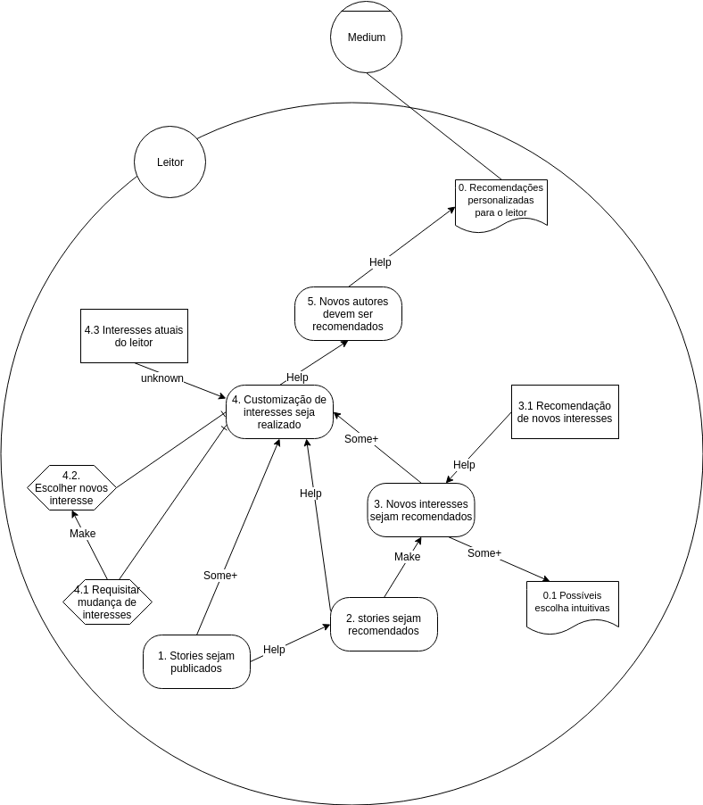
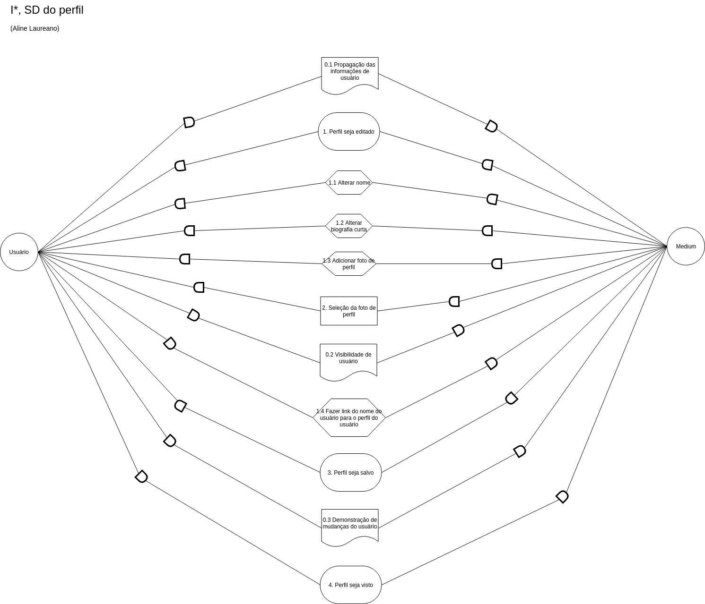
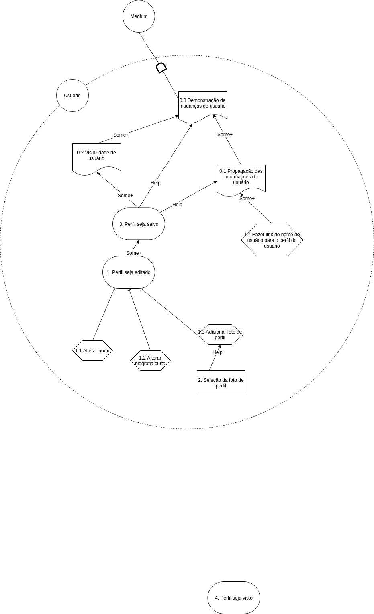
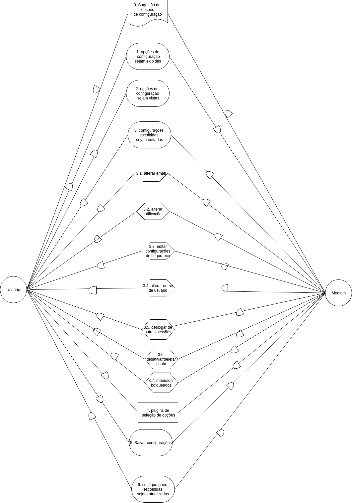
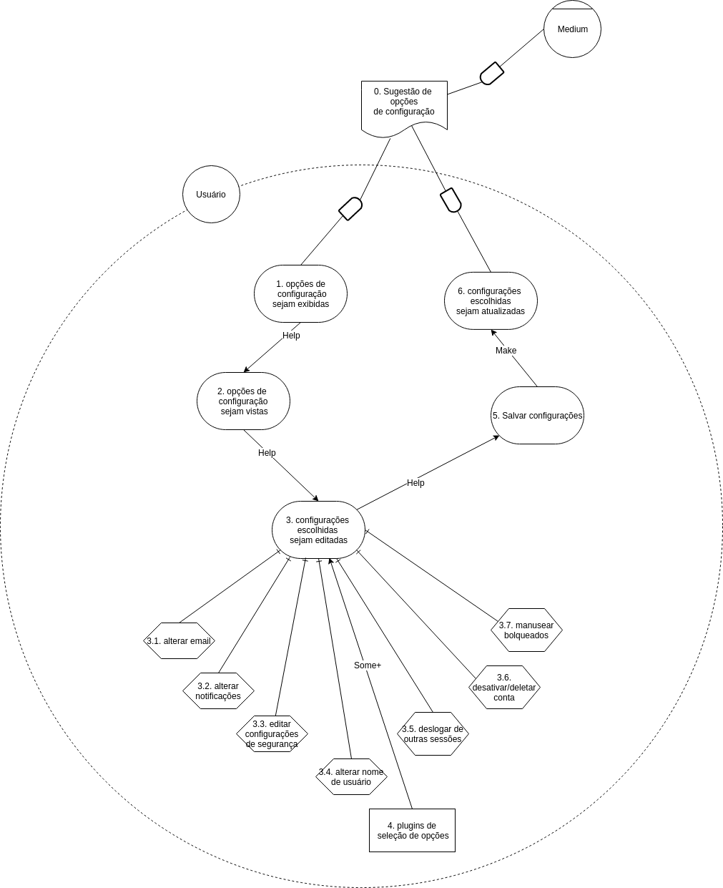

## Versionamento de edições
| Data       | autor               | Descrição                        | Versão |
|------------|---------------------|----------------------------------|--------|
| 04/06/2019 | william elias alves | adição de introdução e objetivos | 0.1    |
| 04/06/2019 | william elias alves | adição de metodologia e resultados | 0.2    |
| 05/06/2019 | Matheus Blanco | Adição inicial dos checklists e verificações | 0.3 |
| 06/06/2019 | Matheus Blanco | Refatoração dos checklists | 0.4 |
| 07/06/2019 | Matheus Blanco | Refatoração das verificações, inclusão de pareceres | 0.5 |
| 10/07/2019 | Matheus Blanco |Adição desta tabela ao documento|0.6|
|10/07/2019|Matheus Blanco | Adição dos I*'s refatorados |0.7|

### Introdução
Verificação é uma análise de modelos cuja uma tarefa pode ser desempenhado por pessoas como por softwares. Tem como objetivo assegurar que o sistema produzido atenda às especificações estabelecidas.

### Objetivos
Para a realização da verificação, foi utilizado o método de inspeção de Fagan. Esse tipo de abordagem atua na verificação de artefatos de elicitação e sem uma estrutura própria, ou produzidos por Engenheiros de Software/Requisitos, o que o configura, nesse caso, como uma lista de requisitos.

### Metodologia
Para a realização da análise dos I*'s com ênfase na verificação, foi escolhida a técnica de inspeção.
Os passos a serem realizados para inspeção são os seguintes:

* **Definição dos critérios de aceitação**: Para que haja um padrão estabelecido de como o conteúdo do backlog do produto deva se parecer;
* **Análise geral dos I*s**

### Resultados
Após todo processo criativo por trás da verificação por meio da inspeção, os seguintes resultados foram obtidos:

* Criação de 11 critérios de aceitação para os I* SD e 12 critérios de aceitação para os I* SR;

* Verifição dos 14 I*'s presentes na Wiki e Drive.

* Foram refatorados somente os I*'s que tinham a maior quantidade de déficits.

## Checklist I* SD
| Código| Item | Descrição|
|----------------|----------------------|-------------------------------------|
| 1 | Atores | Escolha apropriada dos atores existentes de acordo com o contexto |
| 2 | Dependências | Avaliação e representação apropriada das relações de dependências de cada balão , de acordo com o contexto|
| 3 | Relações | Apenas um item de relacionamento entre os atores, não podendo haver uma sequência de metas e Resources/tasks e resources/metas e tasks |
| 4 | Hardgoal | Metas escritas na voz passiva e condizentes com a operacionalização adequada ao contexto |
| 5 | Tasks | Linguagem apropriada, no infinitivo, e sucintas para representar uma tarefa pequena e operacionalizável|
| 6 | Resources | Linguagem apropriada, utilizando-se de substantivos, de recursos exteriores e utiliźaveis na tarefa descrita |
| 7 | Softgoals | Linguagem apropriada, com utilização de substantivos, e softgoals apropriados com o contexto de requisito não funcional da situação do artefato |
| 8 | Sequência subjetiva | Existência intrinseca de um processo sequêncial |
| 9 | Sequência objetiva | Numeração da ordem dos balões existentes |
| 10 | Rastreabilidade | Existência de rastreabilidade no artefato |
| 11 | Qualidade | Quantidade adequada ao contexto, sem o leitor ser capaz de notar imediatamente a falta de algum elemento de requisito faltante |

## Checklist I* SR
| Código| Item | Descrição|
|----------------|----------------------|-------------------------------------|
| 1 | Atores | Escopo dos atores condizente com a realidade da situação |
| 2 | Ligações | Avaliação e representação apropriada das relações dos itens, levando em consideração o seu impacto geral |
| 3 | Relações | Seguimento correto das relações e seus entendimentos de decomposição e sequenciamento |
| 4 | inicialização | Inicialização do percurso a partir de um softgoal/requisito não funcional, terminando em sua operacionalização |
| 5 | Hardgoal | Metas escritas na voz passiva e condizentes com a operacionalização adequada ao contexto |
| 6 | Tasks |  | Linguagem apropriada, no infinitivo, e sucintas para representar uma tarefa pequena e operacionalizável |
| 7 | Resources | Linguagem apropriada, utilizando-se de substantivos, de recursos exteriores e utiliźaveis na tarefa descrita |
| 8 | Softgoals | Linguagem apropriada, com utilização de substantivos, e softgoals apropriados com o contexto de requisito não funcional da situação do artefato |
| 9 | Sequência subjetiva| Existência intrinseca de um processo sequêncial |
| 10 | Sequência objetiva | Numeração da ordem dos balões existentes |
| 11 | Rastreabilidade | Existência de rastreabilidade no artefato |
| 12| Qualidade | Quantidade adequada ao contexto, sem o leitor ser capaz de notar imediatamente a falta de algum elemento de requisito faltante |

## Tabelas de avaliação dos I*'s v1

**Responsáveis:** Matheus Blanco e William Elias

### Publicações
#### I* Publicações SD V2.0

| Código| Item | Cumprimento | Parecer |
|----------------|----------------------|-------------------------------------|---|
| 1 | Atores | [sim] | Atores condizentes com o contexto, correto|
| 2 | Dependências | [sim] | Dependências estão plausíveis de acordo com o contexto, correto |
| 3 | Relações | [sim] | Inexistência de dois elementos numa mesma dependência, correto |
| 4 | Hardgoals | [sim] | hardgoals com linguagem correta e operacionalizáveis |
| 5 | Tasks | [não] | Falta de linguagem no infinitivo |
| 6 | Resources | [sim] | Linguagem correta e contexto adequado |
| 7 | Softgoals | [sim] | condizível com requisito não funcional e linguagem correta |
| 8 | Sequência Subjetiva| [não] | falta de ordem subjetiva|
| 9 | Sequência Objetiva | [não] | falta de numeração|
| 10 | Rastreabilidade | [não] | falta identificação de rastreabilidade |
| 11 | Qualidade | [sim] | I* com elementos adequados ao contexto |

#### I* Publicações SR-Usuário V2.0

| Código| Item | Cumprimento | Parecer |
|----------------|----------------------|-------------------------------------|---|
| 1 | Atores | [sim] | escopo de ator bem definido |
| 2 | Ligações | [não] | falta de impactos em certas relações |
| 3 | Relações | [sim] | decomposição e sequenciamento adequados |
| 4 | Inicialização | [sim] | inicia com um softogoal |
| 5 | Hardgoals | [sim] | hardgoals com linguagem correta e operacionalizáveis |
| 6 | Tasks | [não] | Falta de linguagem no infinitivo |
| 7 | Resources | [sim] | Linguagem correta e contexto adequado |
| 8 | Softgoals | [sim] |  condizível com requisito não funcional e linguagem correta |
| 9 | Sequência Subjetiva| [sim] | sequência subjetiva identificável |
| 10 | Sequência Objetiva | [não] | falta de numeração |
| 11 | Rastreabilidade | [não] | falta identificação de rastreabilidade |
| 12 | Qualidade | [sim] | I* com elementos adequados ao contexto |

#### I* Publicações SR-Medium V2.0

| Código| Item | Cumprimento | Parecer |
|----------------|----------------------|-------------------------------------|---|
| 1 | Atores | [sim] | escopo de ator bem definido |
| 2 | Ligações | [sim] | impactos condizentes |
| 3 | Relações | [sim] | falta de decomposição mas sequenciamento adequados |
| 4 | Inicialização | [sim] | inicia com um softogoal |
| 5 | Hardgoals | [sim] | hardgoals com linguagem correta e operacionalizáveis |
| 6 | Tasks | [não] | tarefas grandes demais para serem tasks |
| 7 | Resources | [não] | inexistente |
| 8 | Softgoals | [sim] |  condizível com requisito não funcional e linguagem correta |
| 9 | Sequência Subjetiva| [sim] | sequência subjetiva identificável |
| 10 | Sequência Objetiva | [não] | falta de numeração |
| 11 | Rastreabilidade | [não] | falta identificação de rastreabilidade |
| 12 | Qualidade | [sim] | I* com elementos adequados ao contexto |

### Stories
#### I* Stories SD V2.0

| Código| Item | Cumprimento | Parecer |
|----------------|----------------------|-------------------------------------|---|
| 1 | Atores | [sim] | Atores condizentes com o contexto, correto|
| 2 | Dependências | [sim] | Falta de uma dependência |
| 3 | Relações | [sim] | Inexistência de dois elementos numa mesma dependência |
| 4 | Hardgoals | [sim] | hardgoals com linguagem correta e operacionalizáveis |
| 5 | Tasks | [sim] | linguagem no correta e operações pequenas |
| 6 | Resources | [não] | resource de monetização confuso |
| 7 | Softgoals | [sim] | condizível com requisito não funcional e linguagem correta |
| 8 | Sequência Subjetiva| [sim] | ordem subjetiva notável |
| 9 | Sequência Objetiva | [não] | falta de numeração|
| 10 | Rastreabilidade | [não] | falta identificação de rastreabilidade |
| 11 | Qualidade | [sim] | I* com elementos adequados ao contexto |

#### I* Stories SR V2.0

| Código| Item | Cumprimento | Parecer |
|----------------|----------------------|-------------------------------------|---|
| 1 | Atores | [não] | apenas um ator definido |
| 2 | Ligações | [sim] | impactos demonstrados |
| 3 | Relações | [sim] | decomposição e sequenciamento adequados |
| 4 | Inicialização | [sim] | inicia com um softogoal |
| 5 | Hardgoals | [sim] | hardgoals com linguagem correta e operacionalizáveis |
| 6 | Tasks | [sim] | linguagem correta e adequados ao contexto |
| 7 | Resources | [não] | resource de monetização confuso |
| 8 | Softgoals | [sim] |  condizível com requisito não funcional e linguagem correta |
| 9 | Sequência Subjetiva| [sim] | sequência subjetiva identificável |
| 10 | Sequência Objetiva | [não] | falta de numeração |
| 11 | Rastreabilidade | [não] | falta identificação de rastreabilidade |
| 12 | Qualidade | [sim] | I* com elementos adequados ao contexto |

### Interesses
#### I* Interesses SD V1.0

| Código| Item | Cumprimento | Parecer | Erros consertados na versão seguinte?|
|----------------|----------------------|-------------------------------------|-|---|
| 1 | Atores | [sim] | Atores condizentes com o contexto, correto|-|
| 2 | Dependências | [sim] | dependências corretas ao contexto |-|
| 3 | Relações | [sim] | Inexistência de dois elementos numa mesma dependência |-|
| 4 | Hardgoals | [não] | alguns hardgoals com linguagem ativa ao invés de passiva|sim|
| 5 | Tasks | [não] | linguagem fora do infinitivo |sim|
| 6 | Resources | [não] | resources que poderiam ser softgoals |sim|
| 7 | Softgoals | [sim] | condizível com requisito não funcional e linguagem correta|-|
| 8 | Sequência Subjetiva| [sim] | ordem subjetiva notável |-|
| 9 | Sequência Objetiva | [não] | falta de numeração|sim|
| 10 | Rastreabilidade | [não] | falta identificação de rastreabilidade |não|
| 11 | Qualidade | [sim] | I* com elementos adequados ao contexto | -|

##### I* Consertado

#### I* Interesses SR V1.0

| Código| Item | Cumprimento | Parecer | Erros consertados na versão seguinte?|
|----------------|----------------------|-------------------------------------|---|-|
| 1 | Atores | [sim] | ator e agente definidos |-|
| 2 | Ligações | [sim] | alguns impactos em certas ligação não foram demonstrados |-|
| 3 | Relações | [sim] | decomposição e sequenciamento adequados |-|
| 4 | Inicialização | [não] | não foi possível identificar se onde o SR começou, logo não se soube dizer se começa com o softgoal ou não |sim|
| 5 | Hardgoals | [sim] | hardgoals com linguagem correta e operacionalizáveis |-|
| 6 | Tasks | [sim] | linguagem correta e adequados ao contexto |-|
| 7 | Resources | [sim] | resource adequados ao contexto |-|
| 8 | Softgoals | [não] |  condizível com requisito não funcional mas linguagem parecendo mais com a de 'claims' em NFR |sim|
| 9 | Sequência Subjetiva| [sim] | sequência subjetiva identificável |-|
| 10 | Sequência Objetiva | [não] | falta de numeração |sim|
| 11 | Rastreabilidade | [não] | falta identificação de rastreabilidade |não|
| 12 | Qualidade | [sim] | I* com elementos adequados ao contexto, entretanto está pequeno |-|

##### I* Consertado

### Perfil
#### I* Perfil SD V2.0

| Código| Item | Cumprimento | Parecer | Erro consertado na versão seguinte?|
|----------------|----------------------|-------------------------------------|---|---|
| 1 | Atores | [sim] | Atores condizentes com o contexto, correto| -|
| 2 | Dependências | [sim] | dependências corretas ao contexto |-|
| 3 | Relações | [sim] | Inexistência de dois elementos numa mesma dependência |-|
| 4 | Hardgoals | [sim] | hardgoals com linguagem correta e adequados, entretanto poucos hardgoals |-|
| 5 | Tasks | [sim] | linguagem correta e adequados ao contexto |-|
| 6 | Resources | [sim] | resources adequados ao contexto e com a linguagem correta |-|
| 7 | Softgoals | [não] | softgoal parecido com um hardgoal | sim |
| 8 | Sequência Subjetiva| [sim] | ordem subjetiva notável, com exceção de alguns elementos fora de ordem, como o primeiro hardgoal |-|
| 9 | Sequência Objetiva | [não] | falta de numeração|sim|
| 10 | Rastreabilidade | [não] | falta identificação de rastreabilidade |sim|
| 11 | Qualidade | [não] | I* com elementos adequados ao contexto, entretanto pequeno |sim|

##### I* Consertado

#### I* Perfil SR-Usuário V1.0

| Código| Item | Cumprimento | Parecer | Erro consertado na versão seguinte?|
|----------------|----------------------|-------------------------------------|---|---|
| 1 | Atores | [sim] | ator  definidos para o primeiro SR |-|
| 2 | Ligações | [não] | falta de impactos demonstrados |sim|
| 3 | Relações | [sim] | decomposição e sequenciamento adequados, apesar de poucos |-|
| 4 | Inicialização | [não] | não inicia com um softgoal |sim|
| 5 | Hardgoals | [sim] | hardgoals com linguagem correta e operacionalizáveis, apesar de poucos |-|
| 6 | Tasks | [sim] | linguagem correta e adequados ao contexto |-|
| 7 | Resources | [sim] | resource adequados ao contexto |-|
| 8 | Softgoals | [não] |  inexistente |sim|
| 9 | Sequência Subjetiva| [sim] | sequência subjetiva identificável |-|
| 10 | Sequência Objetiva | [não] | falta de numeração |sim|
| 11 | Rastreabilidade | [não] | falta identificação de rastreabilidade |sim|
| 12 | Qualidade | [não] | muito pequeno |sim|

#### I* Perfil SR-Medium V1.0

| Código| Item | Cumprimento | Parecer | Erro consertado na versão seguinte?|
|-------------|---|----------------------|-------------------------------------|---|
| 1 | Atores | [sim] | ator  definidos para o primeiro SR |-|
| 2 | Ligações | [sim] | um impacto não foi demonstrado |-|
| 3 | Relações | [não] | falta de decomposição, mas sequenciamento adequados |sim|
| 4 | Inicialização | [sim] | inicializado com um softgoal |-|
| 5 | Hardgoals | [sim] | hardgoals com linguagem correta e operacionalizáveis, entretanto poucos |-|
| 6 | Tasks | [sim] | linguagem correta e adequados ao contexto |-|
| 7 | Resources | [sim] | inexistente |-|
| 8 | Softgoals | [não] |  condizível com requisito não funcional |sim|
| 9 | Sequência Subjetiva| [sim] | sequência subjetiva identificável |-|
| 10 | Sequência Objetiva | [não] | falta de numeração |sim|
| 11 | Rastreabilidade | [não] | falta identificação de rastreabilidade |sim|
| 12 | Qualidade | [não] | muito pequeno |sim|

##### I* Consertado

### Pesquisar Conteúdo
#### I* Pesquisar Conteúdo SD V2.0

| Código| Item | Cumprimento | Parecer |
|----------------|----------------------|-------------------------------------|---|
| 1 | Atores | [sim] | Atores condizentes com o contexto, correto|
| 2 | Dependências | [sim] | dependências corretas ao contexto |
| 3 | Relações | [sim] | Inexistência de dois elementos numa mesma dependência |
| 4 | Hardgoals | [não] | hardgoals com linguagem incorreta, sendo que apenas um deles está em voz passiva |
| 5 | Tasks | [não] | linguagem invertida com hardgoals |
| 6 | Resources | [não] | resources parecidos com hardgoals/softgoals |
| 7 | Softgoals | [sim] | softgoals adequados |
| 8 | Sequência Subjetiva| [sim] | ordem subjetiva notável, com exceção de alguns elementos fora de ordem, a partir da metade do fluxo |
| 9 | Sequência Objetiva | [não] | falta de numeração|
| 10 | Rastreabilidade | [não] | falta identificação de rastreabilidade |
| 11 | Qualidade | [sim] | I* com elementos adequados ao contexto |

#### I* Pesquisar conteúdo SR V2.0

| Código| Item | Cumprimento | Parecer |
|----------------|----------------------|-------------------------------------|---|
| 1 | Atores | [não] | apenas um ator trabalhado no sr |
| 2 | Ligações | [não] | falta de impactos demonstrados |
| 3 | Relações | [sim] | decomposição e sequenciamento adequados, apesar de poucos |
| 4 | Inicialização | [sim] | inicia com um softgoal, entretanto o artefato indica tal de maneira um pouco confusa |
| 5 | Hardgoals | [não] | hardgoals possuem linguagem invertida com tasks |
| 6 | Tasks | [não] | tasks possuem linguagem invertida com hardgoals |
| 7 | Resources | [sim] | inexsistente |
| 8 | Softgoals | [não] |  softgoals adequados |
| 9 | Sequência Subjetiva| [sim] | sequência subjetiva identificável |
| 10 | Sequência Objetiva | [não] | falta de numeração |
| 11 | Rastreabilidade | [não] | falta identificação de rastreabilidade |
| 12 | Qualidade | [sim] |  |

### Configurações
#### I* Configurações SD V1.0

| Código| Item | Cumprimento | Parecer | Erro consertado na versão seguinte? |
|---|---|---|---|---|
| 1 | Atores | [sim] | Atores condizentes com o contexto, correto|-|
| 2 | Dependências | [sim] | dependências corretas ao contexto |-|
| 3 | Relações | [não] | Existência de dois elementos numa mesma dependência |sim|sim|
| 4 | Hardgoals | [sim] | hardgoals com linguagem correta, com exceção do último |-|
| 5 | Tasks | [não] | tarefas que poderiam ser hardgoals |sim|
| 6 | Resources | [sim] | resources adequados, entretanto poderia ser decomposto |-|
| 7 | Softgoals | [sim] | adequado |-|
| 8 | Sequência Subjetiva| [sim] | ordem subjetiva notável, com exceção de alguns elementos fora de ordem |-|
| 9 | Sequência Objetiva | [não] | falta de numeração|sim|
| 10 | Rastreabilidade | [não] | falta identificação de rastreabilidade |não|
| 11 | Qualidade | [não] | I* com apenas alguns elementos adequados ao contexto |sim|

##### I* Consertado

#### I* Configurações SR V1.0

| Código| Item | Cumprimento | Parecer | Erro Consertado na versão seguinte? |
|----------------|----------------------|-------------------------------------|---|---|
| 1 | Atores | [não] | apenas um ator trabalhado no sr |sim|
| 2 | Ligações | [sim] | impactos demonstrados |-|
| 3 | Relações | [não] | decomposição não explícita |sim|
| 4 | Inicialização | [sim] | inicia com um softgoal |-|
| 5 | Hardgoals | [sim] | hardgoals com linguagem correta, com exceção do último |-|
| 6 | Tasks | [não] | tarefas que poderiam ser hardgoals |sim|
| 7 | Resources | [sim] | resources adequados, entretanto poderia ser decomposto |-|
| 8 | Softgoals | [sim] | adequado |-|
| 9 | Sequência Subjetiva| [sim] | sequência subjetiva identificável |-|
| 10 | Sequência Objetiva | [não] | falta de numeração |sim|
| 11 | Rastreabilidade | [não] | falta identificação de rastreabilidade |não|
| 12 | Qualidade | [sim] |  |-|

##### I* Consertado

