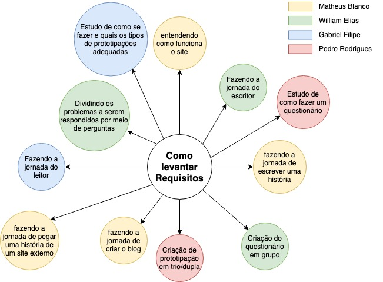
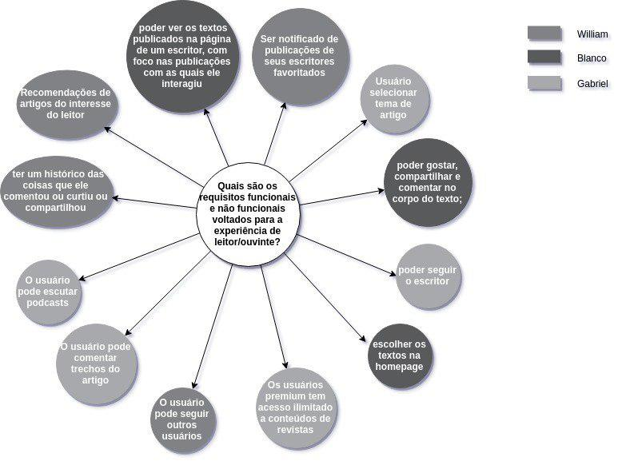
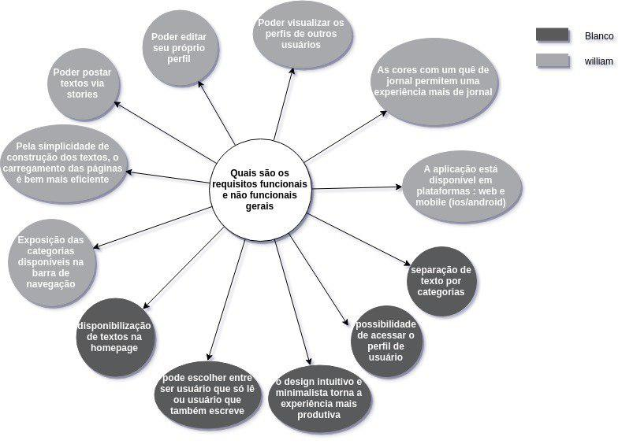
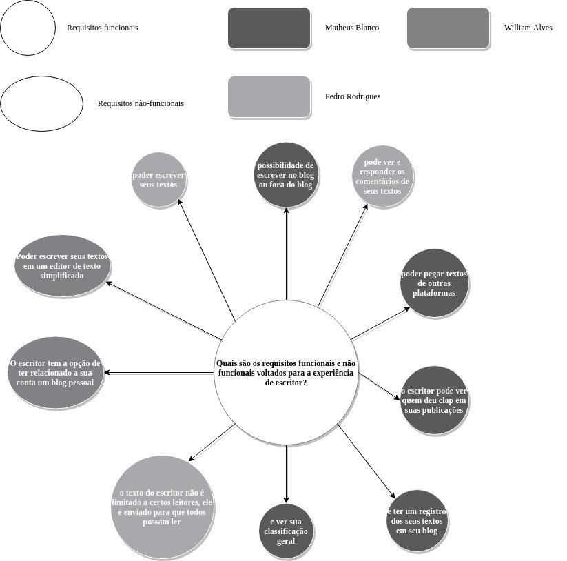

## Versionamento de edições
| Data           | autor                | Descrição                           |Versão|
|----------------|----------------------|-------------------------------------|------|
|   09/04/2019   |   William Elias Alves| Inserção dos brainstormings e mindmaps| 0.1  |
|   15/04/2019   |   Matheus Salles Blanco| Adição dos requisitos elicitados em cada técnica| 0.2  |
|   17/06/2019   |   William Elias Alves| Inserção dos resultados e introdução| 1.0  |

### Introdução

A utlização da técnica de brainstorming é benéfica para realização de processos criativos, ou seja, processos que requerem sugestões de ideias.
O brainstorming consiste em uma reunião com duas ou mais pessoas, na qual há um espaço para expor opniões e ideias sem pré-julgamento. Com esse espaço é possível receber um volume muito grande de ideias e possíveis alternativas para concepção de um produto , por exemplo.

### Metodologia

Mediante reuniões presenciais e via Hangouts, foram organizados brainstormings. Esses foram feitos mediante a resposta de perguntas favoráveis ao entedimento e elicitação dos requisitos da aplicação MEDIUM.
Com a aplicação da técnica de brainstorming e representação dos brainstormings via mapas mentais.

### Resultados

Foram concebidos brainstormings com os seguintes focos:

* Definição e divisão de tarefas
* Elicitação de requisitos

E após o brainstorming foram criados para cada modelo concretizado um mapa mental para melhor visualização do mesmo.

***

### Brainstorming 1

**Tema:** Definição e divisão de tarefas 

**Pergunta:**Como levantar os requisitos?

| Membro     | Sugestão |
|------------|-----------|
| william    |Dividindo os problemas a serem respondidos por meio de perguntas|
| william  e Matheus   |Focando em requisitos com foco no leitor e também para o escritor|
| Matheus    |Entendendo o funcionamento do site por observação|
| Gabriel    |Fazendo a jornada do leitor|
| william    |Fazendo a jornada do escritor|
| Matheus    |fazendo a jornada de escrever uma história|
| Matheus    |fazendo a jornada de pegar uma história de um site externo|
| Matheus    |fazendo a jornada de criar o blog|
| william    |Todos criarem ao menos três técnicas individualmente|
| william    |Criação do questionário em grupo|
| pedro      |Estudo de como fazer um questionário|
| Gabriel    |Fazendo a jornada do leitor|
|pedro       |Criação de prototipação em trio/dupla|

###Brainstorming 2

**Tema:** Elicitação de Requisitos

Ficou decidido pelo grupo um levantamento de requisitos de software ,da aplicação MEDIUM, por meio do brainstorming. Esse levantamento ocorreu sem a utilização direta da aplicação. 
Decidiu-se que iriamos inicialmente respondendo as perguntas aleatoriamente e posteriormente de uma forma mais organizada.

**Pergunta:**Quais são os requisitos funcionais e não funcionais da área comum da aplicação?

| Membro     | Sugestão |
|------------|-----------|
| william    |expor as categorias disponíveis na barra de navegação|
| Matheus    |disponibilizar de textos na homepage|
| william    |postar textos via stories|
| Matheus    |separar os texto por categorias|
| Matheus    |acessar o perfil de usuário|
| william    |editar seu próprio perfil|
| william    |visualizar os perfis de outros usuários|
| william    |carregamento eficiente de artigos|
| william    |cores monocromáticas na construção básica do site|
|matheus     | o design intuitivo e minimalista torna a experiência mais produtiva|	
|matheus     | A aplicação está disponível em plataformas : web e mobile (ios/android)|

**Requisitos Elicitados**

| ID | Requisitos Elicitados desta técnica |
| ------ | ----------------------------- |
| R001 | Responsividade |
| R002 | Portabilidade mobile IOS |
| R003 | Portabilidade mobile Android |
| R007 | Paleta de cores monocromáticas no site |
| R008 | Acessar a área de membro |
| R009 | Visualizar artigos populares |
| R036 | Visualizar perfis de outros usuários |

###Brainstorming 3

**Tema:** Elicitação de Requisitos

**Pergunta:**Quais são os requisitos voltados ao leitor?

| Membro     | Sugestão |
|------------|-----------|
| william    |O leitor recebe as notificações de publicações de seus escritores favoritados|
| Gabriel    |seguir outros usuários|
| Gabriel    | escutar podcasts     |
| Gabriel    | selecionar tema de artigo|
| Matheus    |Escolher os textos na homepage|
| Matheus    |seguir o escritor|
|matheus     | compartilhar o texto|
|matheus     | o leitor poder gostar do texto|
| william    |Recomendações de artigos do interesse do leitor|
| william    |O leitor recebe as notificações de publicações de seus escritores favoritados|
| Pedro    |Os usuários premium tem acesso ilimitado a conteúdos de revistas|
| Matheus    |os usuários podem ver os textos publicados na página de um escritor, com foco nas publicações com as quais ele interagiu|

**Requisitos Elicitados**

| ID | Requisitos Elicitados desta técnica |
| ------ | ----------------------------- |
| R020 | Visualizar stories publicadas |
| R024 | Aplaudir um texto lido |
|R025|Compartilhar texto lido no Facebook ou Instagram|
|R026	|Comentar no corpo do texto	| 
|R027	|receber notificações de textos publicados por autores seguidos|	
|R028	|Seguir escritores|	
|R029	|Seguir usuários	|
|R030	|Escutar podcasts|	
|R031	|Selecionar tema de artigos	|
|R032	|Visualizar textos publicados por um escritor em seu perfil|
|R033	|Ter recomendações de leituras conforme histórico de leitura	|
|R037	|Favoritar publicação|

###Brainstorming 4

**Tema:** Elicitação de Requisitos

**Pergunta:**Quais são os requisitos para a experiência de escritor?

| Membro     | Sugestão |
|------------|----------|
| Matheus    |possibilidade de escrever no blog ou fora do blog|
| Matheus    |pegar textos de outras plataformas|
|matheus     | ver quem deu clap em suas publicações|	
|matheus     | ter um registro dos seus textos em seu blog|
| william    |O escritor tem a opção de ter relacionado a sua conta um blog pessoal|
| william    |Poder escrever seus textos em um editor de texto simplificado|
| Pedro    |poder escrever seus textos|
| Pedro    |ver comentários de seus textos e responder os comentários de seus textos|
| Pedro    |o texto do escritor não é limitado a certos leitores, ele é enviado para que todos possam ler|
| Matheus    |ver sua classificação geral|

**Requisitos Elicitados**

| ID | Requisitos Elicitados desta técnica |
| ------ | ----------------------------- |
| R017 | Ver status |
| R038| Visualizar comentários da publicação |

***
## Por onde começar a elicitar os requisitos

***
## Usuário leitor/ouvinte

***
## Área comum

***
## Escritor

