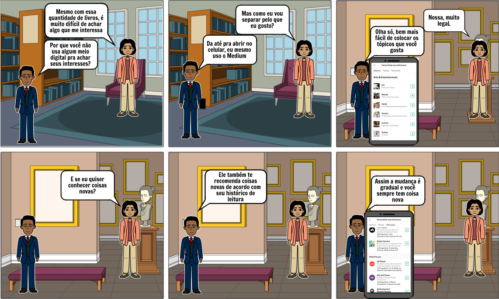
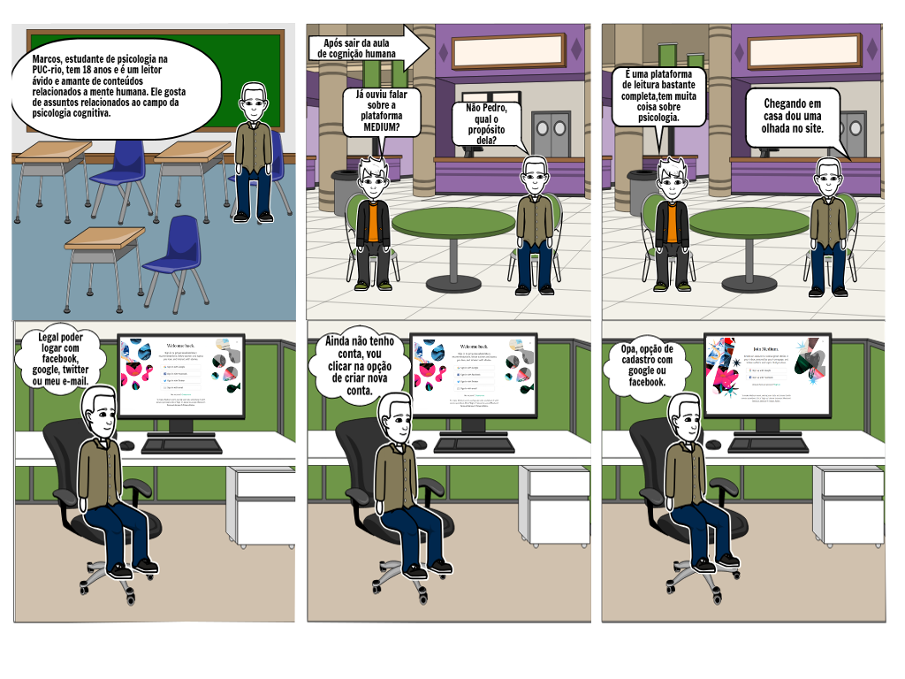
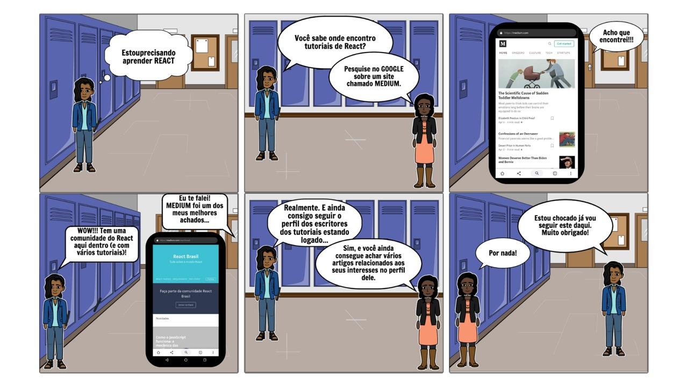
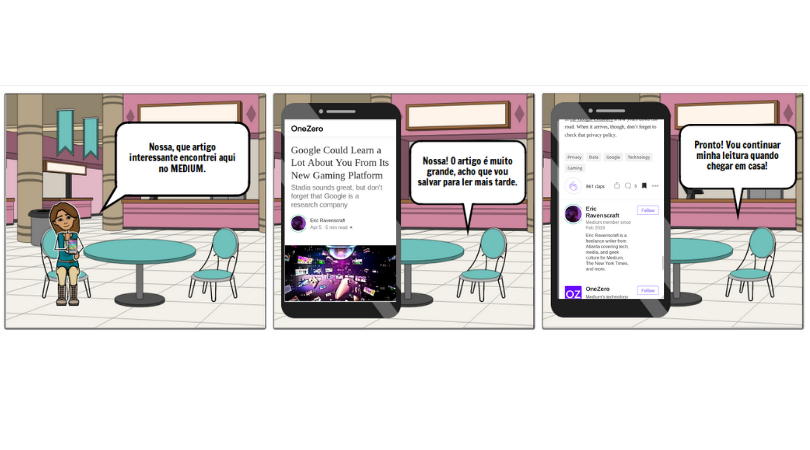

## Versionamento de edições
| Data           | autor                | Descrição                           |Versão|
|----------------|----------------------|-------------------------------------|------|
|   09/04/2019   |  William Elias Alves | Inserção do texto base dos storyboards| 0.1  |
|   09/04/2019   |  Gabriel Filipe Manso Araujo | Inserção de novos storyboards | 0.2  |
|   15/04/2019   |   Matheus Salles Blanco| Adição dos requisitos elicitados em cada técnica| 0.3  |
|   17/04/2019   |   William Elias Alves| Inserção de storybords nessa página avulsa| 0.4  |
|   17/04/2019   |   William Elias Alves| Inserção do rastro de elicitação para login e customização| 0.4  |
|   05/06/2019   |   Gabriel Filie Manso Araujo | Validação e aprimoramento de descrições | 0.5  |
|  24/06/2019    | William Elias        |Adição da metodologia e autores| 1.0|

### Descrição 

Storyboards são uma forma prática e eficiente de desenhar, comunicar e discutir como um produto de software pode ser realizado ou modificado. Todas as pessoas, independente de sua área de atuação, podem visualizar e sugerir mudanças enquanto ainda é simples e barato realizá-las. E agora, os storyboards podem inclusive ajudar na homologação e teste de forma automatizada antes da entrega.

Por meio da aplicação das técnicas de elicitação de requisitos, foi decidido que cada integrante do grupo focasse em uma área específica da plataforma MEDIUM e, mediante a utilização da técnica de [storytelling](storytelling.md), desenvolvessem diversos modelos de storyboards.

### Metodologia

O presente documento foi concebido por meio da aplicação das técnicas de storytelling e storybord com as seguintes ênfases: customização de interesses de um usuário, edição de perfil, login e cadastro na aplicação, criação de uma nova _storie_ e exploração de tópicos de leitura.

Os seguintes storyboards tiveram como ênfases: 

* Customização de interesses de um usuário;
* Login e cadastro na aplicação;
* Como seguir um usuário escritor e encontrar tutoriais;
* Bookmarking;

***
###Storyboards

##### Customização de interesses

**Responsável:**Pedro rodrigues

**Requisitos Elicitados**

| ID | Requisitos Elicitados desta técnica |
| ------ | ----------------------------- |
|R056|Visualizar pessoas que foram seguidas por você|
|R058|selecionar/remover tópicos de interesse|
|R059|Deixar de seguir usuários|
|R060|Deixar de seguir publicações|

#### Login e cadastro

**Responsável:**William Elias

**Requisitos Elicitados**

| ID | Requisitos Elicitados desta técnica |
| ------ | ----------------------------- |
|R103|Login via redes sociais (Facebook Twitter)|
|R104|Login via google|
|R105|Login via E-mail|
|R106|Cadastrar com Google|
|R107|Cadastrar com Facebook|

#### Tutorial e seguir escritor

**Responsável:** Gabriel Filipe

**Requisitos Elicitados**

| ID | Requisitos Elicitados desta técnica |
| ------ | ----------------------------- |
|R043|Visualizar autores seguidos|

#### Bookmarking

**Responsável:** Guilherme

**Requisitos Elicitados**

| ID | Requisitos Elicitados desta técnica |
| ------ | ----------------------------- |
| R051 | Visualizar marcações|
|R052|Ler artigos marcados|
|R053|Visualizar autores seguidos|
