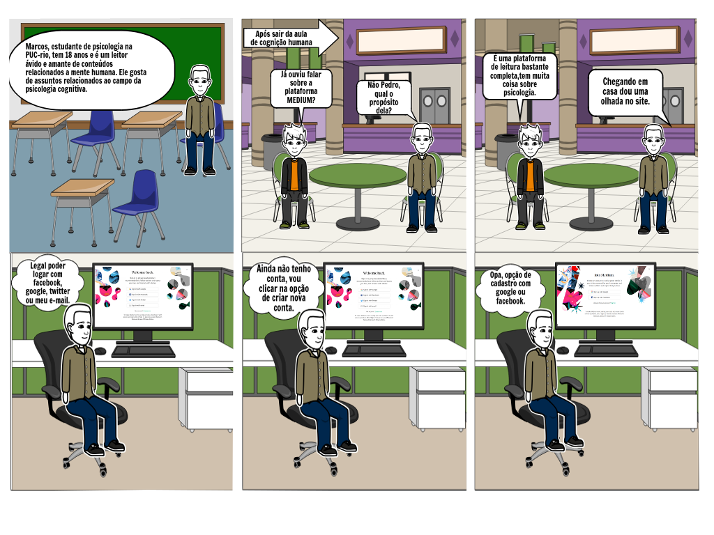

## Versionamento de edições
| Data           | autor                | Descrição                           |Versão|
|----------------|----------------------|-------------------------------------|------|
|   09/04/2019   |  william elias alves | Inserção do texto base dos storybords| 0.1  |
|   09/04/2019   |  Gabriel Filipe Manso Araujo | Inserção de novos storyboards | 0.2  |
|   15/04/2019   |   Matheus Salles Blanco| Adição dos requisitos elicitados em cada técnica| 0.3  |
|   17/04/2019   |   William Elias Alves| Inserção de storybords nessa página avulsa| 0.4  |
|   17/04/2019   |   William Elias Alves| Inserção do rastro de elicitação para login e customização| 0.4  |

## Descrição 
Por meio da aplicação de algumas técnicas de elicitação de requisitos os foi decidido que cada integrante do grupo focasse em uma área da plataforma MEDIUM. Mediante a utilização da técnica de [storytelling](storytelling.md), foram concebidos modelos de storybords.
##Escopo

O presente documento foi concebido por meio da aplicação das técnicas de storytelling e storybord com as seguintes ênfases: customização de interesses de um usuário, edição de perfil, login e cadastro na aplicação, criação de uma nova _storie_ e exploração de tópicos de leitura.

***
#Storyboards

## Customização de interesses

**Requisitos Elicitados**

| ID | Requisitos Elicitados desta técnica |
| ------ | ----------------------------- |
|R056|Visualizar pessoas que foram seguidas por você|
|R058|selecionar/remover tópicos de interesse|
|R059|Deixar de seguir usuários|
|R060|Deixar de seguir publicações|

## Login e cadastro

**Requisitos Elicitados**

| ID | Requisitos Elicitados desta técnica |
| ------ | ----------------------------- |
|R103|Login via redes sociais (Facebook Twitter)|
|R104|Login via google|
|R105|Login via E-mail|
|R106|Cadastrar com Google|
|R107|Cadastrar com Facebook|

## Tutorial e seguir escritor

**Requisitos Elicitados**

| ID | Requisitos Elicitados desta técnica |
| ------ | ----------------------------- |
|R043|Visualizar autores seguidos|

## Bookmarking

**Requisitos Elicitados**

| ID | Requisitos Elicitados desta técnica |
| ------ | ----------------------------- |
| R051 | Visualizar marcações|
|R052|Ler artigos marcados|
|R053|Visualizar autores seguidos|
