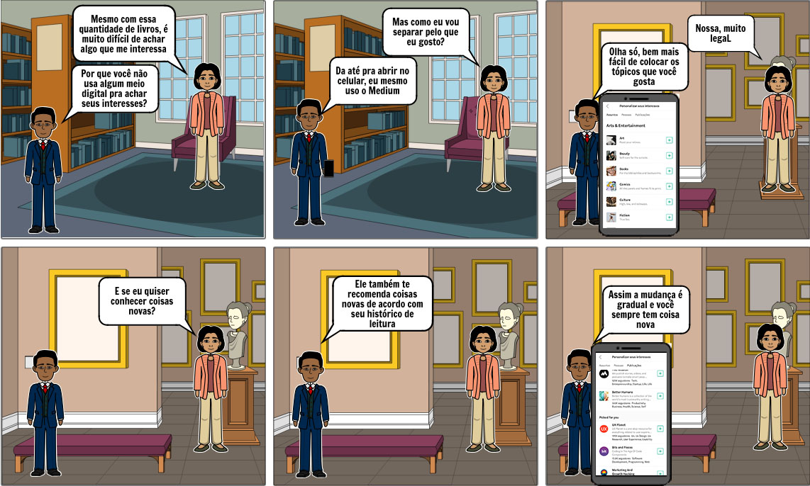

## Versionamento de edições
| Data           | autor                | Descrição                           |Versão|
|----------------|----------------------|-------------------------------------|------|
|   09/04/2019   |  william elias alves | Inserção do texto base e primeira versão dos storytellings e                                              storybords                          | 0.1  |
|   09/04/2019   |  Gabriel Filipe Manso Araujo | Inserção de storytellings e storyboards | 0.2  |

# Descrição 
Por meio da aplicação de algumas técnicas de elicitação de requisitos os foi decidido que cada integrante do grupo focasse em uma área da plataforma MEDIUM. Mediante a utilização da técnica de storytelling, foram concebidos modelos de storybords.
#Escopo

O presente documento foi concebido por meio da aplicação das técnicas de storytelling e storybord com as seguintes ênfases: customização de interesses de um usuário, edição de perfil, login e cadastro na aplicação, criação de uma nova _storie_ e exploração de tópicos de leitura.
***

#Storytellings

## Editar perfil

Carlos é um engenheiro de software fascinado na área de inteligência artificial. Ele gasta boa parte do seu tempo desenvolvendo estudos e pesquisas para a criação de novos algoritmos que sejam cada vez mais eficientes em manipular estruturas de dados do tipo redes neurais.
Buscando apresentar suas ideias em uma plataforma que tivesse leitores que partilham dos mesmos interesses de Carlos, ele decidiu adaptar parte de seus estudos e pesquisas em forma de textos jornalísticos e a postar eles na  plataforma Medium... [LER MAIS](storytellings/Storytelling - Editar perfil.docx)  

## Escritor - New Story

Natália é uma aluna de Engenharia de Software da UnB - FGA, escrevendo seu TCC 2 e chegando perto da tão esperada formatura. Seu TCC trata sobre um assunto que têm ganhado bastante espaço no meio de seu curso, inclusive nos laboratórios de desenvolvimento de Software presentes na faculdade. Natália está escrevendo um TCC baseado na usabilidade de um ChatBot, e está extremamente empolgada com o assunto. 

Natália, além de engenheira de software em formação, também é uma pessoa que gosta de escrever e ensinar seus amigos e colegas sobre quaisquer assunto que domine. Um belo dia, enquanto estava falando sobre como a documentação do Framework RASA para ChatBots é rasa e carece de detalhamento, Natália, que também se demonstra capaz de argumentar com muita sabedoria sobre o assunto, recebe a sugestão de um amigo sobre espalhar seus pensamentos para mais pessoas. Este amigo, em outras palavras, pediu para que Natália criasse um blog para falar sobre Rasa. Entretanto, Natália desgostou da ideia de um blog, devido a suas má experiências no passado, ao tentar fazer bombar um blog sobre gatos e papagaios... [LER MAIS](storytellings/Storytelling - Escritor, New Story.docx)

## Login Cadastro

Marcos, estudante de psicologia na PUC-rio, tem 18 anos e é um leitor ávido e amante de conteúdos relacionados a mente humana. Ele gosta de assuntos relacionados ao campo da psicologia cognitiva.  

Ao sair da aula de cognição humana, cujo o mentor é o Prof. Dr. Paulo de Mendonça, ele recebe um insight de seu colega Pedro. Pedro o informa a respeito da existência de uma aplicação para leitura, chamado MEDIUM e após a conversa Marcos se despede e vai para sua casa... [LER MAIS](storytellings/Storytelling - login_cadastro.docx)  

## Usuário, Explorar Tópicos

Gustavo é um estudante do curso de Educação Física da USP, amante de esportes e atleta, que se preocupa bastante com sua saúde e alimentação. Ao sair do treinamento de polo aquático ele ficou sabendo por meio de seus colegas da existência de um site chamado Médium com os diversos assuntos de seu interesse.  

Assim que chegou em casa Gustavo ligou seu PC e entrou em tal site vendo uma variedade de temas na parte superior e, inclusive, um dos que mais lhe interessava, que era “HEALTH”. No entanto ele também enxergou no canto superior direito o botão “MORE” , e clicou para explorar mais o site e descobrir todos os assuntos que o mesmo abordava... [LER MAIS](storytellings/Storytelling - Usuário, Explorar Tópicos.docx)  

#Storyboards

## Customização de interesses

***
## Login e cadastro

## Tutorial e seguir escritor

## Bookmarking

