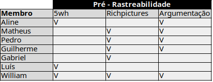

|Data      |        Autor            |           Descrição           |Versão|
|----------|-------------------------|-------------------------------|------|
|24/06/2019| William Elias e Guilherme Marques| Adição da pagina e tabelas | 1.0  |

### Descrição

As tabelas a seguir descrevem a particiapação e dedicação dos membros de acordo com o módulo, foram desenvolvidas com os seguintes enfoques:

- Pré-rastreabilidade
- Elicitação
- Modelagem

Os módulos após esses tiveram particiação de todos os membros, por isso não foram explicitados.

***

#### Pré-rastreabilidade

***Responsáveis: (Matheus Blanco, William Elias e Guilherme Marques)***

***

#### Elicitação

***Responsáveis: (Matheus Blanco, William Elias e Guilherme Marques)***

***

#### Modelagem

***Responsáveis: (Matheus Blanco, William Elias e Guilherme Marques)***

