## Versionamento de edições
| Data           | autor                | Descrição                           |Versão|
|----------------|----------------------|-------------------------------------|------|
|   19/04/2019   | Gabriel Filipe Manso Araujo  | Criação da página | 0.1  |
| 20/04/2019| Matheus Salles Blanco | Adição de alguns cenários | 0.2|
| 21/04/2019| William Elias Alves | Adição de alguns cenários | 0.3|
| 21/04/2019| Pedro Rodrigues Pereira | Adição de alguns cenários | 0.4|
|   22/04/2019   | Gabriel Filipe Manso Araujo  | Adição de alguns cenários | 0.5  |
|   22/04/2019   | Aline Laureano de Araujo Vilela | Adição de alguns cenários | 0.6  |

### Cenários

#### Dar Claps

**Dar Claps - V1.0**

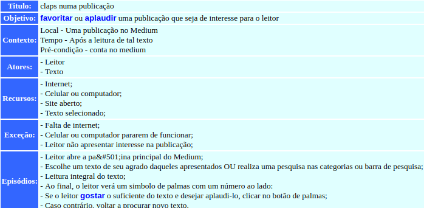

**Dar Claps - V2.0**

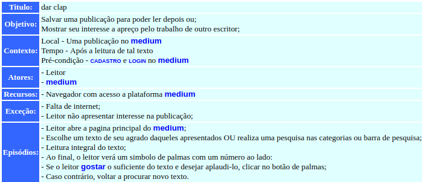

| Rastro | Origem |
| ------- | ------- |
|Rastro| RichPicture - Visão de Leitor|

***

#### Compartilhar publicação

**Compartilhar publicação - V1.0**

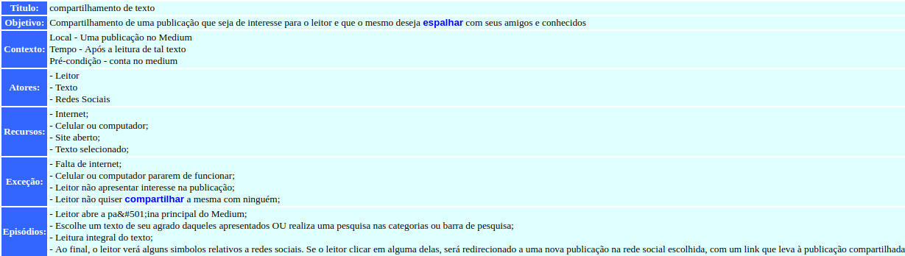

**Compartilhar publicação - V2.0**

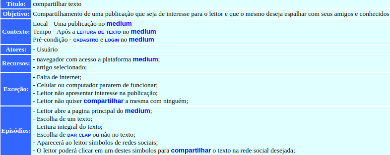

| Rastro | Origem |
| ------- | ------- |
|Rastro| RichPicture - Visão de Leitor|

***

#### Leitura de texto

**Leitura de texto - V1.0**

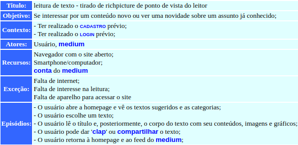

**Leitura de texto - V2.0**

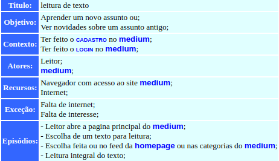

| Rastro | Origem |
| ------- | ------- |
|Rastro| RichPicture - Visão de Leitor|

***

#### Editar perfil

**Editar perfil - V1.0**

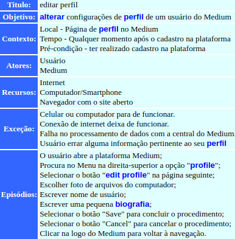

**Editar perfil - V2.0**

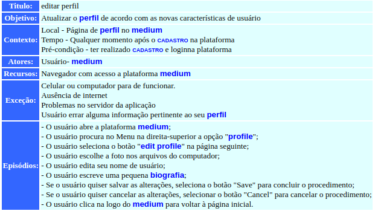

| Rastro | Origem |
| ------- | ------- |
|Rastro| Storytelling - Editar Perfil |

***

#### Premium

**Premium - V1.0**

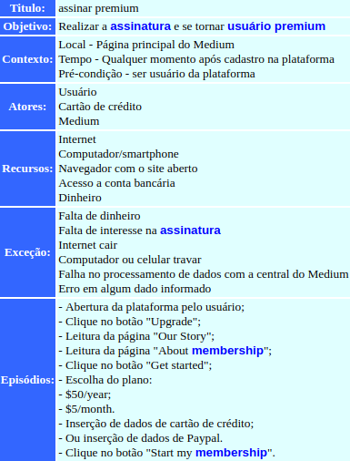

**Premium - V2.0**

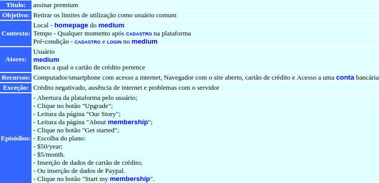

| Rastro | Origem |
| ------- | ------- |
|Rastro| Storytelling - Premium e Assinatura |

***

#### Cadastro

**Cadastro - V1.0**

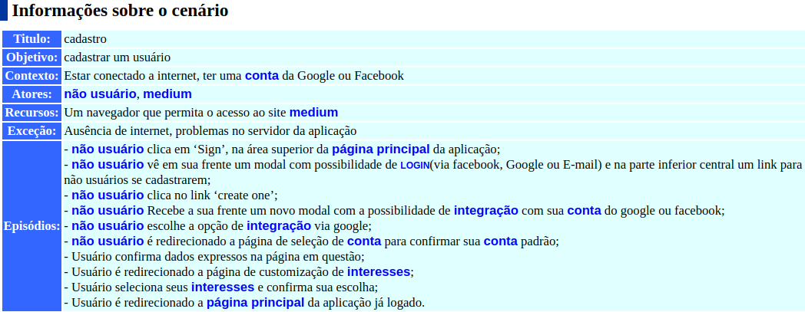

| Rastro | Origem |
| ------- | ------- |
|Rastro| Storytelling - cadastro e login |

***

#### Login

**Login - V1.0**

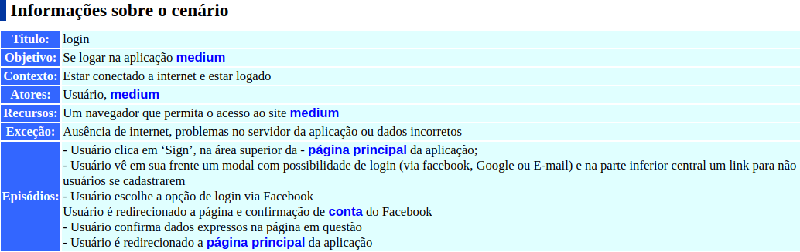

| Rastro | Origem |
| ------- | ------- |
|Rastro| Storytelling - cadastro e login |

***

#### Comentar publicação

**comentar publicação - V1.0**

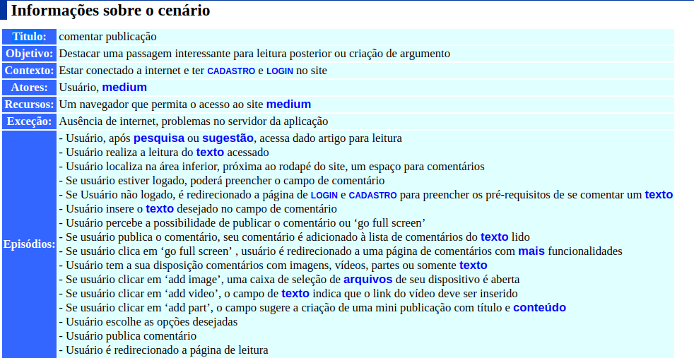

| Rastro | Origem |
| ------- | ------- |
|Rastro| Brainstorming 2 |

***

#### Customizar interesses

**Customizar interesses - V1.0**

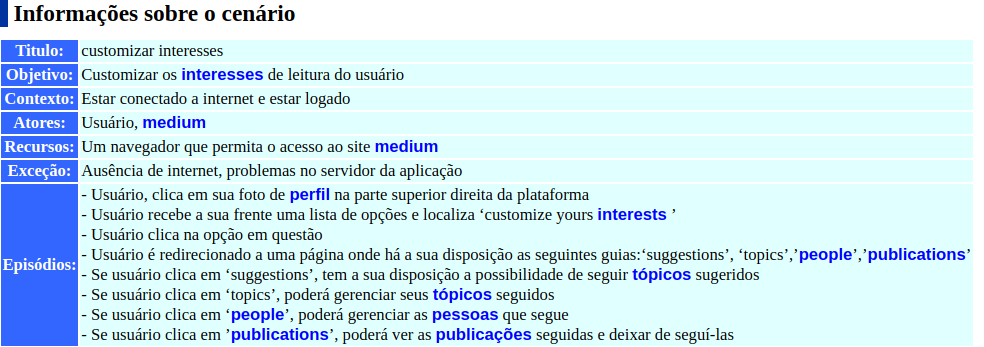

| Rastro | Origem |
| ------- | ------- |
|Rastro| Storybord - customização de interesses|

***

#### Configurar notificações de e-mail

**Configurar notificações de e-mail - V1.0**

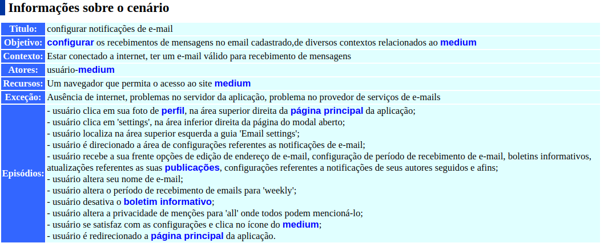

| Rastro | Origem |
| ------- | ------- |
|Rastro| Storytelling - Usuário, Configurando a aplicação|

***

### Criar um novo Storie

**Criar um novo storie - V1.0**

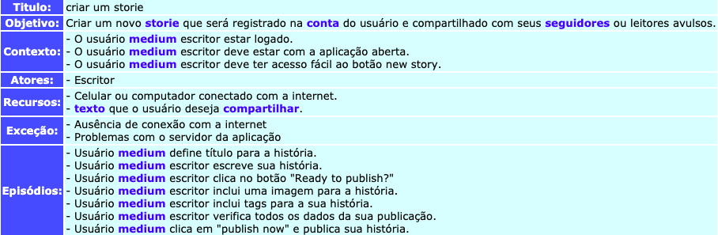

| Rastro | Origem |
| ------- | ------- |
|Rastro| Storytelling - New story|

***

### Criar um novo Bookmark

**Criar um novo bookmark - V1.0**

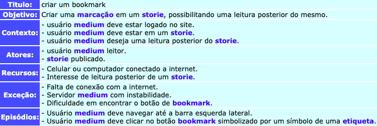

| Rastro | Origem |
| ------- | ------- |
|Rastro| StoryBoard - Bookmark|

***

### Importar um storie

**Importar um storie - V1.0**

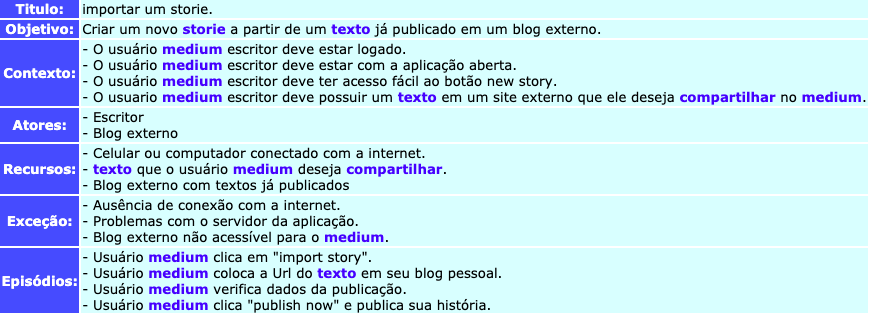

| Rastro | Origem |
| ------- | ------- |
|Rastro| Richpicture - Import Story|

***

### Responder um storie

**Responder um storie - V1.0**

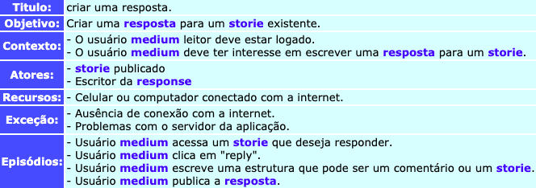

| Rastro | Origem |
| ------- | ------- |
|Rastro| Richpicture - New Story|

***

### Seguir usuário

**Seguir Usuário - V1.0**

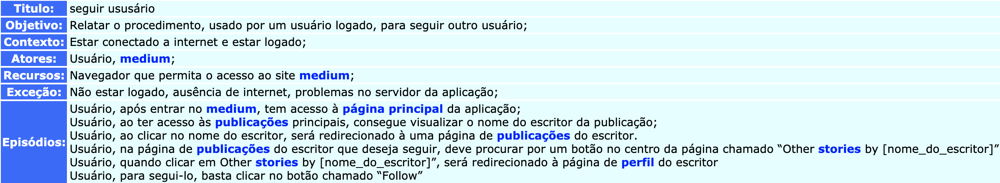

| Rastro | Origem |
| ------- | ------- |
|Rastro| Richpicture - Ponto de vista do Leitor|

***

### Deixar de seguir usuário

**Deixar de seguir usuário - V1.0**

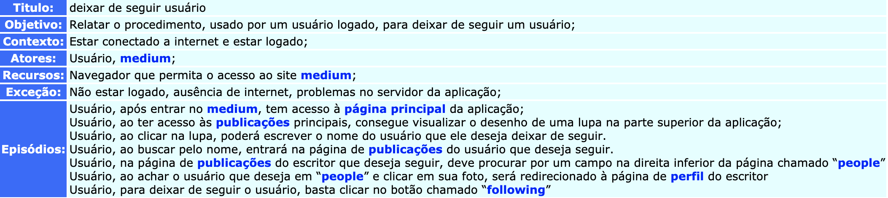

| Rastro | Origem |
| ------- | ------- |
|Rastro| Richpicture - Ponto de vista do Leitor|

***

### Pesquisa por usuário

**Pesquisa por usuário - V1.0**

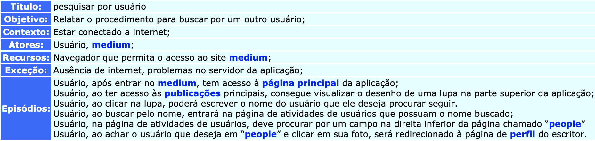

| Rastro | Origem |
| ------- | ------- |
|Rastro| Richpicture - Ponto de vista do Leitor|

***

### Pesquisa por artigo

**Pesquisa por artigo - V1.0**

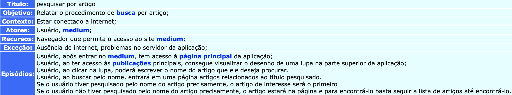

| Rastro | Origem |
| ------- | ------- |
|Rastro| Richpicture - Ponto de vista do Leitor|

***

### Ver vagas de emprego disponíveis

**Ver vagas de emprego disponíveis - V1.0**

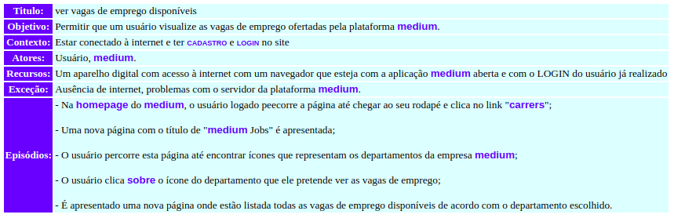

***
