## Versionamento de edições
| Data           | autor                | Descrição                           |Versão|
|----------------|----------------------|-------------------------------------|------|
|   19/04/2019   | Gabriel Filipe Manso Araujo  | Criação da página | 0.1  |
| 20/04/2019| Matheus Salles Blanco | Adição de alguns cenários | 0.2|
| 21/04/2019| William Elias Alves | Adição de alguns cenários | 0.3|
| 21/04/2019| Pedro Rodrigues Pereira | Adição de alguns cenários | 0.4|
|   22/04/2019   | Gabriel Filipe Manso Araujo  | Adição de alguns cenários | 0.5  |
|   22/04/2019   | Aline Laureano de Araujo Vilela | Adição de alguns cenários | 0.6|
|21/06/2019|Matheus Blanco| Adição de definição e metodologia|0.7|

### Definição

Na Engenharia de Requisitos, os Cenários são uma estratégia reconhecida para compreender as interações entre ambientes e sistemas, como também elicitar a parte comportamental do software, sua dinâmica e/ou seu fluxo. 

Os Cenários fazem uso de algumas abstrações como Título, Metas ou Objetivos, Contexto Atores, Recursos, Exceção ou Episódios.

### Metodologia

Como metodologia de trabalho, foi definido que a equipe deveria navegar pela plataforma do Medium para encontrar possíveis casos onde uma funcionalidade poderia ser transformada em cenários. O grupo definiu uma meta de 4 a 5 cenários por pessoa, o que totalizaria 35 cenários identificados.

### Cenários

#### Ajuda

**Responsável**: Luis Cláudio T. Lima

**Ajuda - V1.0**

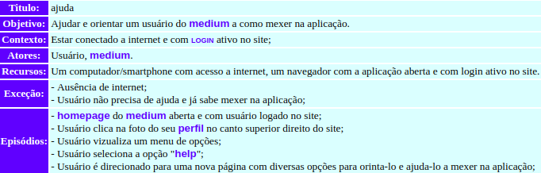

| Rastro | Origem |
| ------- | ------- |
|Rastro| Storytelling - Usuário, Configurando a aplicação|

#### Dar Claps

**Responsável**: Matheus Blanco

**Dar Claps - V1.0**

**Dar Claps - V2.0**

**Dar Claps - V3.0**

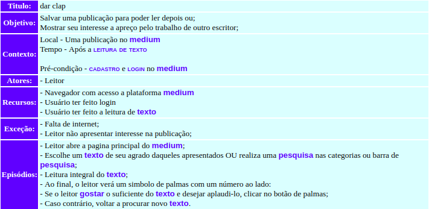

| Rastro | Origem |
| ------- | ------- |
|Rastro| RichPicture - Visão de Leitor|

***

#### Compartilhar publicação

**Responsável**: MatheusBlanco

**Compartilhar publicação - V1.0**

**Compartilhar publicação - V2.0**

| Rastro | Origem |
| ------- | ------- |
|Rastro| RichPicture - Visão de Leitor|

***

#### Leitura de texto

**Responsável**: MatheusBlanco

**Leitura de texto - V1.0**

**Leitura de texto - V2.0**

**Leitura de texto - V3.0**

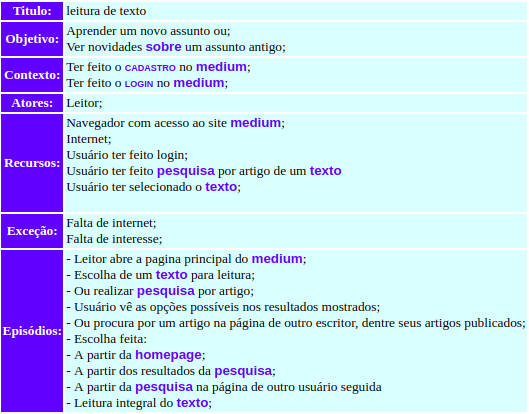

| Rastro | Origem |
| ------- | ------- |
|Rastro| RichPicture - Visão de Leitor|

***

### Explorar Categorias

**Responsável**: Luis Cláudio T. Lima

**Explorar categorias - V1.0**

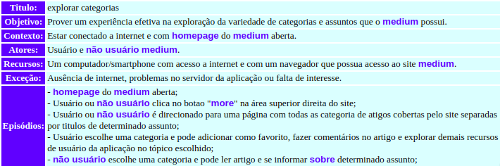

| Rastro | Origem |
| ------- | ------- |
|Rastro| StoryBoard - Customização de interesses|

### Editar perfil

**Responsável**: Matheus Blanco

**Editar perfil - V1.0**

**Editar perfil - V2.0**

**Editar perfil - V3.0**

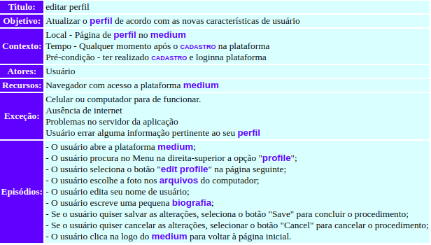

| Rastro | Origem |
| ------- | ------- |
|Rastro| Storytelling - Editar Perfil |

***

#### Assinar Premium

**Responsável**: Matheus Blanco

**Premium - V1.0**

**Premium - V2.0**

**Premium - V3.0**

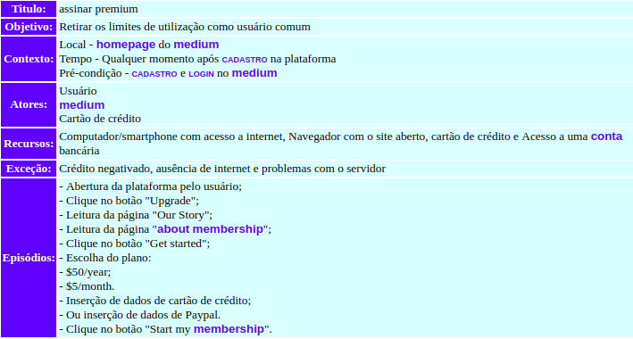

| Rastro | Origem |
| ------- | ------- |
|Rastro| Storytelling - Premium e Assinatura |

***

### Trocar de usuário

**Responsável**: Luis Cláudio T. Lima

**Trocar de usuário - V1.0**

| Rastro | Origem |
| ------- | ------- |
|Rastro| Storytelling - Extras do Medium|

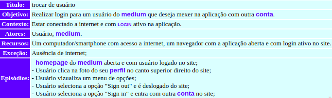

| Rastro | Origem |
| ------- | ------- |
|Rastro| Storytelling - Extras do Medium|

### Se candidatar a uma vaga de emprego

**Responsável**: Guilherme Marques

**Se candidatar a uma vaga de emprego - V1.0**

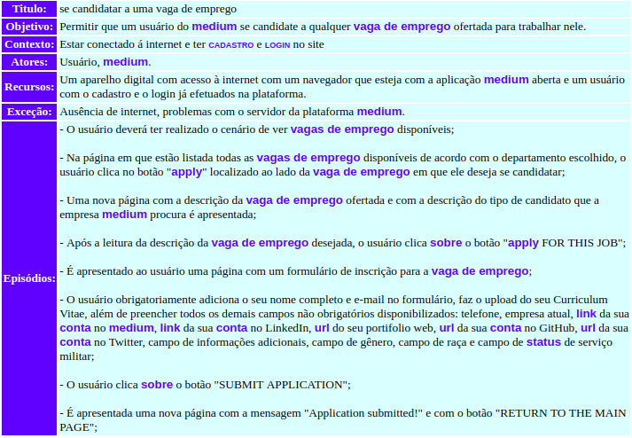

#### Cadastro

**Responsável**: William Elias

**Cadastro - V1.0**

**Cadastro - V2.0**

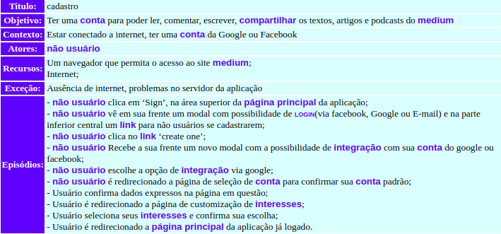

**Cadastro - V3.0**

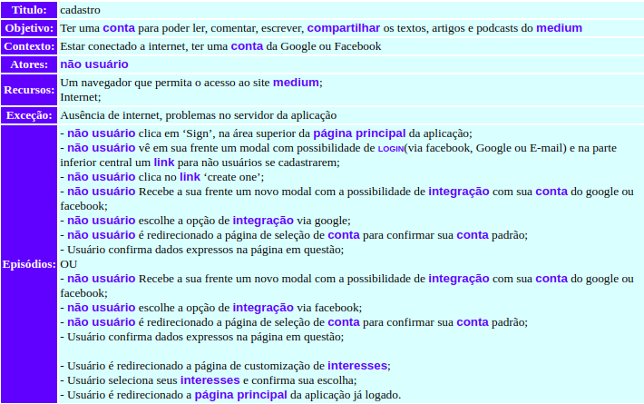

| Rastro | Origem |
| ------- | ------- |
|Rastro| Storytelling - cadastro e login |

***

#### Login

**Responsável**: William Elias

**Login - V1.0**

**Login - V2.0**

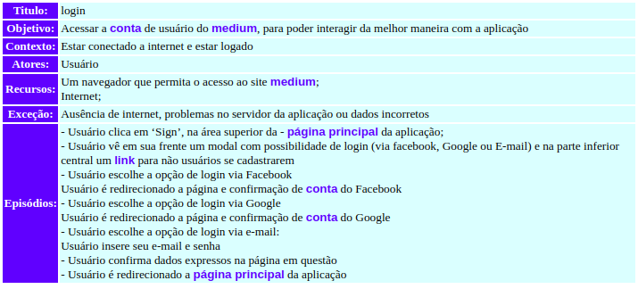

| Rastro | Origem |
| ------- | ------- |
|Rastro| Storytelling - cadastro e login |

***

#### Comentar publicação

**Responsável**: William Elias

**comentar publicação - V1.0**

| Rastro | Origem |
| ------- | ------- |
|Rastro| Brainstorming 2 |

***

#### Customizar interesses

**Responsável**: William Elias

**Customizar interesses - V1.0**

**Customizar interesses - V2.0**

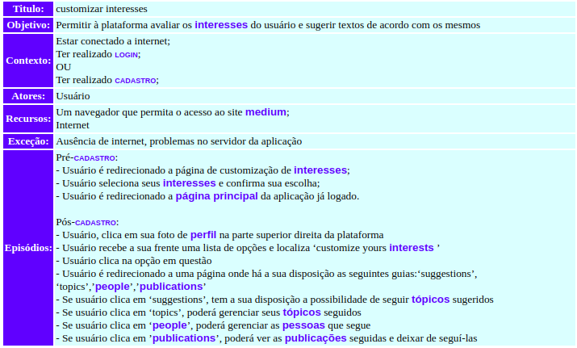

| Rastro | Origem |
| ------- | ------- |
|Rastro| Storybord - customização de interesses|

***

#### Configurar notificações de e-mail

**Responsável**: William Elias

**Configurar notificações de e-mail - V1.0**

**Configurar notificações de e-mail - V2.0**

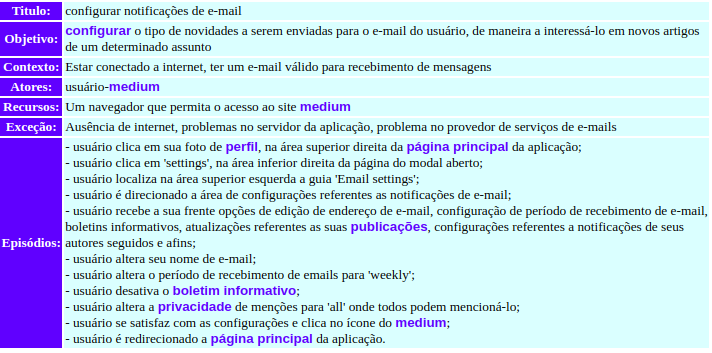

| Rastro | Origem |
| ------- | ------- |
|Rastro| Storytelling - Usuário, Configurando a aplicação|

***

#### Criar nova Série

**Responsável**: Pedro Rodrigues

**Criar nova Série - V1.0**

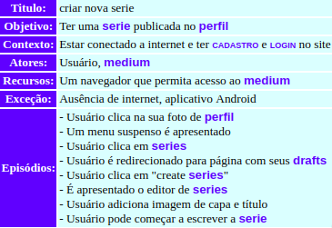

### Criar um novo Storie

**Responsável**: Pedro Rodrigues

**Criar um novo storie - V1.0**

**Criar um novo storie - V2.0**

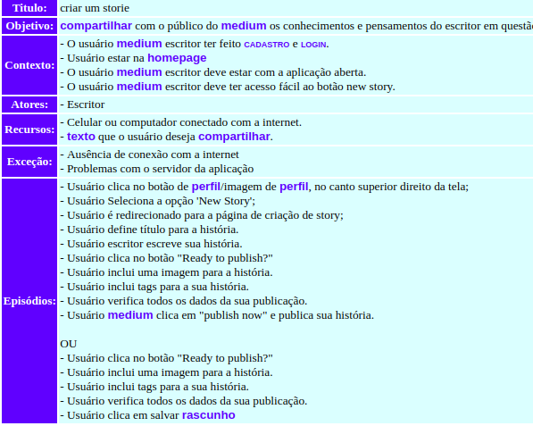

| Rastro | Origem |
| ------- | ------- |
|Rastro| Storytelling - New story|

***

### Criar um novo Bookmark

**Responsável**: Pedro Rodrigues

**Criar um novo bookmark - V1.0**

**Criar um novo bookmark - V2.0**

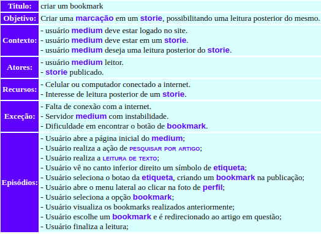

| Rastro | Origem |
| ------- | ------- |
|Rastro| StoryBoard - Bookmark|

***

### Criar uma resposta

**Responsável**: Aline Laureano

**Criar uma resposta - V1.0**

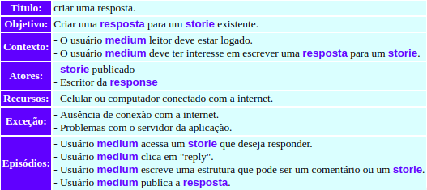

| Rastro | Origem |
| ------- | ------- |
|Rastro| Storytelling - Extras do Medium|

### Importar um storie

**Responsável**: Pedro Rodrigues

**Importar um storie - V1.0**

**Importar um storie - V2.0**

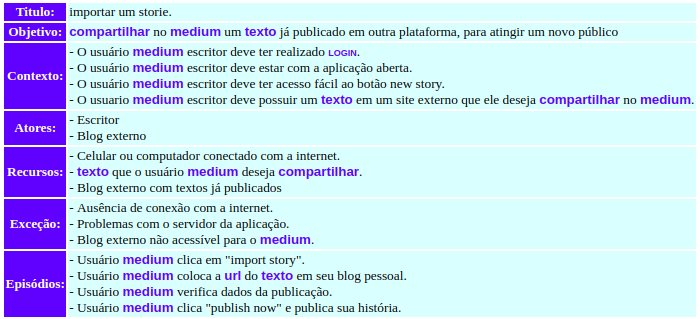

| Rastro | Origem |
| ------- | ------- |
|Rastro| Richpicture - Import Story|

***

### Responder um storie

**Responsável**: Pedro Rodrigues

**Responder um storie - V1.0**

| Rastro | Origem |
| ------- | ------- |
|Rastro| Richpicture - New Story|

***

### Seguir usuário

**Responsável**: Gabriel Filipe

**Seguir Usuário - V1.0**

**Seguir Usuário - V2.0**

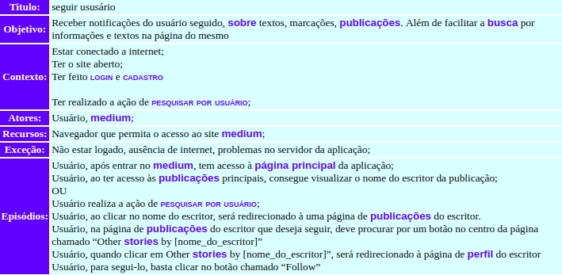

| Rastro | Origem |
| ------- | ------- |
|Rastro| Richpicture - Ponto de vista do Leitor|

***

### Deixar de seguir usuário

**Responsável**: Gabriel Filipe

**Deixar de seguir usuário - V1.0**

**Deixar de seguir usuário - V2.0**

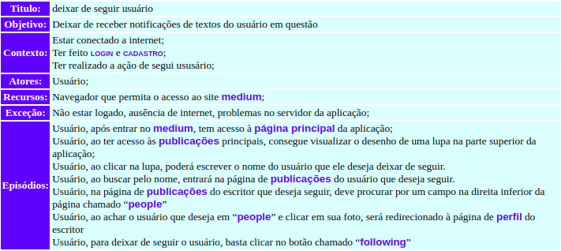

| Rastro | Origem |
| ------- | ------- |
|Rastro| Richpicture - Ponto de vista do Leitor|

***

### Excluir conta

**Responsável**: Luis Claudio T. Lima

**Excluir conta - V1.0**

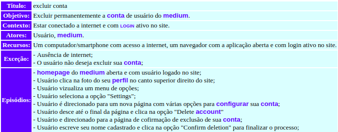

| Rastro | Origem |
| ------- | ------- |
|Rastro| Storytelling - Usuário, Configurando a aplicação|

### Pesquisa por usuário

**Responsável**: Gabriel Filipe

**Pesquisa por usuário - V1.0**

**Pesquisa por usuário - V2.0**

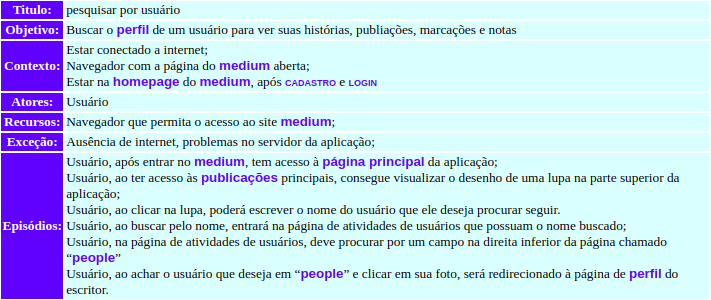

| Rastro | Origem |
| ------- | ------- |
|Rastro| Richpicture - Ponto de vista do Leitor|

***

### Pesquisa por artigo

**Responsável**: Gabriel Filipe

**Pesquisa por artigo - V1.0**

| Rastro | Origem |
| ------- | ------- |
|Rastro| Richpicture - Ponto de vista do Leitor|

***

### Ver vagas de emprego disponíveis

**Responsável**: Aline Laureano

**Ver vagas de emprego disponíveis - V1.0**

| Rastro | Origem |
| ------- | ------- |
|Rastro| Storytelling - Extras do Medium|

***
