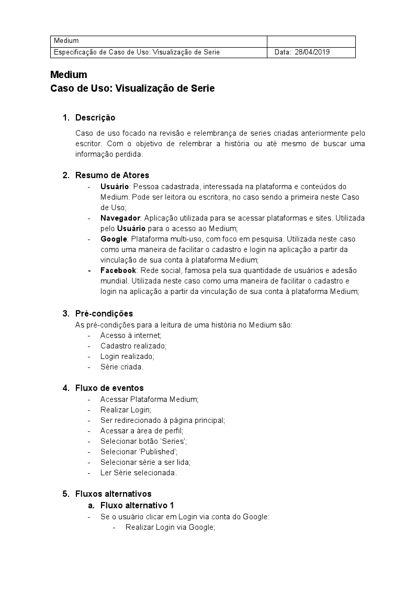
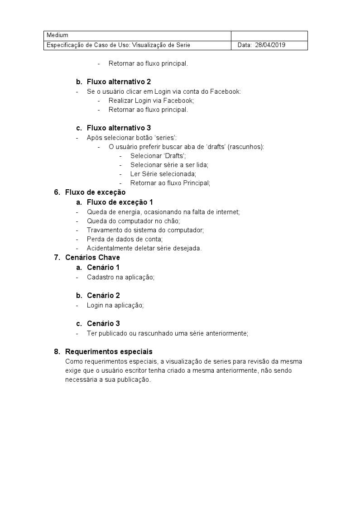

## Versionamento de edições
| Data           | autor                | Descrição                           |Versão|
|----------------|----------------------|-------------------------------------|------|
|   28/04/2019   | William Elias Alves  | Criação da página | 0.1  |
|   28/04/2019   | William Elias Alves  | Inserção das especificações| 0.2  |

#Definição

Com o auxílio do desenvolvimento de cenários, ficou possível obter uma visão mais clara a respeito da concepção de casos de uso. Os casos de uso facilitam na obtenção de uma visão geral a respeito de dada funcionalidade de uma aplicação e poderá ser usada beneficamente por desenvolvedores, pois ela contém aspectos relevantes referentes a relacionamentos entre entidades.

***
#Especificações
***

#### Área comum(william elias alves)

**UC01-Efetuar Cadastro**

|||
|---|---|
|**Descrição**| Funcionalidade responsável por realizar cadastro na aplicação.|
|**Atores**|Visitante e Usuário|
|**Pré-condições**|Visitante deve estar conectado à internet|
|**Pós-condições**|Visitante se tornará Usuário Usuário estará logado na aplicação  Usuário terá acesso às funcionalidades da aplicação|
|**Fluxo principal**|** [FP01] Este fluxo se inicia quando o usuário deseja realizar o cadastro na    aplicação:**  1-Visitante clica em 'Sign in'  2-Visitante clica em 'create one' 3-Visitante escolhe entre as opções de integração via redes sociais  4-Visitante escolhe tópicos de interesse  5-Visitante é redirecionada a página principal da aplicação já logado|
|**Fluxo alternativo**|** [FA01] Possibilidade de integração via E-mail:** No passo 3 do fluxo   principal, há a opção de login via E-mail|
|**Fluxo de exceção**|** [FE01] Verificação de conexão à internet** No passo 3 há a verificação de  conexão com a internet  ** [FE02] Erro no serviço de integração de contas** No passo 3, a integração com as redes sociais deve retornar status 200 |

***

**UC02-Efetuar Login**

|||
|---|---|
|**Descrição**| Funcionalidade responsável por realizar login na aplicação.|
|**Atores**|Usuário|
|**Pré-condições**|Usuário deve estar conectado à internet Usuário deve ter um cadastro ativo|
|**Pós-condições**|Usuário estará logado na aplicação  Usuário terá acesso às funcionalidades da aplicação|
|**Fluxo principal**|** [FP01] Este fluxo se inicia quando o usuário deseja realizar o login na    aplicação:**  1-Usuário clica em 'Sign in'  2-Usuário escolhe entre as opções de integração via redes sociais  3-Usuário é redirecionada a página principal da aplicação já logado|
|**Fluxo alternativo**|** [FA01] Possibilidade de integração via E-mail:** No passo 2 do fluxo   principal, há a opção de login via E-mail|
|**Fluxo de exceção**|** [FE01] Verificação de conexão à internet** No passo 2 há a verificação de  conexão com a internet  ** [FE02] Erro no serviço de integração de contas** No passo 2, a integração com as redes sociais deve retornar status 200 |

***

**UC03-Pesquisar artigo**

|||
|---|---|
|**Descrição**| Funcionalidade responsável por realizar pesquisa de artigos na plataforma Medium.|
|**Atores**|Visitante e Usuário|
|**Pré-condições**|Usuário/Visitante deve estar conectado à internet|
|**Pós-condições**|Usuário/Visitante recebera um artigo para leitura
|**Fluxo principal**|** [FP01] Este fluxo se inicia quando o usuário pesquisar um artigo na  aplicação**  1-Usuário/Visitante clica no ícone da lupa 2-Usuário/Visitante insere o termo a ser pesquisado  3-Usuário/Visitante recebe como resultado um ou mais artigos para leitura|
|**Fluxo alternativo**|** [FA01] Selecionar podcast:** No passo 3 do fluxo   principal, há a opção de selecionar um podcast a ser escutado|
|**Fluxo de exceção**|** [FE01] Verificação de conexão à internet** No passo 2 há a verificação de  conexão com a internet  ** [FE02] Nenhum resultado** No passo 3, pode haver um erro de digitação ou a não existência de artigos/podcasts para o termo inserido|

***

**UC04-Escutar podcast**

|||
|---|---|
|**Descrição**| Funcionalidade responsável pela possibilidade de escutar um podcast.|
|**Atores**|Visitante e Usuário|
|**Pré-condições**|Usuário/Visitante deve estar conectado à internet|
|**Pós-condições**|Usuário/Visitante recebera terá escutado um podcast
|**Fluxo principal**|** [FP01] Este fluxo se inicia quando o usuário seleciona um podcast a ouvir**  1-Usuário/Visitante clica no podcast escolhido 2-Usuário/Visitante visualiza um reprodutor de mídia 3-Usuário/visitante clica em reproduzir|
|**Fluxo alternativo**|** [FA01] Voltar para página principal:** No passo 2 o usuário pode retornar a página principal da aplicação para selecionar outro podcast|
|**Fluxo de exceção**|** [FE01] Verificação de conexão à internet** No passo 2 há a verificação de  conexão com a internet  ** [FE02] Reprodutor com problemas** No passo 3, pode haver um erro de no reprodutor usado pela plataforma|

***

**UC05-Ler artigo**

|||
|---|---|
|**Descrição**| Funcionalidade responsável por possibilitar a leitura de um artigona plataforma Medium.|
|**Atores**|Visitante e Usuário|
|**Pré-condições**|Usuário/Visitante deve estar conectado à internet|
|**Pós-condições**|Usuário/Visitante terá lido um artigo 
|**Fluxo principal**|** [FP01] Este fluxo se inicia quando o usuário selecionar um artigo para   leitura**  1-Usuário/Visitante clica no artigo escolhido 2-Usuário/Visitante visualiza a página com conteúdo do artigo|
|**Fluxo de exceção**|** [FE01] Verificação de conexão à internet** No passo 2 há a verificação de  conexão com a internet|

***

**UC06-Visualizar artigos populares**

|||
|---|---|
|**Descrição**| Funcionalidade responsável exibir artigos populares.|
|**Atores**|Visitante e Usuário|
|**Pré-condições**|Usuário/Visitante deve estar conectado à internet|
|**Pós-condições**|Usuário/Visitante visualizará os artigos populares na barra lateral direita da página princiapal da aplicação|
|**Fluxo principal**|** [FP01] Este fluxo se inicia quando o usuário acessa a área principal da  aplicação**  1-Usuário/Visitante clica no ícone do Medium 2-Usuário/Visitante visualiza os artigos populares na lateral direita do site|
|**Fluxo de exceção**|** [FE01] Verificação de conexão à internet** No passo 2 há a verificação de  conexão com a internet|

***

**UC07-Visualizar artigos por categoria**

|||
|---|---|
|**Descrição**| Funcionalidade responsável pela exibição de artigos por categoria.|
|**Atores**|Visitante e Usuário|
|**Pré-condições**|Usuário/Visitante deve estar conectado à internet|
|**Pós-condições**|Usuário/Visitante recebera uma lista de arigos para leitura, dada uma categoria
|**Fluxo principal**|** [FP01] Este fluxo se inicia quando o usuário Acessa a página principal da aplicação** 1-Usuário/Visitante clica no ícone do Medium 2-Usuário/Visitante visualiza a barra de categorias na área superior do site 3-Usuário/Visitante escolhe uma categoria 4-Usuário clica na categoria desejada 5-Usuário visualiza um lista de artigos|
|**Fluxo de exceção**|** [FE01] Verificação de conexão à internet** No passo 2 há a verificação de  conexão com a internet  ** [FE02] Nenhum resultado** No passo 5, pode ser que não exista artigos/podcasts para o termo clicado|

***

**UC08-Acessar área de ajuda**

|||
|---|---|
|**Descrição**| Funcionalidade responsável por exibir a área de ajuda da plataforma Medium.|
|**Atores**|Visitante e Usuário|
|**Pré-condições**|Usuário/Visitante deve estar conectado à internet|
|**Pós-condições**|Usuário/Visitante recebera várias instruções de utilização da plataforma
|**Fluxo principal**|** [FP01] Este fluxo se inicia em qualquer página do site**  1-Usuário/Visitante clica em 'Help' 2-Usuário/Visitante Seleciona o tópico de ajuda desejado  3-Usuário/Visitante recebe instruções sobre dado assunto|
|**Fluxo alternativo**|** [FA01] Acessar pela foto do perfil:** O passo 1 pode ser substituido por acessar a página de ajuda por meio da foto do perfil de usuário|
|**Fluxo de exceção**|** [FE01] Verificação de conexão à internet** No passo 2 há a verificação de  conexão com a internet|

***

**UC09-Editar Perfil**

|||
|---|---|
|**Descrição**| Funcionalidade responsável por possibilitar a edição do perfil de usuário Medium.|
|**Atores**|Usuário|
|**Pré-condições**|Usuário deve estar conectado à internet Usuário deve estar logado|
|**Pós-condições**|Usuário terá editado seus informações básicas|
|**Fluxo principal**|** [FP01] Este fluxo se inicia quando o usuário clica em 'profile'**  1-Usuário clica em sua foto de usuário 2-Usuário clica em 'profile' 3-Usuário clica em edit 'profile'   4-Usuário altera seu nome no campo de texto 5-Usuário clica em sua foto de perfil   6-Usuário seleciona uma foto para o perfil de seu dispositivo 7-Usuário clica em 'save'|
|**Fluxo alternativo**|** [FA01] Cancelar edição:** No passo 7 do fluxo principal, há a opção de cancelar edição|
|**Fluxo de exceção**|** [FE01] Verificação de conexão à internet** No passo 2 há a verificação de  conexão com a internet  ** [FE02] Erro de leitura de imagem** No passo 6, pode haver um erro de na leitura ou corrompimento da imagem 'upada'|

**UC10-Configurar preferências**

|||
|---|---|
|**Descrição**| Funcionalidade responsável por exibir configurações da aplicação na plataforma web.|
|**Atores**|Usuário|
|**Pré-condições**|Usuário deve estar conectado à internet Usuário deve estar logado|
|**Pós-condições**|Usuário terá configurado alguns aspectos da aplicação
|**Fluxo principal**|** [FP01] Este fluxo se inicia quando o usuário clica na foto de seu perfil**  1-Usuário clica em sua foto de perfil 2-Usuário clica em 'settings' 3-Usuário visualiza opções de configurações de e-mail, conexões, conta, membership e seguraça 4-Usuário modifica o que achar necessário|
|**Fluxo de exceção**|** [FE01] Verificação de conexão à internet** No passo 2 há a verificação de  conexão com a internet  **|

**UC11-Tornar-se membership**

|||
|---|---|
|**Descrição**| Funcionalidade responsável por exibir a área de membership.|
|**Atores**|Usuário|
|**Pré-condições**|Usuário deve estar conectado à internet|
|**Pós-condições**|Usuário se tornará membership|
|**Fluxo principal**|** [FP01] Este fluxo se inicia quando o usuário clica em 'upgrade'**  1-Usuário clica no ícone de 'upgrade' 2-Usuário clica em 'get start' 3-Usuário seleciona o plano desejado 4-Usuário seleciona a forma de pagamento 6-Usuário clica em 'start membership'|
|**Fluxo de exceção**|** [FE01] Verificação de conexão à internet** No passo 2 há a verificação de  conexão com a internet|

#### Acesso ao Medium Membership(william elias alves)

**UC01-Selecionar plano**

|||
|---|---|
|**Descrição**| Funcionalidade responsável por possibilitar a seleção de planos.|
|**Atores**|Usuário|
|**Pré-condições**|Usuário deve estar conectado à internet Usuário deve estar logado|
|**Pós-condições**|Usuário terá escolhido um plano de pagamento|
|**Fluxo principal**|** [FP01] Este fluxo se inicia quando o usuário deseja selecionar um plano**  1-Usuário clica no ícone de 'upgrade' 2-Usuário clica em 'get start' 3-Usuário seleciona o plano desejado|
|**Fluxo de exceção**|** [FE01] Verificação de conexão à internet** No passo 3 há a verificação de  conexão com a internet|

***

**UC02-Selecionar $5/Mês**

|||
|---|---|
|**Descrição**| Funcionalidade responsável por possibilitar a seleção do plano mensal.|
|**Atores**|Usuário|
|**Pré-condições**|Usuário deve estar conectado à internet|
|**Pós-condições**|Usuário terá selecionado o plano mensal|
|**Fluxo principal**|** [FP01] Este fluxo se inicia quando o usuário deseja selecionar um plano**  1-Usuário clica na área 'plain' 2-Usuário clica em plano mensal|
|**Fluxo alternativo**|** [FA01] **UC03-Selecionar $50/Ano** **|

***
**UC03-Selecionar $50/Ano**

|||
|---|---|
|**Descrição**| Funcionalidade responsável por possibilitar a seleção do plano anual.|
|**Atores**|Usuário|
|**Pré-condições**|Usuário deve estar conectado à internet|
|**Pós-condições**|Usuário terá selecionado o plano mensal|
|**Fluxo principal**|** [FP01] Este fluxo se inicia quando o usuário deseja selecionar um plano**  1-Usuário clica na área 'plain' 2-Usuário clica em plano anual|
|**Fluxo alternativo**|** [FA01] **UC02-Selecionar $5/Mês** **|

***

**UC04-Selecionar Método de pagamento**

|||
|---|---|
|**Descrição**| Funcionalidade responsável por possibilitar a seleção do método de pagamento.|
|**Atores**|Usuário|
|**Pré-condições**|Usuário deve estar conectado à internet|
|**Pós-condições**|Usuário terá selecionado o método de pagamento|
|**Fluxo principal**|** [FP01] Este fluxo se inicia quando o usuário deseja selecionar um método de pagamento**  1-Usuário clica na área 'payment' 2-Usuário clica em 'credit card'|
|**Fluxo alternativo**|** [FA01] **UC05-Pagar via PayPal**|

***

**UC05-Pagar via PayPal**

|||
|---|---|
|**Descrição**| Funcionalidade responsável por possibilitar a seleção do método de pagamento como PayPal.|
|**Atores**|Usuário|
|**Pré-condições**|Usuário deve estar conectado à internet|
|**Pós-condições**|Usuário terá selecionado o método de pagamento|
|**Fluxo principal**|** [FP01] Este fluxo se inicia quando o usuário deseja selecionar o método de pagamento como Paypal** 1-Usuário clica em 'Payments'  2-Usuário clica em PayPal 3-Usuário visualiza um modal de inserção de dados do PayPal 4-Usuário insere seus dados de login no PayPal|
|**Fluxo alternativo**|** [FA01] **UC06-Pagar via cartão de crédito**|
|**Fluxo de exceção**|** [FE01] Dados PaylPal inválidos** No passo 4 pode haver inconsistência nos dados inseridos o que impossibilita a execução dos próximos passos|

***

**UC06-Pagar via cartão de crédito**

|||
|---|---|
|**Descrição**| Funcionalidade responsável disponibilizar o método de pagamento como Cartão de crédito.|
|**Atores**|Usuário|
|**Pré-condições**|Usuário deve estar conectado à internet|
|**Pós-condições**|Usuário terá escolhido o método de pagamento como cartão de crédito|
|**Fluxo principal**|** [FP01]O fluxo se inicia quando o usuário deseja selecionar o método de pagamento como Cartão de crédito** 1-Usuário insere o número do cartão 2-Usuário insere a data de expiração do cartão 3-Usuário insere o código de segurança do cartão||
|**Fluxo alternativo**|** [FA01] UC05-Pagar via PayPal**|
|**Fluxo de exceção**|** [FE01] Dados do cartão de crédito inválidos** No passo 1,2 e 3 pode haver inconsistência nos dados inseridos o que impossibilita a execução dos próximos passos|

***

**UC07-Acessar área de membro vip**

|||
|---|---|
|**Descrição**| Funcionalidade responsável disponibilizar o método de pagamento como Cartão de crédito.|
|**Atores**|Usuário|
|**Pré-condições**|Usuário deve estar conectado à internet|
|**Pós-condições**|Usuário visualizará a área de membership|
|**Fluxo principal**|** [FP01]O fluxo se inicia quando o usuário deseja acessar a área de membership** 1-Usuário clica em 'access'|

***

#### Series (Matheus Blanco)

**Versão 1.0**

**Versão 2.0**

**UC01-Acessar menu lateral**

|||
|---|---|
|**Descrição**| Funcionalidade responsável por disponibilizar um DropDown de opções para o usuário.|
|**Atores**|Usuário|
|**Pré-condições**|Usuário deve estar logado|
|**Pós-condições**|Usuário visualizará as opções |
|**Fluxo principal**|**[FP01] O fluxo se inicia quando o usuário deseja acessar o menu lateral** 1-Usuário clica no ícone de perfil|

***

**UC02-Visualizar Series**

|||
|---|---|
|**Descrição**| Funcionalidade responsável por disponibilizar uma página que mostra as series criadas como rascunho ou publicadas.|
|**Atores**|Usuário|
|**Pré-condições**|Usuário deve possuir rascunhos e/ou series publicados|
|**Pós-condições**|Usuário poderá criar series, publicar rascunhos ou visualizar os publicados |
|**Fluxo principal**|**[FP01] O fluxo se inicia quando o usuário acessa a página de Series** 1-Usuário clica no botão series no menu lateral;  2-Usuário visualiza rascunhos criados.|
|**Fluxo alternativo**|**[FA01] UC04 - Visualizar published**;  **[FA02] UC05 - Criar series**|

***

**UC03-Visualizar Drafts**

|||
|---|---|
|**Descrição**| Funcionalidade responsável por permitir que o usuário acesse e reveja os rascunhos de series criados anteriormente.|
|**Atores**|Usuário|
|**Pré-condições**|Usuário deve ter acessado a página de series e ter rascunhos salvos|
|**Pós-condições**|Usuário visualizará as opções |
|**Fluxo principal**|**[FP01] O fluxo se inicia quando o usuário deseja abrir as series rascunhadas** 1-Usuário seleciona uma serie criada  2-Usuário lê a serie criada|
|**Fluxo alternativo**|**[FA01] UC08 - Editar rascunho**|

***

**UC04-Visualizar Published**

|||
|---|---|
|**Descrição**| Funcionalidade responsável por permitir que o usuário acesse e reveja as series publicadas anteriormente.|
|**Atores**|Usuário|
|**Pré-condições**|Usuário deve ter acessado a página de series e series publicadas|
|**Pós-condições**|Usuário visualizará as opções de series publicadas |
|**Fluxo principal**|**[FP01] O fluxo se inicia quando o usuário deseja abrir as series publicadas** 1-Usuário seleciona uma serie publicada  2-Usuário lê a serie criada|

***

**UC05-Criar series**

|||
|---|---|
|**Descrição**| Funcionalidade responsável por permitir que o usuário crie uma nova serie.|
|**Atores**|Usuário|
|**Pré-condições**|Usuário deve ter acessado a página de series|
|**Pós-condições**|Usuário poderá rascunhar e publicar a história criada |
|**Fluxo principal**|** [FP01] O fluxo se inicia quando o usuário deseja criar uma nova serie** 1-Usuário aperta o botão de Create Series** 2-Usuário cria a serie, incluindo texto, imagens|
|**Fluxo alternativo**|**[FA01] UC07 - Publicar serie** **[FA02] UC06 - enviar previa para app de celular**|

***

**UC06-Enviar previa para celular**

|||
|---|---|
|**Descrição**| Funcionalidade responsável por permitir que o usuário envie a prévia do rascunho para ser visualizada no aplicativo de celular.|
|**Atores**|Usuário|
|**Pré-condições**|Usuário deve ter criado e salvo o rascunho de uma serie|
|**Pós-condições**|Usuário poderá visualizar a serie no celular|
|**Fluxo principal**|**[FP01] O fluxo se inicia quando o usuário deseja mandar a serie para o aplicativo de celular** 1-Usuário aperta o botão de Send preview to phone 2-Usuário visualiza serie no celular|

***

**UC07-Publicar serie**

|||
|---|---|
|**Descrição**| Funcionalidade responsável por permitir que o usuário publique sua serie.|
|**Atores**|Usuário|
|**Pré-condições**|Usuário deve ter criado e salvo o rascunho de uma serie|
|**Pós-condições**|Usuário poderá visualizar a serie publicada|
|**Fluxo principal**|**[FP01] O fluxo se inicia quando o usuário deseja publicar a serie para que outros usuários a vejam** 1-Usuário aperta o botão de publicar 2-Usuário visualiza a serie publicada no computador|

***

**UC08-Editar rascunho**

|||
|---|---|
|**Descrição**| Funcionalidade responsável por permitir que o usuário faça edições no rascunho criado.|
|**Atores**|Usuário|
|**Pré-condições**|Usuário deve ter criado e salvo o rascunho de uma serie|
|**Pós-condições**|Usuário poderá melhorar o rascunho e posteriormente, publicá-lo|
|**Fluxo principal**|**[FP01] O fluxo se inicia quando o usuário deseja editar o rascunho criado** 1-Usuário visualiza a página com os rascunhos 2-Usuário seleciona um rascunho a ser editado 3-Usuário edita o rascunho 4-Usuário pode sair da página recente para salvar o rascunho recém editado.|

***

**Rastro:**

||
|--|
|Caso de Uso retirado do Léxico 'Series'|