## Versionamento de edições
| Data           | autor                | Descrição                           |Versão|
|----------------|----------------------|-------------------------------------|------|
|   27/05/2019   | William Elias Alves  | Adição dos I* de publicações| 0.1  |
|   27/05/2019   | Matheus Blanco  | Adição dos I* de stories e definição e objetivos e resultados| 0.2  |
|   28/05/2019   | Pedro Rodrigues | Adição dos I* de customizar interesses | 0.3  |

## Definição

O framework I* é um meio emergente de modelagem de requisitos não-funcionais orientado a agente e centrada na condução das características intencionais deles. Estes, os agentes, atribuem propriedades intecionais, tais quais metas, crenças, habilidades, compromissos, entre si. Também atribuem entre si dependências, as quais podem gerar tanto oportunidades quanto vulnerabilidades. Essas alternativas são usadas para avaliar o posicionamento do agente num contexto social.

## Objetivo

O framework se baseia numa abordagem orientada a metas, de maneira que as mesma capturam os objetivos que o sistema se propôe a atingir. Esta captura de metas ocorre em diferentes níveis de abstração do framework.

## Resultados

Foram modelados I*s nos modelos SD e SR com os seguintes enfoques:

* Stories;
* Pesquisa;
* Publicações;
* Customização de interesses;
* Perfil;

***
### Tabela de descrição dos I*s##

Para conseguirmos organizar as categorias de requisitos para os moldes I* e relacionáveis ao software MEDIUM fora criada uma tabela relacionando categorias de atores, hardgoals, softgoals, tarefas, recursos e dependências.

(espaço para a tabela aqui)

#### Publicações

**Responsável:** William Elias Alves

**Modelo SD**

Versão 1.0

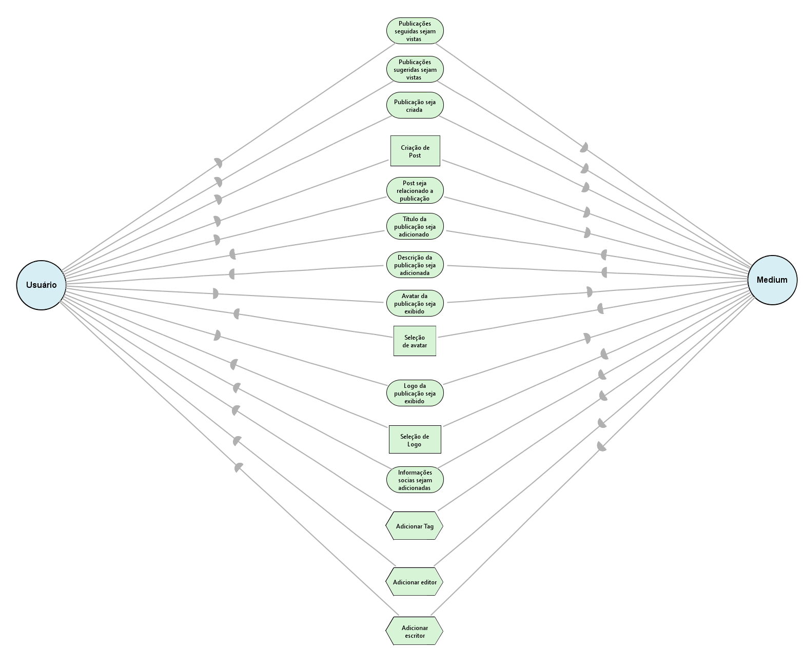

Versão 2.0

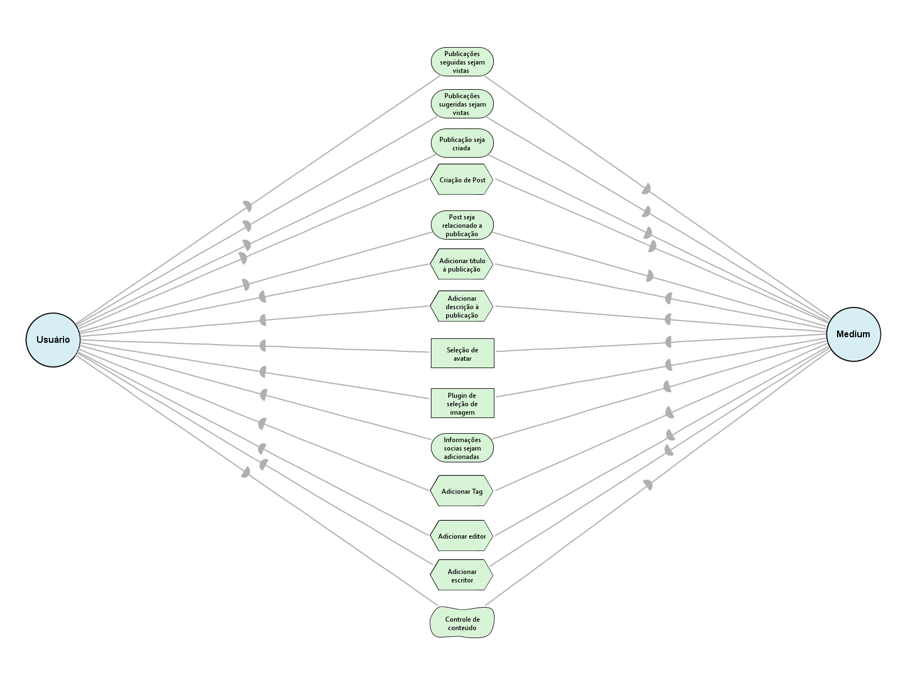

***

**Modelo SR-Usuário**

Versão 1.0

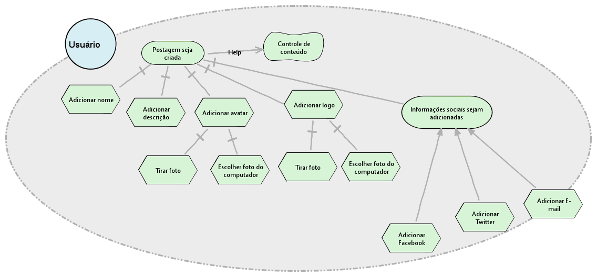

Versão 2.0

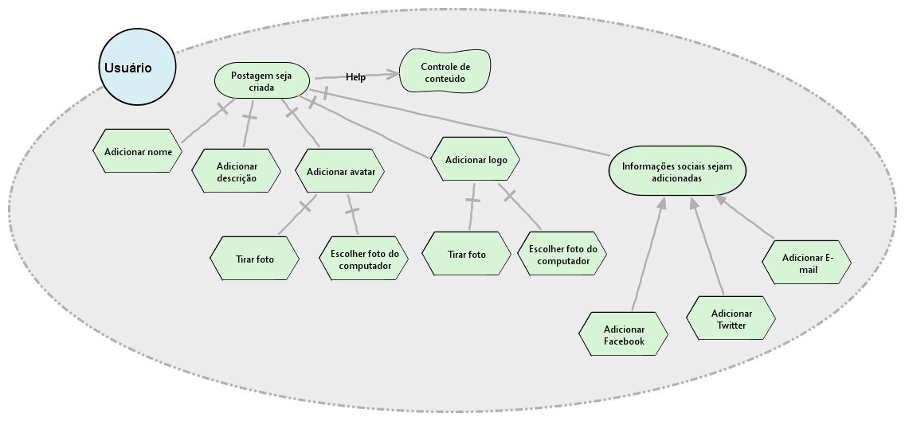

***

**Modelo SR-Medium**

Versão 1.0

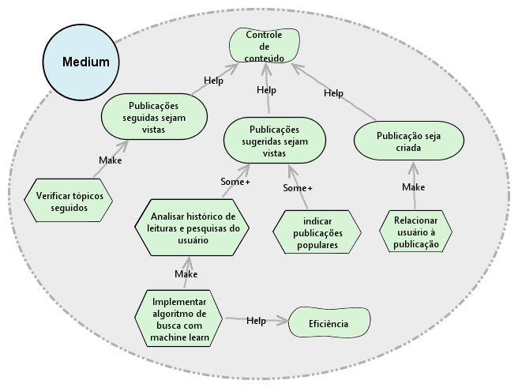

#### Stories

**Responsável:** Matheus Blanco

**Modelo SD**

Versão 1.0

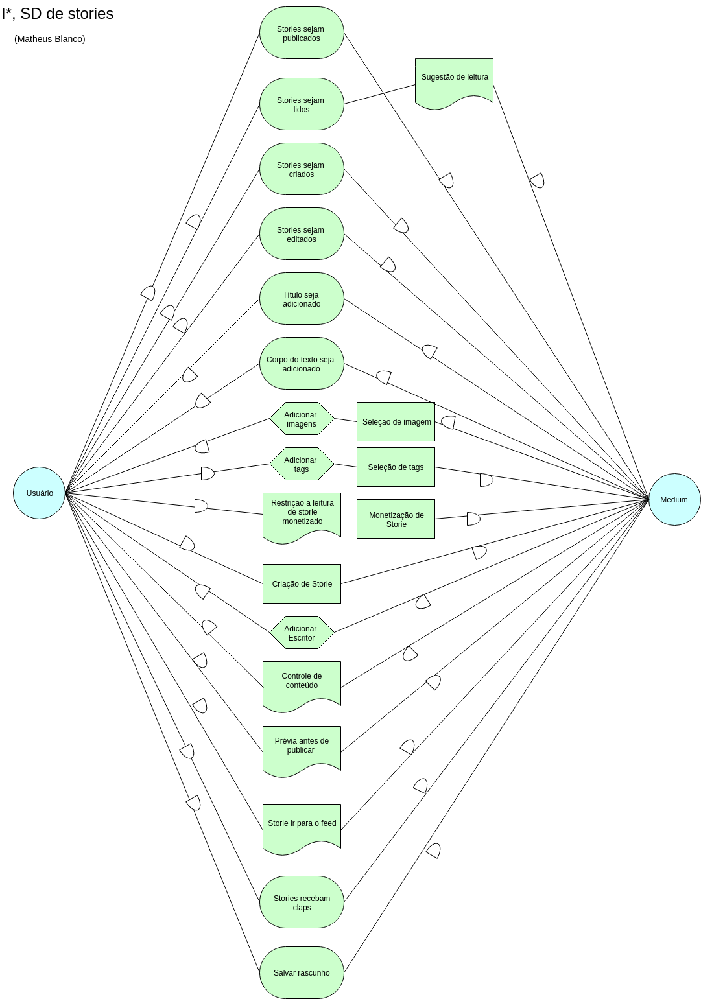

Versão 2.0

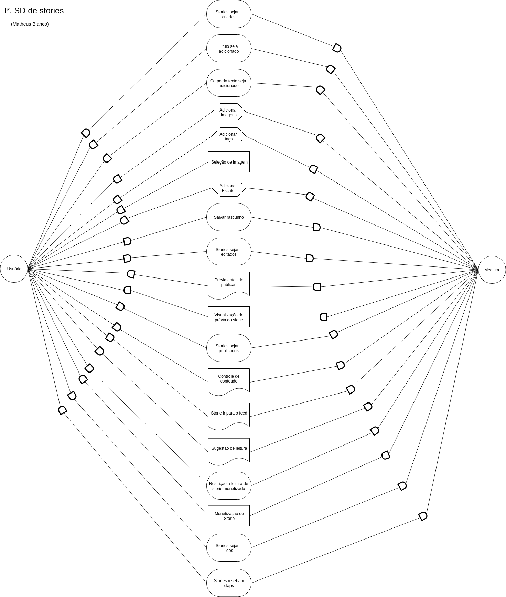

***

**Modelo SR**

Versão 1.0

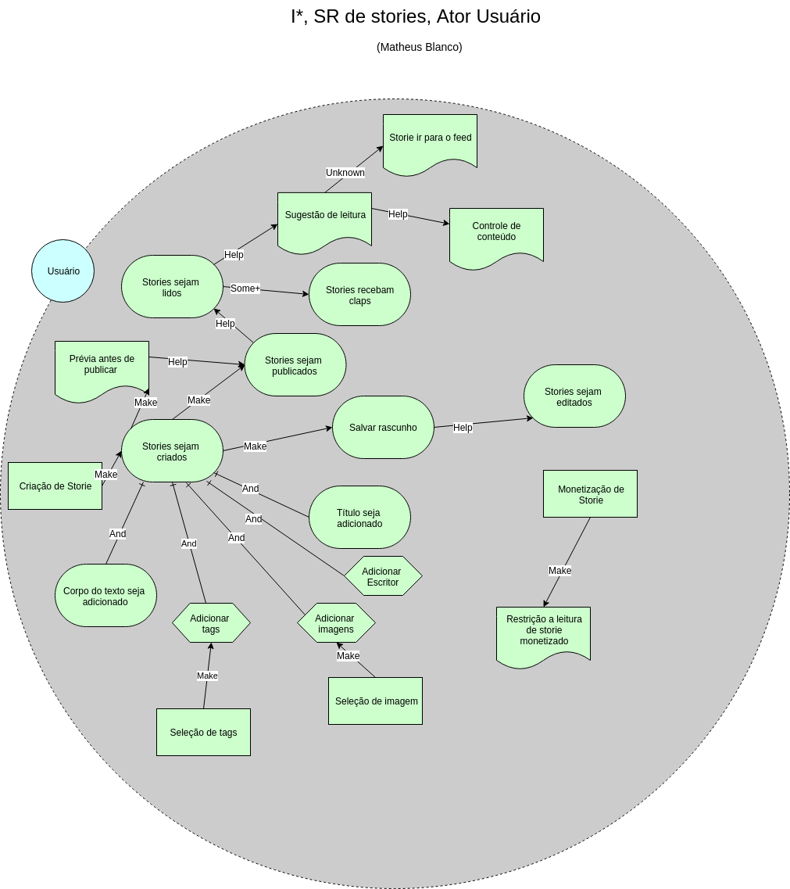

Versão 2.0

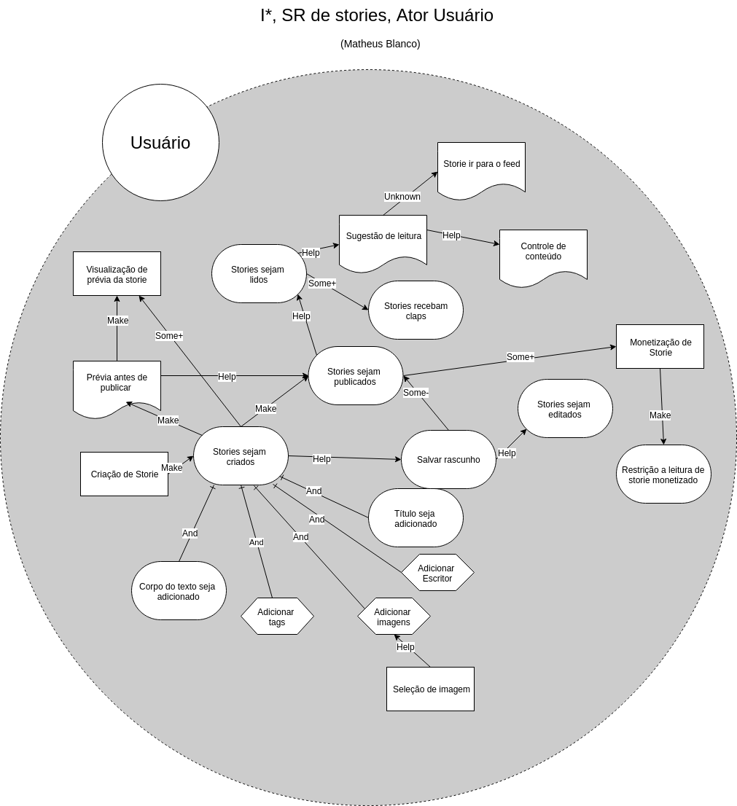

***

#### Customizar interesses

**Responsável:** Pedro Rodrigues

**Modelo SD**

Versão 1.0

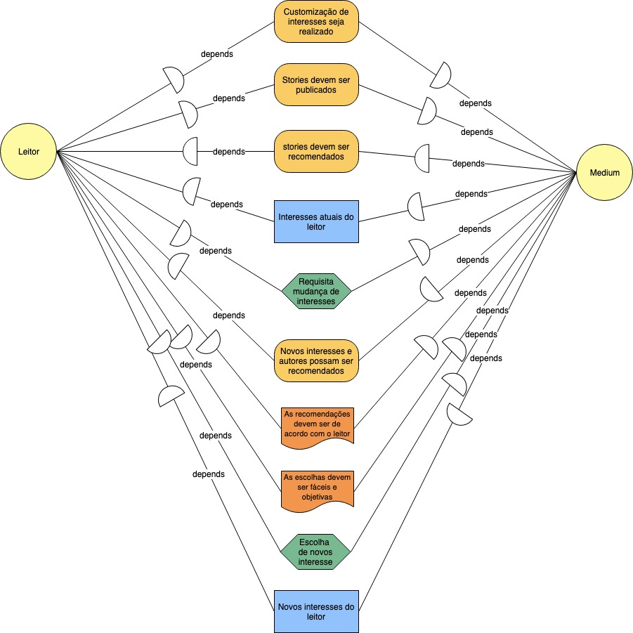

***

**Modelo SR**

Versão 1.0

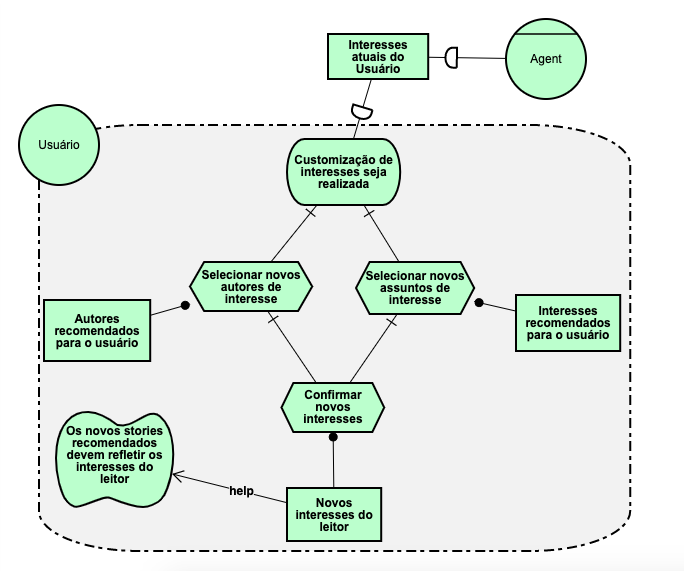

