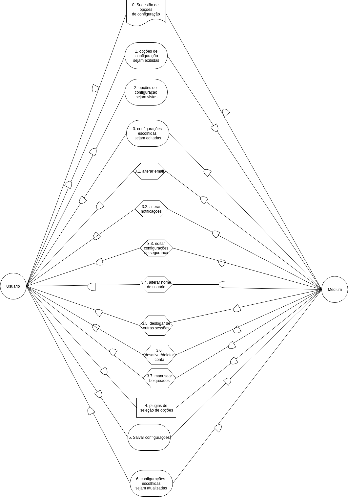
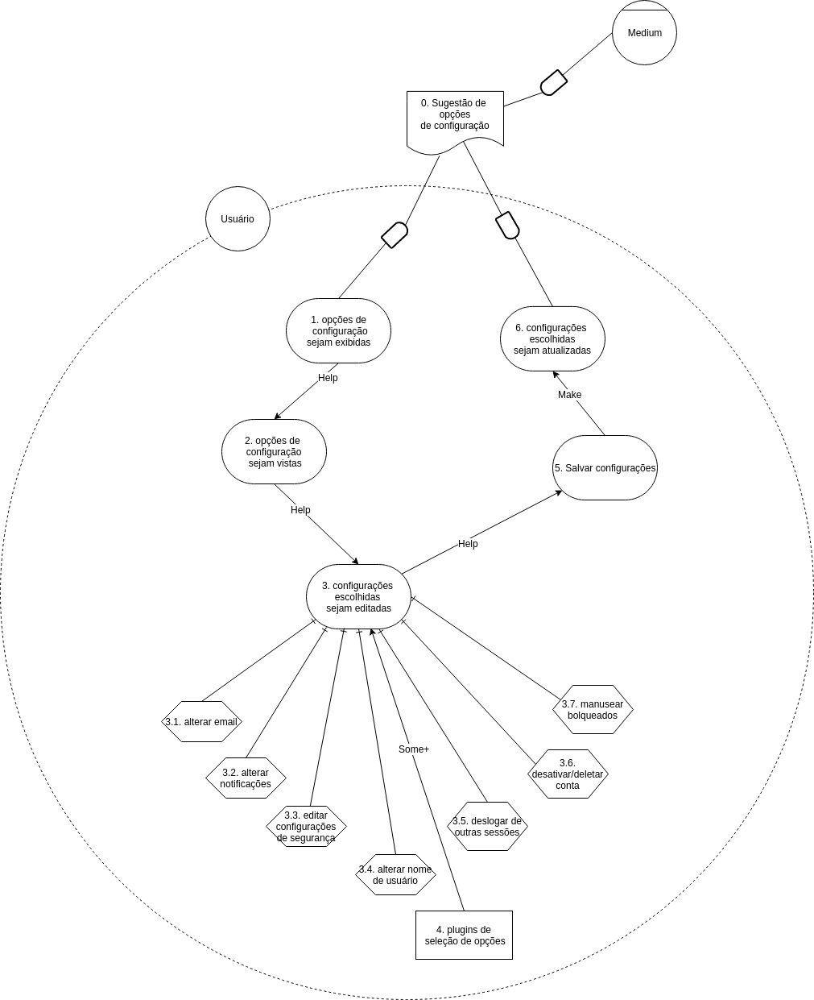

## Versionamento de edições
| Data           | autor                | Descrição                           |Versão|
|----------------|----------------------|-------------------------------------|------|
|   27/05/2019   | William Elias Alves  | Adição dos I* de publicações| 0.1  |
|   27/05/2019   | Matheus Blanco  | Adição dos I* de stories e definição e objetivos e resultados| 0.2  |
|   28/05/2019   | Pedro Rodrigues | Adição dos I* de customizar interesses | 0.3  |
|   29/05/2019   | Aline Laureano | Adição dos I* de Perfil do Usuário | 0.4  |
|   29/05/2019   | Gabriel Filipe  | Adição dos I* de iteroperabilidade | 0.5  |
|   06/05/2019   | Luis Claudio T. Lima  | Adição dos I* de configuração | 0.6  |
| 10/06/2019|Matheus Blanco|Novas versões de I*|0.7|
|21/06/2019|Matheus Blanco|Adição de rastro de Requisitos modelados|0.7|
|21/06/2019|Matheus Blanco| Adição de tabela pré-I* e metodologia|0.8|

## Definição

O framework I* é um meio emergente de modelagem de requisitos não-funcionais orientado a agente e centrada na condução das características intencionais deles. Estes, os agentes, atribuem propriedades intecionais, tais quais metas, crenças, habilidades, compromissos, entre si. Também atribuem entre si dependências, as quais podem gerar tanto oportunidades quanto vulnerabilidades. Essas alternativas são usadas para avaliar o posicionamento do agente num contexto social.

## Objetivo

O framework se baseia numa abordagem orientada a metas, de maneira que as mesma capturam os objetivos que o sistema se propôe a atingir. Esta captura de metas ocorre em diferentes níveis de abstração do framework.

## Resultados

Foram modelados I*s nos modelos SD e SR com os seguintes enfoques:

* Stories;
* Pesquisa;
* Publicações;
* Customização de interesses;
* Perfil;
* Configurações;

***
### Metodologia  e Tabela de descrição dos I*s##

Para conseguirmos organizar as categorias de requisitos para os moldes I Estrela e relacionáveis ao software MEDIUM foi criada uma tabela relacionando categorias de atores, hardgoals, softgoals, tarefas, recursos e dependências. Cada integrante do grupo ficou responsável por pelo menos um tema da tabela e, a partir dele, preencheu os itens pedidos na tabela. Posteriormente, o integrante do grupo criou recebeu a tarefa de criar um modelo I Estrela SD e um modelo I Estrela SR, a partir dos dados obtidos na tabela. A tabela se encontra abaixo:

  <table class="waffle" cellspacing="0" cellpadding="0">
    <tbody>
      <tr style='height:20px;'>
        <th id="0R0" style="height: 20px;" class="row-headers-background">
        </th>
        <td class="s0"></td>
        <td class="s0"></td>
        <td class="s1"></td>
        <td class="s2" colspan="5">Descrições</td>
        <td class="s3" dir="ltr"></td>
        <td class="s3" dir="ltr"></td>
      </tr>
      <tr style='height:20px;'>
        <th id="0R1" style="height: 20px;" class="row-headers-background">
        </th>
        <td class="s4">Responsável</td>
        <td class="s5">Categoria</td>
        <td class="s6">Atores</td>
        <td class="s6">Hardgoals</td>
        <td class="s6">Softgoals</td>
        <td class="s6">Tarefas</td>
        <td class="s6">Recurso</td>
        <td class="s6">Dependências</td>
        <td class="s3" dir="ltr"></td>
        <td class="s3" dir="ltr"></td>
      </tr>
      <tr style='height:20px;'>
        <th id="0R2" style="height: 20px;" class="row-headers-background">
        </th>
        <td class="s7" rowspan="16">Blanco</td>
        <td class="s8" rowspan="16">Stories</td>
        <td class="s1" rowspan="16">Usuário, Medium</td>
        <td class="s1">Stories sejam publicados</td>
        <td class="s1"></td>
        <td class="s1"></td>
        <td class="s1"></td>
        <td class="s1">Usuário D Medium</td>
        <td class="s3" dir="ltr"></td>
        <td class="s9" dir="ltr"></td>
      </tr>
      <tr style='height:20px;'>
        <th id="0R3" style="height: 20px;" class="row-headers-background">
        </th>
        <td class="s10">Stories sejam lidos</td>
        <td class="s10">Sugestão de leitura</td>
        <td class="s10"></td>
        <td class="s10"></td>
        <td class="s10">Usuário D Medium</td>
        <td class="s3" dir="ltr"></td>
        <td></td>
      </tr>
      <tr style='height:20px;'>
        <th id="0R4" style="height: 20px;" class="row-headers-background">
        </th>
        <td class="s1">Stories sejam criados</td>
        <td class="s1"></td>
        <td class="s1"></td>
        <td class="s1"></td>
        <td class="s1">Usuário D Medium</td>
        <td class="s3" dir="ltr"></td>
        <td></td>
      </tr>
      <tr style='height:20px;'>
        <th id="0R5" style="height: 20px;" class="row-headers-background">
        </th>
        <td class="s10">Stories sejam editados</td>
        <td class="s10"></td>
        <td class="s10"></td>
        <td class="s10"></td>
        <td class="s10">Usuário D Medium</td>
        <td class="s3" dir="ltr"></td>
        <td></td>
      </tr>
      <tr style='height:20px;'>
        <th id="0R6" style="height: 20px;" class="row-headers-background">
        </th>
        <td class="s1">Título seja adicionado</td>
        <td class="s1"></td>
        <td class="s1"></td>
        <td class="s1"></td>
        <td class="s1">Medium D Usuário</td>
        <td class="s3" dir="ltr"></td>
        <td></td>
      </tr>
      <tr style='height:20px;'>
        <th id="0R7" style="height: 20px;" class="row-headers-background">
        </th>
        <td class="s10">Corpo do texto seja adicionado</td>
        <td class="s10"></td>
        <td class="s10"></td>
        <td class="s10"></td>
        <td class="s10">Medium D Usuário</td>
        <td class="s3" dir="ltr"></td>
        <td></td>
      </tr>
      <tr style='height:20px;'>
        <th id="0R8" style="height: 20px;" class="row-headers-background">
        </th>
        <td class="s1"></td>
        <td class="s1"></td>
        <td class="s1">Adicionar imagens</td>
        <td class="s1">Seleção de Imagem</td>
        <td class="s1">Medium D Usuário</td>
        <td class="s3" dir="ltr"></td>
        <td></td>
      </tr>
      <tr style='height:20px;'>
        <th id="0R9" style="height: 20px;" class="row-headers-background">
        </th>
        <td class="s10"></td>
        <td class="s10"></td>
        <td class="s10">Adicionar tags</td>
        <td class="s10">Seleção de tags</td>
        <td class="s10">Usuário D Medium</td>
        <td class="s3" dir="ltr"></td>
        <td></td>
      </tr>
      <tr style='height:20px;'>
        <th id="0R10" style="height: 20px;" class="row-headers-background">
        </th>
        <td class="s1"></td>
        <td class="s11">Restrição a leitura de Storie monetizado</td>
        <td class="s1"></td>
        <td class="s1 softmerge">
          
Monetização de storie

        </td>
        <td class="s1">Usuário D Medium</td>
        <td class="s3" dir="ltr"></td>
        <td></td>
      </tr>
      <tr style='height:20px;'>
        <th id="0R11" style="height: 20px;" class="row-headers-background">
        </th>
        <td class="s10"></td>
        <td class="s10"></td>
        <td class="s10"></td>
        <td class="s10">Criação de Storie</td>
        <td class="s10">Usuário D Medium</td>
        <td class="s3" dir="ltr"></td>
        <td></td>
      </tr>
      <tr style='height:20px;'>
        <th id="0R12" style="height: 20px;" class="row-headers-background">
        </th>
        <td class="s1"></td>
        <td class="s1"></td>
        <td class="s1">Adicionar escritor</td>
        <td class="s1"></td>
        <td class="s1">Medium D Usuário</td>
        <td class="s3" dir="ltr"></td>
        <td></td>
      </tr>
      <tr style='height:20px;'>
        <th id="0R13" style="height: 20px;" class="row-headers-background">
        </th>
        <td class="s10"></td>
        <td class="s10">Controle de conteúdo</td>
        <td class="s10"></td>
        <td class="s10"></td>
        <td class="s10">Medium D Usuário</td>
        <td class="s3" dir="ltr"></td>
        <td></td>
      </tr>
      <tr style='height:20px;'>
        <th id="0R14" style="height: 20px;" class="row-headers-background">
        </th>
        <td class="s1"></td>
        <td class="s1">Prévia antes de publicar</td>
        <td class="s1"></td>
        <td class="s1"></td>
        <td class="s1">Usuário D Medium</td>
        <td class="s3" dir="ltr"></td>
        <td></td>
      </tr>
      <tr style='height:20px;'>
        <th id="0R15" style="height: 20px;" class="row-headers-background">
        </th>
        <td class="s10">Stories recebam claps</td>
        <td class="s10"></td>
        <td class="s10"></td>
        <td class="s10"></td>
        <td class="s10">Usuário D Medium</td>
        <td class="s3" dir="ltr"></td>
        <td></td>
      </tr>
      <tr style='height:20px;'>
        <th id="0R16" style="height: 20px;" class="row-headers-background">
        </th>
        <td class="s1"></td>
        <td class="s1">Storie ir para o feed</td>
        <td class="s1"></td>
        <td class="s1"></td>
        <td class="s1">Usuário D Medium</td>
        <td class="s3" dir="ltr"></td>
        <td></td>
      </tr>
      <tr style='height:20px;'>
        <th id="0R17" style="height: 20px;" class="row-headers-background">
        </th>
        <td class="s10">Salvar rascunho</td>
        <td class="s10"></td>
        <td class="s10"></td>
        <td class="s10"></td>
        <td class="s10">Usuário D Medium</td>
        <td class="s3" dir="ltr"></td>
        <td></td>
      </tr>
      <tr style='height:20px;'>
        <th id="0R18" style="height: 20px;" class="row-headers-background">
        </th>
        <td class="s7" rowspan="15">Gabriel</td>
        <td class="s8" rowspan="15">Pesquisa</td>
        <td class="s12" rowspan="15">Usuário, visitante</td>
        <td class="s1">- Lupa de pesquisa seja visível</td>
        <td class="s1"></td>
        <td class="s1"></td>
        <td class="s1"></td>
        <td class="s1">Usuário D Medium</td>
        <td class="s3" dir="ltr"></td>
        <td></td>
      </tr>
      <tr style='height:20px;'>
        <th id="0R19" style="height: 20px;" class="row-headers-background">
        </th>
        <td class="s10">- Barra de pesquisa seja exibida</td>
        <td class="s10"></td>
        <td class="s10"></td>
        <td class="s10"></td>
        <td class="s10">Usuário D Medium</td>
        <td class="s3" dir="ltr"></td>
        <td></td>
      </tr>
      <tr style='height:20px;'>
        <th id="0R20" style="height: 20px;" class="row-headers-background">
        </th>
        <td class="s1">- Mensagem guia de pesquisa seja visível</td>
        <td class="s1"></td>
        <td class="s1"></td>
        <td class="s1"></td>
        <td class="s1">Usuário D Medium</td>
        <td class="s3" dir="ltr"></td>
        <td></td>
      </tr>
      <tr style='height:20px;'>
        <th id="0R21" style="height: 20px;" class="row-headers-background">
        </th>
        <td class="s10"></td>
        <td class="s10"></td>
        <td class="s10">- Escrever Título</td>
        <td class="s10"></td>
        <td class="s10">Medium D Usuário</td>
        <td class="s3" dir="ltr"></td>
        <td></td>
      </tr>
      <tr style='height:20px;'>
        <th id="0R22" style="height: 20px;" class="row-headers-background">
        </th>
        <td class="s11">- Barra de possível resultado de pesquisa seja exibida</td>
        <td class="s11">- Dedução de resultados de pesquisa</td>
        <td class="s1"></td>
        <td class="s1"></td>
        <td class="s1">Usuário D Medium</td>
        <td class="s3" dir="ltr"></td>
        <td></td>
      </tr>
      <tr style='height:20px;'>
        <th id="0R23" style="height: 20px;" class="row-headers-background">
        </th>
        <td class="s10"></td>
        <td class="s10">- Satisfação do usuário</td>
        <td class="s10"></td>
        <td class="s10"></td>
        <td class="s10">Medium D Usuário</td>
        <td class="s3" dir="ltr"></td>
        <td></td>
      </tr>
      <tr style='height:20px;'>
        <th id="0R24" style="height: 20px;" class="row-headers-background">
        </th>
        <td class="s11">- Possíveis usuários associadas ao resultado de pesquisa sejam visíveis</td>
        <td class="s1"></td>
        <td class="s1"></td>
        <td class="s1"></td>
        <td class="s1">Usuário D Medium</td>
        <td class="s3" dir="ltr"></td>
        <td></td>
      </tr>
      <tr style='height:20px;'>
        <th id="0R25" style="height: 20px;" class="row-headers-background">
        </th>
        <td class="s10"></td>
        <td class="s10"></td>
        <td class="s10"></td>
        <td class="s10">- Mais usuários</td>
        <td class="s10">Usuário D Medium</td>
        <td class="s3" dir="ltr"></td>
        <td></td>
      </tr>
      <tr style='height:20px;'>
        <th id="0R26" style="height: 20px;" class="row-headers-background">
        </th>
        <td class="s11">- Possíveis publicações associadas ao resultado de pesquisa sejam visíveis</td>
        <td class="s1"></td>
        <td class="s1"></td>
        <td class="s1"></td>
        <td class="s1">Usuário D Medium</td>
        <td class="s3" dir="ltr"></td>
        <td></td>
      </tr>
      <tr style='height:20px;'>
        <th id="0R27" style="height: 20px;" class="row-headers-background">
        </th>
        <td class="s10"></td>
        <td class="s10"></td>
        <td class="s10"></td>
        <td class="s13">- Mais publicações</td>
        <td class="s10">Usuário D Medium</td>
        <td class="s3" dir="ltr"></td>
        <td></td>
      </tr>
      <tr style='height:20px;'>
        <th id="0R28" style="height: 20px;" class="row-headers-background">
        </th>
        <td class="s11">- Possíveis tags associadas ao resultado de pesquisa sejam visíveis</td>
        <td class="s1"></td>
        <td class="s1"></td>
        <td class="s1"></td>
        <td class="s1">Usuário D Medium</td>
        <td class="s3" dir="ltr"></td>
        <td></td>
      </tr>
      <tr style='height:20px;'>
        <th id="0R29" style="height: 20px;" class="row-headers-background">
        </th>
        <td class="s10"></td>
        <td class="s10"></td>
        <td class="s10">- Pesquisar Título</td>
        <td class="s10"></td>
        <td class="s10">Medium D Usuário</td>
        <td class="s3" dir="ltr"></td>
        <td></td>
      </tr>
      <tr style='height:20px;'>
        <th id="0R30" style="height: 20px;" class="row-headers-background">
        </th>
        <td class="s1"></td>
        <td class="s1"></td>
        <td class="s14">- Redicionar para página de resultados da pesquisa</td>
        <td class="s1"></td>
        <td class="s1">Medium D Usuário</td>
        <td class="s3" dir="ltr"></td>
        <td></td>
      </tr>
      <tr style='height:20px;'>
        <th id="0R31" style="height: 20px;" class="row-headers-background">
        </th>
        <td class="s10">- Resultados de pesquisa sejam exibidos</td>
        <td class="s10"></td>
        <td class="s10"></td>
        <td class="s10"></td>
        <td class="s10">Usuário D Medium</td>
        <td class="s3" dir="ltr"></td>
        <td></td>
      </tr>
      <tr style='height:20px;'>
        <th id="0R32" style="height: 20px;" class="row-headers-background">
        </th>
        <td class="s1"></td>
        <td class="s1">- Controle de conteúdo</td>
        <td class="s1"></td>
        <td class="s1"></td>
        <td class="s1">Usuário D Medium</td>
        <td class="s3" dir="ltr"></td>
        <td></td>
      </tr>
      <tr style='height:20px;'>
        <th id="0R33" style="height: 20px;" class="row-headers-background">
        </th>
        <td class="s8" rowspan="17">William</td>
        <td class="s7" rowspan="17">Publicações</td>
        <td class="s15" rowspan="17">Usuário,Medium</td>
        <td class="s10"></td>
        <td class="s10"></td>
        <td class="s10"></td>
        <td class="s16">- Seleção de avatar </td>
        <td class="s16">-Medium D Usuário   </td>
        <td class="s3" dir="ltr"></td>
        <td></td>
      </tr>
      <tr style='height:20px;'>
        <th id="0R34" style="height: 20px;" class="row-headers-background">
        </th>
        <td class="s11"></td>
        <td class="s1"></td>
        <td class="s1"></td>
        <td class="s17">- Seleção de logo</td>
        <td class="s1">-Medium D Usuário</td>
        <td class="s3" dir="ltr"></td>
        <td class="s18"></td>
      </tr>
      <tr style='height:20px;'>
        <th id="0R35" style="height: 20px;" class="row-headers-background">
        </th>
        <td class="s10"></td>
        <td class="s10"></td>
        <td class="s10"></td>
        <td class="s16">- Criação de Post</td>
        <td class="s10">-Medium D Usuário</td>
        <td class="s19" dir="ltr"></td>
        <td class="s1"></td>
      </tr>
      <tr style='height:20px;'>
        <th id="0R36" style="height: 20px;" class="row-headers-background">
        </th>
        <td class="s11"></td>
        <td class="s11">Restrição a leitura de post monetizado </td>
        <td class="s11"></td>
        <td class="s17 softmerge">
          
- Monetização de Post

        </td>
        <td class="s1">-Usuário D Medium</td>
        <td class="s3" dir="ltr"></td>
        <td></td>
      </tr>
      <tr style='height:20px;'>
        <th id="0R37" style="height: 20px;" class="row-headers-background">
        </th>
        <td class="s10">- Publicações seguidas sejam vistas </td>
        <td class="s10"></td>
        <td class="s10"></td>
        <td class="s16"></td>
        <td class="s16">-Usuário D Medium</td>
        <td class="s3" dir="ltr"></td>
        <td></td>
      </tr>
      <tr style='height:38px;'>
        <th id="0R38" style="height: 38px;" class="row-headers-background">
        </th>
        <td class="s11">- Publicações sugeridas sejam vistas </td>
        <td class="s1">- Sugestão de conteúdo</td>
        <td class="s1"></td>
        <td class="s17"></td>
        <td class="s17">-Usuário D Medium</td>
        <td class="s3" dir="ltr"></td>
        <td></td>
      </tr>
      <tr style='height:20px;'>
        <th id="0R39" style="height: 20px;" class="row-headers-background">
        </th>
        <td class="s10">- Publicação seja criada </td>
        <td class="s10"></td>
        <td class="s10"></td>
        <td class="s16"></td>
        <td class="s16">-Usuário D Medium</td>
        <td class="s3" dir="ltr"></td>
        <td></td>
      </tr>
      <tr style='height:20px;'>
        <th id="0R40" style="height: 20px;" class="row-headers-background">
        </th>
        <td class="s11">- Título da publicação seja adicionado </td>
        <td class="s1"></td>
        <td class="s1"></td>
        <td class="s17"></td>
        <td class="s17">-Medium D Usuário</td>
        <td class="s3" dir="ltr"></td>
        <td></td>
      </tr>
      <tr style='height:20px;'>
        <th id="0R41" style="height: 20px;" class="row-headers-background">
        </th>
        <td class="s20 softmerge">
          
- Descrição da publicação seja adicionada

        </td>
        <td class="s21"></td>
        <td class="s21"></td>
        <td class="s16"></td>
        <td class="s22">-Medium D Usuário</td>
        <td class="s3" dir="ltr"></td>
        <td></td>
      </tr>
      <tr style='height:20px;'>
        <th id="0R42" style="height: 20px;" class="row-headers-background">
        </th>
        <td class="s11">- Avatar da publicação seja exibido </td>
        <td class="s1"></td>
        <td class="s1"></td>
        <td class="s17"></td>
        <td class="s17">-Usuário D Medium</td>
        <td class="s3" dir="ltr"></td>
        <td></td>
      </tr>
      <tr style='height:20px;'>
        <th id="0R43" style="height: 20px;" class="row-headers-background">
        </th>
        <td class="s10">- Logo da publicação seja exibido </td>
        <td class="s10"></td>
        <td class="s10"></td>
        <td class="s16"></td>
        <td class="s16">-Usuário D Medium</td>
        <td class="s3" dir="ltr"></td>
        <td></td>
      </tr>
      <tr style='height:20px;'>
        <th id="0R44" style="height: 20px;" class="row-headers-background">
        </th>
        <td class="s11">- Informações socias sejam adicionadas </td>
        <td class="s1"></td>
        <td class="s1"></td>
        <td class="s17"></td>
        <td class="s17">-Medium D Usuário</td>
        <td class="s3" dir="ltr"></td>
        <td></td>
      </tr>
      <tr style='height:20px;'>
        <th id="0R45" style="height: 20px;" class="row-headers-background">
        </th>
        <td class="s10"></td>
        <td class="s10"></td>
        <td class="s10">- Adicionar Tags</td>
        <td class="s16"></td>
        <td class="s22">-Medium D Usuário</td>
        <td class="s3" dir="ltr"></td>
        <td></td>
      </tr>
      <tr style='height:20px;'>
        <th id="0R46" style="height: 20px;" class="row-headers-background">
        </th>
        <td class="s11"></td>
        <td class="s1"></td>
        <td class="s11">- Adicionar editor</td>
        <td class="s17"></td>
        <td class="s17">-Medium D Usuário</td>
        <td class="s3" dir="ltr"></td>
        <td></td>
      </tr>
      <tr style='height:21px;'>
        <th id="0R47" style="height: 21px;" class="row-headers-background">
        </th>
        <td class="s10"></td>
        <td class="s10"></td>
        <td class="s10">- Adicionar escritor</td>
        <td class="s16"></td>
        <td class="s16">-Medium D Usuário</td>
        <td class="s3" dir="ltr"></td>
        <td></td>
      </tr>
      <tr style='height:18px;'>
        <th id="0R48" style="height: 18px;" class="row-headers-background">
        </th>
        <td class="s11">- Post seja relacionado a publicação</td>
        <td class="s1"></td>
        <td class="s1"></td>
        <td class="s17"></td>
        <td class="s17">-Usuário D Medium</td>
        <td class="s3" dir="ltr"></td>
        <td></td>
      </tr>
      <tr style='height:28px;'>
        <th id="0R49" style="height: 28px;" class="row-headers-background">
        </th>
        <td class="s10"></td>
        <td class="s10">- Controle de conteúdo</td>
        <td class="s10"></td>
        <td class="s16"></td>
        <td class="s16"></td>
        <td class="s3" dir="ltr"></td>
        <td></td>
      </tr>
      <tr style='height:20px;'>
        <th id="0R50" style="height: 20px;" class="row-headers-background">
        </th>
        <td class="s7" rowspan="10">Pedro</td>
        <td class="s23" rowspan="10">Customização de interesses</td>
        <td class="s12" rowspan="10">Usuário, Medium</td>
        <td class="s24 softmerge">
          
 - Customização de interesses seja realizada
          

        </td>
        <td class="s25"></td>
        <td class="s25"></td>
        <td class="s17"></td>
        <td class="s17">-Usuário D Medium</td>
        <td class="s3" dir="ltr"></td>
        <td></td>
      </tr>
      <tr style='height:20px;'>
        <th id="0R51" style="height: 20px;" class="row-headers-background">
        </th>
        <td class="s10"> - Stories devem ser publicados</td>
        <td class="s10"></td>
        <td class="s10"></td>
        <td class="s10"></td>
        <td class="s10">-Usuário D Medium</td>
        <td class="s3" dir="ltr"></td>
        <td></td>
      </tr>
      <tr style='height:26px;'>
        <th id="0R52" style="height: 26px;" class="row-headers-background">
        </th>
        <td class="s1"> - Stories devem ser recomendados</td>
        <td class="s1"></td>
        <td class="s1"></td>
        <td class="s1"></td>
        <td class="s1">-Medium D Usuário</td>
        <td class="s3" dir="ltr"></td>
        <td></td>
      </tr>
      <tr style='height:20px;'>
        <th id="0R53" style="height: 20px;" class="row-headers-background">
        </th>
        <td class="s10"></td>
        <td class="s10"></td>
        <td class="s10"></td>
        <td class="s10 softmerge">
          
Interesses atuais do  leitor

        </td>
        <td class="s10">-Medium D Usuário</td>
        <td class="s3" dir="ltr"></td>
        <td></td>
      </tr>
      <tr style='height:20px;'>
        <th id="0R54" style="height: 20px;" class="row-headers-background">
        </th>
        <td class="s1"></td>
        <td class="s1"></td>
        <td class="s24 softmerge">
          
- Requisita mudança de interesses

        </td>
        <td class="s25"></td>
        <td class="s25">-Usuário D Medium</td>
        <td class="s3" dir="ltr"></td>
        <td></td>
      </tr>
      <tr style='height:20px;'>
        <th id="0R55" style="height: 20px;" class="row-headers-background">
        </th>
        <td class="s20 softmerge">
          
 - Novos interesses e autores devem ser
             recomendados

        </td>
        <td class="s21"></td>
        <td class="s21"></td>
        <td class="s10"></td>
        <td class="s10">-Medium D Usuário</td>
        <td class="s3" dir="ltr"></td>
        <td></td>
      </tr>
      <tr style='height:20px;'>
        <th id="0R56" style="height: 20px;" class="row-headers-background">
        </th>
        <td class="s1"> </td>
        <td class="s24 softmerge">
          
- As recomendações devem ser de
            acordo com o leitor

        </td>
        <td class="s25"></td>
        <td class="s25"></td>
        <td class="s1">-Usuário D Medium</td>
        <td class="s3" dir="ltr"></td>
        <td></td>
      </tr>
      <tr style='height:20px;'>
        <th id="0R57" style="height: 20px;" class="row-headers-background">
        </th>
        <td class="s10"></td>
        <td class="s20 softmerge">
          
- As escolhas devem ser fáceis e objetivas
          

        </td>
        <td class="s21"></td>
        <td class="s21"></td>
        <td class="s10">-Usuário D Medium</td>
        <td class="s3" dir="ltr"></td>
        <td></td>
      </tr>
      <tr style='height:20px;'>
        <th id="0R58" style="height: 20px;" class="row-headers-background">
        </th>
        <td class="s1"></td>
        <td class="s1"></td>
        <td class="s24 softmerge">
          
- Escolha de novos interesses

        </td>
        <td class="s25"></td>
        <td class="s25">-Usuário D Medium</td>
        <td class="s3" dir="ltr"></td>
        <td></td>
      </tr>
      <tr style='height:20px;'>
        <th id="0R59" style="height: 20px;" class="row-headers-background">
        </th>
        <td class="s10"></td>
        <td class="s10"></td>
        <td class="s10"></td>
        <td class="s10 softmerge">
          
Novos interesses do leitor

        </td>
        <td class="s10">-Medium D Usuário</td>
        <td class="s3" dir="ltr"></td>
        <td></td>
      </tr>
      <tr style='height:20px;'>
        <th id="0R60" style="height: 20px;" class="row-headers-background">
        </th>
        <td class="s7" rowspan="9">Aline</td>
        <td class="s8" rowspan="9">Perfil</td>
        <td class="s1" rowspan="9">Usuário e Medium </td>
        <td class="s1">Perfil seja visto</td>
        <td class="s1"></td>
        <td class="s1"></td>
        <td class="s1"></td>
        <td class="s1">-Usuário D Medium</td>
        <td class="s3" dir="ltr"></td>
        <td></td>
      </tr>
      <tr style='height:20px;'>
        <th id="0R61" style="height: 20px;" class="row-headers-background">
        </th>
        <td class="s26">- Transmissão eficiente das informações para o usuário</td>
        <td class="s10"></td>
        <td class="s10"></td>
        <td class="s10"></td>
        <td class="s10">-Usuário D Medium</td>
        <td class="s3" dir="ltr"></td>
        <td></td>
      </tr>
      <tr style='height:20px;'>
        <th id="0R62" style="height: 20px;" class="row-headers-background">
        </th>
        <td class="s1">Perfil seja editado</td>
        <td class="s1"></td>
        <td class="s1"></td>
        <td class="s1"></td>
        <td class="s17">-Medium D Usuário</td>
        <td class="s3" dir="ltr"></td>
        <td></td>
      </tr>
      <tr style='height:20px;'>
        <th id="0R63" style="height: 20px;" class="row-headers-background">
        </th>
        <td class="s10"></td>
        <td class="s10"></td>
        <td class="s10">Adicionar nome</td>
        <td class="s10"></td>
        <td class="s16">-Medium D Usuário</td>
        <td class="s3" dir="ltr"></td>
        <td></td>
      </tr>
      <tr style='height:20px;'>
        <th id="0R64" style="height: 20px;" class="row-headers-background">
        </th>
        <td class="s1"></td>
        <td class="s1"></td>
        <td class="s24 softmerge">
          
Adicionar biografia curta

        </td>
        <td class="s25"></td>
        <td class="s27">-Medium D Usuário</td>
        <td class="s3" dir="ltr"></td>
        <td></td>
      </tr>
      <tr style='height:20px;'>
        <th id="0R65" style="height: 20px;" class="row-headers-background">
        </th>
        <td class="s10"></td>
        <td class="s10"></td>
        <td class="s10">Adicionar foto de perfil</td>
        <td class="s10"></td>
        <td class="s16">-Medium D Usuário</td>
        <td class="s3" dir="ltr"></td>
        <td></td>
      </tr>
      <tr style='height:20px;'>
        <th id="0R66" style="height: 20px;" class="row-headers-background">
        </th>
        <td class="s1"></td>
        <td class="s1"></td>
        <td class="s1"></td>
        <td class="s11">Seleção da foto de perfil</td>
        <td class="s17">-Medium D Usuário</td>
        <td class="s3" dir="ltr"></td>
        <td></td>
      </tr>
      <tr style='height:20px;'>
        <th id="0R67" style="height: 20px;" class="row-headers-background">
        </th>
        <td class="s10">Nome de usuário seja visto</td>
        <td class="s10"></td>
        <td class="s10"></td>
        <td class="s10"></td>
        <td class="s10">-Usuário D Medium</td>
        <td class="s3" dir="ltr"></td>
        <td></td>
      </tr>
      <tr style='height:20px;'>
        <th id="0R68" style="height: 20px;" class="row-headers-background">
        </th>
        <td class="s1"></td>
        <td class="s1"></td>
        <td class="s28">Fazer link do nome do usuário para o perfil do usuário</td>
        <td class="s1"></td>
        <td class="s1">-Usuário D Medium</td>
        <td class="s3" dir="ltr"></td>
        <td></td>
      </tr>
      <tr style='height:20px;'>
        <th id="0R69" style="height: 20px;" class="row-headers-background">
        </th>
        <td class="s29" dir="ltr">Luis</td>
        <td class="s7">Configuraração </td>
        <td class="s10"></td>
        <td class="s10"></td>
        <td class="s10"></td>
        <td class="s10"></td>
        <td class="s10"></td>
        <td class="s10"></td>
        <td class="s3" dir="ltr"></td>
        <td></td>
      </tr>
    </tbody>
  </table>

#### Publicações

**Responsável:** William Elias Alves

**Responsável: William elias**

**Modelo SD**

Versão 1.0

Versão 2.0

***

**Modelo SR-Usuário**

Versão 1.0

Versão 2.0

***

**Modelo SR-Medium**

Versão 1.0

#### Requisitos modelados no artefato
|ID|Nome|
|-|-|
|R005|Visualizar data de publicação dos artigos|
|R010|Criar nova 'serie'|
|R012|Visualizar 'serie'|
|R013|Salvar 'serie' como rascunho|
|R014|Editar 'serie'|
|R015|Deletar 'serie'|
|R016|Deletar status|
|R017|Escrever 'new story'|
|R018|Salvar 'story' como rascunho|
|R019|Visualizar rascunho das 'stories'|
|R020| Visualizar 'stories' publicadas|
|R021|Importar 'story'|
|R022|Editar 'story'|
|R023|Deletar 'story'|
|R024|Aplaudir um texto lido|
|R025|Compartilhar texto lido nas redes sociais|
|R026|Comentar no corpo do texto da 'story'|
|R037|Visualizar comentários da publicação|
|R044| Visualizar 'clap' em 'stories'|
|R048|Criar publicação|
|R049|Visualizar rascunho da publicação|
|R050| Editar publicação|
|R051| Deletar publicação|

#### Stories

**Responsável:** Matheus Blanco

**Modelo SD**

Versão 1.0

Versão 2.0

***

**Modelo SR**

Versão 1.0

Versão 2.0

***

#### Requisitos modelados no artefato
|ID|Nome|
|-|-|
|R017|Escrever 'new story'|
|R018|Salvar 'story' como rascunho|
|R019|Visualizar rascunho das 'stories'|
|R020| Visualizar 'stories' publicadas|
|R021|Importar 'story'|
|R022|Editar 'story'|
|R023|Deletar 'story'|
|R024|Aplaudir um texto lido|
|R026|Comentar no corpo do texto da 'story'|
|R037|Visualizar comentários da publicação|
|R044| Visualizar 'clap' em 'stories'|

#### Customizar interesses

**Responsável:** Pedro Rodrigues

**Modelo SD**

Versão 1.0

Versão 2.0

***

**Modelo SR**

Versão 1.0

Versão 2.0

***

#### Requisitos modelados no artefato
|ID|Nome|
|-|-|
|R009|Controle de Conteúdo|
|R020|Visualizar 'stories' publicadas|
|R031|Selecionar tema de artigos para leitura|
|R052|Selecionar tópicos de interesse|
|R054|Deixar de seguir publicações|
|R058|Selecionar período de sugestão de artigos|
|R059|Desativar sugestão de artigos|
|R062| Ativar/desativar recomendações de stories|

#### Perfil do Usuário

**Responsável:** Aline Laureano

**Modelo SD**

Versão 1.0

Versão 2.0

Versão 3.0

***

**Modelo SR**

*Usuário* -
Versão 1.0

*Medium* -
Versão 1.0

*Usuário e Medium* -
Versão 1.0

Versão 2.0

#### Requisitos modelados no artefato
|ID|Nome|
|-|-|
|R040|Editar informações de perfil|
|R041|Salvar/cancelar edição de perfil|
|R045|Visualizar próprio perfil|

#### Pesquisar conteúdo

**Responsável:** Gabriel Filipe

**Modelo SD**

Versão 1.0

Versão 2.0

**Modelo SR**

Versão 1.0

Versão 2.0

#### Requisitos modelados no artefato
|ID|Nome|
|-|-|
|R004|Pesquisar artigos por nome|
|R028|Seguir escritores|
|R029|Seguir usuários|
|R031|Selecionar tema de artigos para leitura|
|R032|Visualizar textos publicados por um escritor em seu perfil|
|R035|Visualizar perfis de outros usuários|
|R042|Visualizar autores seguidos|
|R052|Selecionar tópicos de interesse|
|R054|Deixar de seguir publicações|

#### Configurações

**Responsável:** Luís Cláudio T. Lima

**Modelo SD**

Versão 1.0

Versão 2.0

**Modelo SR**

Versão 1.0

Versão 2.0

#### Requisitos modelados no artefato
|ID|Nome|
|-|-|
|R006|Política de privacidade|
|R030|Receber notificações dos escritores seguidos|
|R038|Reportar publicação|
|R039|Reportar usuário|
|R058|Selecionar período de sugestão de artigos|
|R059|Desativar sugestão de artigos|
|R060|Ativar/Desativar boletim informativo|
|R061|Selecionar tema do boletim informativo|
|R062|Ativar/Desativar recomendações de stories|
|R063|Ativar/Desativar notificações por e-mail|
|R064|Ativar/Desativar notificação social|
|R067|Conectar com redes sociais|
|R068|Conectar com Google|
|R072|Gerenciar usuários bloqueados|
|R073|Fazer download de meus dados do Medium|
|R074|Deslogar de outras sessões|
|R075|Desativar conta|
|R076|Deletar conta|
