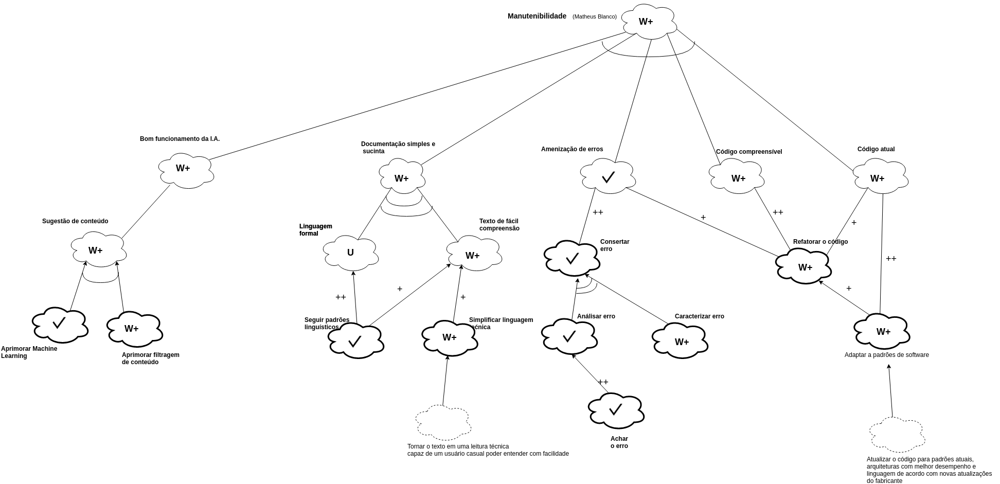

## Versionamento de edições
| Data           | autor                | Descrição                           |Versão|
|----------------|----------------------|-------------------------------------|------|
|   27/05/2019   | William Elias Alves  | Inserção de definição e objetivo | 0.1  |
|   27/05/2019   | William Elias Alves  | Adição da definição, objetivo e resultados | 0.2  |
|   27/05/2019   | William Elias Alves  | Adição dos nfrs de controle de conteúdo | 0.3  |
|   28/05/2019   | Matheus Blanco  | Adição dos nfrs de manutenibilidade | 0.4  |
|   28/05/2019   | Pedro Rodrigues  | Adição dos nfrs de usabilidade | 0.5  |
|   29/05/2019   | Pedro Rodrigues  | Adição modelo relacional, nfr de usabilidade | 0.6  |
|   29/05/2019   | Aline Laureano  | Adição dos nfrs de performance | 0.7  |
|   29/05/2019   | Luis Claudio T. Lima  | Adição dos nfrs de confiabilidade | 0.8  |
|   29/05/2019   | Gabriel Filipe  | Adição dos nfrs de iteroperabilidade | 0.9  |

## Definição

O framework NFR é um meio de modelagem de requisitos que abrange especificadamente os requisitos não funcionais de um software. Por meio da utilização de conceitos como softgoals, operations e afins.
No presente documento serão expostos o modelo de relação por meio do NFR e o modelo de análise.

## Objetivo

A modelagem aqui feita é de suma importância para a compreensão do funcionamento dos requisitos não funcionais da aplicação MEDIUM e sua influência em meio ao concebimento do software e possíveis justificativas para algumas adoções de escolhas.

## Resultados

Foram modelados NFRs de análise e relação com os seguintes enfoques:

* Controle de conteúdo;
* Segurança;
* Performance;
* Escalabilidade;
* Usabilidade;
* Manutenibilidade;
* Confiabilidade;
* Interoperabilidade.

***
### Tabela de descrição dos NRFs

Para conseguirmos organizar as categorias de requisitos não funcionais factíveis e relacionáveis ao software MEDIUM fora criada uma tabela relacionando categorias de requisitos, metas e observações referentes as metas.

(Espaço para a tabela)

**A seguir podemos visualizar os nfrs construídos de acordo com as categorias.**

***

### Requisitos não funcionais :

#### Manutenibilidade

**Responsável**: Matheus Salles Blanco

**Modelo Analítico(V1.0)**

**Modelo Relacional(V1.0)**

**Modelo Analítico(V2.0)**

**Modelo Relacional(V2.0)**

**Modelo Analítico(V3.0)**

**Modelo Relacional(V3.0)**

#### Controle de Qualidade

**Responsável**: William Elias Alves

**Modelo Relacional(V1.0)**

**Modelo Analítico(V1.0)**

#### Usabilidade

**Responsável**: Pedro Rodrigues Pereira

**Modelo Analítico(V1.0)**

**Modelo Relacional(V1.0)**

#### Performance

**Responsável**: Aline Laureano de A. Vilela

**Modelo Relacional(V1.0)**

**Modelo Relacional(V2.0)**

**Modelo Analítico(V1.0)**

#### Confiabilidade

**Responsável**: Luis Claudio Telles Lima

**Modelo Relacional(V1.0)**

**Modelo Analítico(V1.0)**

#### Iteroperabilidade

**Responsável**: Gabriel Filipe Manso Araujo

**Modelo Analítico(V1.0)**

**Modelo Analítico(V2.0)**

**Modelo Relacional(V1.0)**

#### Segurança

**Responsável**: Guilherme Marques

**Modelo Analítico(V1.0)**

**Modelo Relacional(V2.0)**

