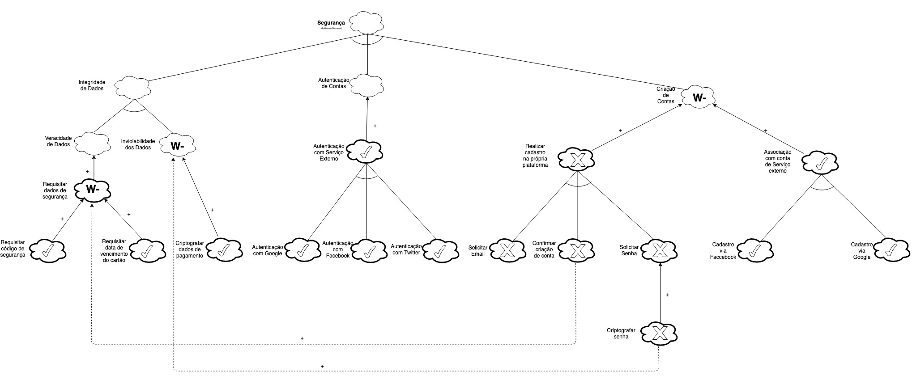

## Versionamento de edições
| Data           | autor                | Descrição                           |Versão|
|----------------|----------------------|-------------------------------------|------|
|   27/05/2019   | William Elias Alves  | Inserção de definição e objetivo | 0.1  |
|   27/05/2019   | William Elias Alves  | Adição da definição, objetivo e resultados | 0.2  |
|   27/05/2019   | William Elias Alves  | Adição dos nfrs de controle de conteúdo | 0.3  |
|   28/05/2019   | Matheus Blanco  | Adição dos nfrs de manutenibilidade | 0.4  |
|   28/05/2019   | Pedro Rodrigues  | Adição dos nfrs de usabilidade | 0.5  |
|   29/05/2019   | Pedro Rodrigues  | Adição modelo relacional, nfr de usabilidade | 0.6  |
|   29/05/2019   | Aline Laureano  | Adição dos nfrs de performance | 0.7  |
|   29/05/2019   | Luis Claudio T. Lima  | Adição dos nfrs de confiabilidade | 0.8  |
|   29/05/2019   | Gabriel Filipe  | Adição dos nfrs de iteroperabilidade | 0.9  |
|   21/06/2019   | Pedro Rodrigues Pereira | Adição da metodologia | 1.0 |
|   21/06/2019   | Pedro R. e Guilherme M. | Adição de modelos de nfr refatorados | 1.1 |
|   21/06/2019   | Pedro R. e Guilherme M. | Adição de modelos de nfr refatorados | 1.2 |

## Definição

O framework NFR é um meio de modelagem de requisitos que abrange especificadamente os requisitos não funcionais de um software. Por meio da utilização de conceitos como softgoals, operations e afins.
No presente documento serão expostos o modelo de relação por meio do NFR e o modelo de análise.

## Objetivo

A modelagem aqui feita é de suma importância para a compreensão do funcionamento dos requisitos não funcionais da aplicação MEDIUM e sua influência em meio ao concebimento do software e possíveis justificativas para algumas adoções de escolhas.

### Metodologia

Para conseguirmos organizar as categorias de requisitos não funcionais factíveis e relacionáveis ao software MEDIUM fora criada uma tabela relacionando categorias de requisitos, metas e observações referentes as metas.

Após a divisão dos modelos de nfr que seriam feitos, foi estabelecido um tema pra cada membro e o membro realizou o preenchimento da tabela indicando possíveis tópicos de interesse que seriam abordados no modelo em questão.

A seguir o registro da tabela usada:

<table>
          <!--Created with XmlGrid Free Online XML Editor (http://xmlgrid.net)-->
       <tr>
              <td></td>
              <td></td>
              <td>Responsável</td>
              <td>Categorias</td>
              <td>Metas</td>
              <td>Observações</td>
          </tr>
       <tr>
              <td></td>
              <td></td>
              <td>Guilherme</td>
              <td>Segurança</td>
              <td>Bloqueio de  usuário</td>
              <td></td>
          </tr>
       <tr>
              <td></td>
              <td></td>
              <td></td>
              <td></td>
              <td>Verificação de fraudes</td>
              <td></td>
          </tr>
       <tr>
              <td></td>
              <td></td>
              <td></td>
              <td></td>
              <td>Programa de busca de bugs</td>
              <td></td>
          </tr>
       <tr>
              <td></td>
              <td></td>
              <td></td>
              <td></td>
              <td>Restrição de idade</td>
              <td></td>
          </tr>
       <tr>
              <td></td>
              <td></td>
              <td></td>
              <td></td>
              <td>Autenticação de contas</td>
              <td></td>
          </tr>
       <tr>
              <td></td>
              <td></td>
              <td></td>
              <td></td>
              <td>Segurança para api de posts</td>
              <td>- Controle de chamadas a API Medium de posts feitos</td>
          </tr>
       <tr>
              <td></td>
              <td></td>
              <td></td>
              <td></td>
              <td>Privacidade</td>
              <td></td>
          </tr>
       <tr>
              <td></td>
              <td></td>
              <td>William</td>
              <td>Controle de conteúdo</td>
              <td>Denúncia de post</td>
              <td>- Análise do conteúdo do post
  - Reportar usuário 
  - Política de postagens
  - Verificar conteúdo da postagem</td>
          </tr>
       <tr>
              <td></td>
              <td></td>
              <td></td>
              <td></td>
              <td>Denúncia de usuário</td>
              <td>- Análise das atividades do usuário
   - Política de usuários
   - Verificar atividades do usuário
- Reportar usuário</td>
          </tr>
       <tr>
              <td></td>
              <td></td>
              <td></td>
              <td></td>
              <td>Desabilitação de comentários de post</td>
              <td></td>
          </tr>
       <tr>
              <td></td>
              <td></td>
              <td></td>
              <td></td>
              <td>Restrição a leitura de post monetizado</td>
              <td></td>
          </tr>
       <tr>
              <td></td>
              <td></td>
              <td></td>
              <td></td>
              <td>Sugestão de conteúdo</td>
              <td>- Sugestão de conteúdos populares
  - implementar algoritmo de filtragem
- Sugestão de conteúdos com base na leitura  
  - implementar estrutura de Machine Learn</td>
          </tr>
       <tr>
              <td></td>
              <td></td>
              <td>Aline</td>
              <td>Performance</td>
              <td>Utilizar poucos recursos do computador do usuário</td>
              <td>- Utilizar servidores para a hospedagem da aplicação</td>
          </tr>
       <tr>
              <td></td>
              <td></td>
              <td></td>
              <td></td>
              <td>Garantir uma performance eficiente da aplicação</td>
              <td>- Utilizar testes de performance</td>
          </tr>
       <tr>
              <td></td>
              <td></td>
              <td></td>
              <td></td>
              <td>Transmitir de forma eficiente as informações para o usuário</td>
              <td>- Responder rápido às ações do usuário: retornar dados do banco de dados sem recarregar a página;</td>
          </tr>
       <tr>
              <td></td>
              <td></td>
              <td></td>
              <td></td>
              <td></td>
              <td>- Resposta do sistema compreensível ao usuário:</td>
          </tr>
       <tr>
              <td></td>
              <td></td>
              <td></td>
              <td></td>
              <td></td>
              <td>-- Mostrar alterações de estado feitas pelo usuário:</td>
          </tr>
       <tr>
              <td></td>
              <td></td>
              <td></td>
              <td></td>
              <td></td>
              <td>---Mensagens para mostrar falhas/erros do sistema;</td>
          </tr>
       <tr>
              <td></td>
              <td></td>
              <td></td>
              <td></td>
              <td></td>
              <td>--- Mostrar as alterações das ações efetivadas;</td>
          </tr>
       <tr>
              <td></td>
              <td></td>
              <td></td>
              <td></td>
              <td></td>
              <td>-- Uso de linguagem natural;</td>
          </tr>
       <tr>
              <td></td>
              <td></td>
              <td>Pedro</td>
              <td>Usabilidade</td>
              <td>Identidade visual</td>
              <td>- Ser agradavel ao usuário</td>
          </tr>
       <tr>
              <td></td>
              <td></td>
              <td></td>
              <td></td>
              <td>Portabilidade</td>
              <td>- Suporte a plataforma mobile     
- Suporte aos navegadores Google Chrome, Mozila firefox e Edge</td>
          </tr>
       <tr>
              <td></td>
              <td></td>
              <td></td>
              <td></td>
              <td>Clareza nas informações</td>
              <td>- Usar Linguagem natural
 - Aplicar Design
 - Implementar paleta de cores</td>
          </tr>
       <tr>
              <td></td>
              <td></td>
              <td></td>
              <td></td>
              <td>Tempo de leitura de um artigo</td>
              <td>- obter tempo de leitura
- implementar algorítmo
- implementar machine learning</td>
          </tr>
       <tr>
              <td></td>
              <td></td>
              <td>Blanco</td>
              <td>Manutenibilidade</td>
              <td>Bom funcionamento da I.A.</td>
              <td></td>
          </tr>
       <tr>
              <td></td>
              <td></td>
              <td></td>
              <td></td>
              <td>Documentação simples e sucinta</td>
              <td></td>
          </tr>
       <tr>
              <td></td>
              <td></td>
              <td></td>
              <td></td>
              <td>Amenização de erros</td>
              <td></td>
          </tr>
       <tr>
              <td></td>
              <td></td>
              <td></td>
              <td></td>
              <td>Código de fácil compreensão</td>
              <td></td>
          </tr>
       <tr>
              <td></td>
              <td></td>
              <td></td>
              <td></td>
              <td>Código atual</td>
              <td></td>
          </tr>
       <tr>
              <td></td>
              <td></td>
              <td>LuisC</td>
              <td>Confiabilidade</td>
              <td>Alta disponibilidade</td>
              <td></td>
          </tr>
       <tr>
              <td></td>
              <td></td>
              <td>Gabriel</td>
              <td>Interoperabilidade</td>
              <td>Portabilidade</td>
              <td>- Disponibilidade Mobile (iOS, Android) e Web</td>
          </tr>
       <tr>
              <td></td>
              <td></td>
              <td></td>
              <td></td>
              <td>Flexibilização</td>
              <td>- Plataforma Web:  Google Chrome, Mozila Firefox, Edge e Safari</td>
          </tr>
       <tr>
              <td></td>
              <td></td>
              <td></td>
              <td></td>
              <td>Customização</td>
              <td></td>
          </tr>
       <tr>
              <td></td>
              <td></td>
              <td></td>
              <td></td>
              <td>Integridade</td>
              <td>Provinda de segurança</td>
          </tr>
   </table>

## Resultados

Foram modelados NFRs de análise e relação com os seguintes enfoques:

* Controle de conteúdo;
* Segurança;
* Performance;
* Escalabilidade;
* Usabilidade;
* Manutenibilidade;
* Confiabilidade;
* Interoperabilidade.

***

**A seguir podemos visualizar os nfrs construídos de acordo com as categorias.**

***

### Requisitos não funcionais :

#### Manutenibilidade

**Responsável**: Matheus Salles Blanco

**Modelo Analítico(V1.0)**

**Modelo Analítico(V2.0)**

**Modelo Analítico(V3.0)**

**Modelo Analítico(V4.0) - Pós Refatoração(Autores: Pedro Rodrigues e Guilherme Marques)**

**Modelo Relacional(V1.0)**

**Modelo Relacional(V2.0)**

**Modelo Relacional(V3.0)**

**Modelo Relacional(V4.0) - Pós Refatoração(Autores: Pedro Rodrigues e Guilherme Marques)** 

#### Controle de Qualidade

**Responsável**: William Elias Alves

**Modelo Relacional(V1.0)**

**Modelo Relacional(V2.0)**

**Modelo Analítico(V1.0)**

#### Usabilidade

**Responsável**: Pedro Rodrigues Pereira

**Modelo Analítico(V1.0)**

**Modelo Relacional(V1.0)**

#### Performance

**Responsável**: Aline Laureano de A. Vilela

**Modelo Relacional(V1.0)**

**Modelo Relacional(V2.0)**

**Modelo Relacional(V3.0) - Pós Refatoração (Autores: Pedro Rodrigues e Guilherme Marques)**

**Modelo Analítico(V1.0)**

**Modelo Analítico(V2.0) - Pós Refatoração (Autores: Pedro Rodrigues e Guilherme Marques)**

#### Confiabilidade

**Responsável**: Luis Claudio Telles Lima

**Modelo Relacional(V1.0)**

**Modelo Analítico(V1.0)**

#### Iteroperabilidade

**Responsável**: Gabriel Filipe Manso Araujo

**Modelo Analítico(V1.0)**

**Modelo Analítico(V2.0)**

**Modelo Relacional(V1.0)**

#### Segurança

**Responsável**: Guilherme Marques

**Modelo Analítico(V1.0)**

**Modelo Analítico(V2.0) - Pós Refatoração(Autores: Pedro Rodrigues e Guilherme Marques)** 

**Modelo Relacional(V1.0)**

**Modelo Relacional(V2.0) - Pós Refatoração(Autores: Pedro Rodrigues e Guilherme Marques)** 
