## Versionamento de edições
| Data           | autor                | Descrição                           |Versão|
|----------------|----------------------|-------------------------------------|------|
|   28/04/2019   | William Elias Alves  | Criação da página | 0.1  |
|   28/04/2019   | William Elias Alves  | Inserção dos casos de uso cadastro, login, membership| 0.2  |
|   28/04/2019   | William Elias Alves  | Inserção dos casos de uso cadastro, login, membership versão 2.0| 0.3  |
|28/04/2019| William Elias Alves  | Inserção dos casos de uso de stories| 0.4  |
|29/04/2019| Matheus Salles Blanco  | Inserção dos casos de uso de series e edição de perfil e bookmark| 0.4  |

#Definição

Com o auxílio do desenvolvimento de cenários, ficou possível obter uma visão mais clara a respeito da concepção de casos de uso. Os casos de uso facilitam na obtenção de uma visão geral a respeito de dada funcionalidade de uma aplicação e poderá ser usada beneficamente por desenvolvedores, pois ela contém aspectos relevantes referentes a relacionamentos entre entidades.

***
#Casos de Uso
***
#### 
**<a id="areacomum">Área comum V.1</a>**(william elias alves)

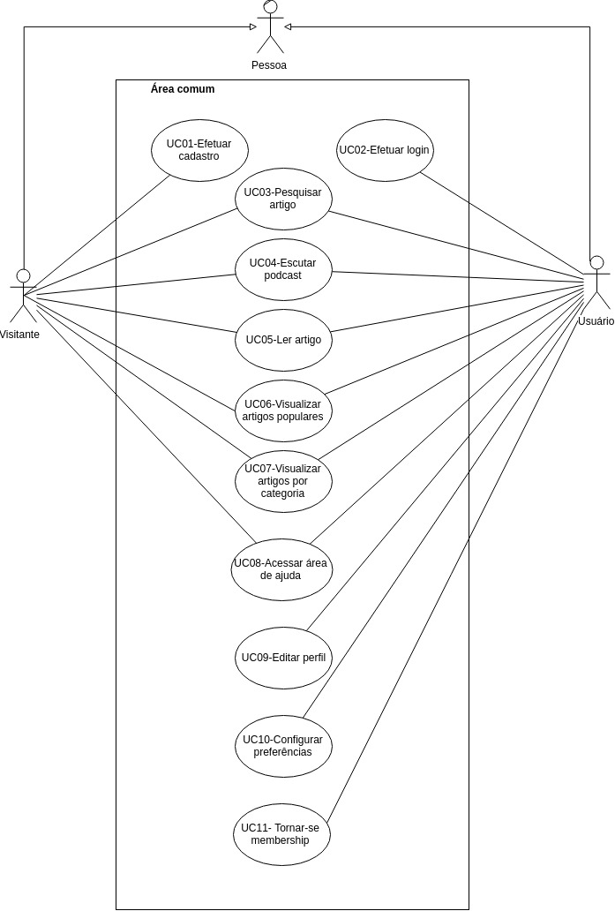

| Rastro | Origem |
| ------- | ------- |
|Rastro| Brainstorming 2 |
|Rastro| Introspecção 1 |

***

***
#### Acesso ao Medium Membership
**Membership - V1.0** (william elias alves)

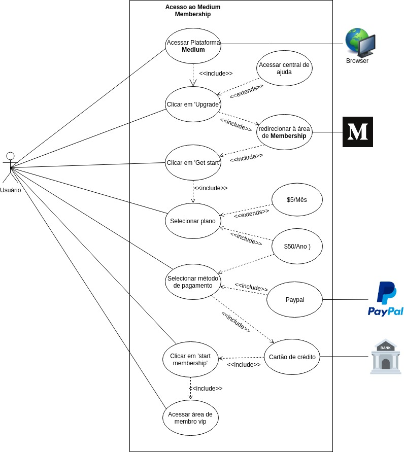

**Membership - V2.0** (william elias alves)

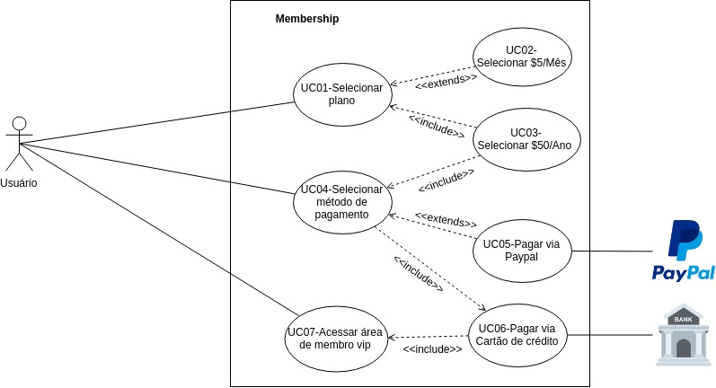

| Rastro | Origem |
| ------- | ------- |
|Rastro | Cenário Premium |

***

#### Login
**Login - V1.0** (william elias alves)

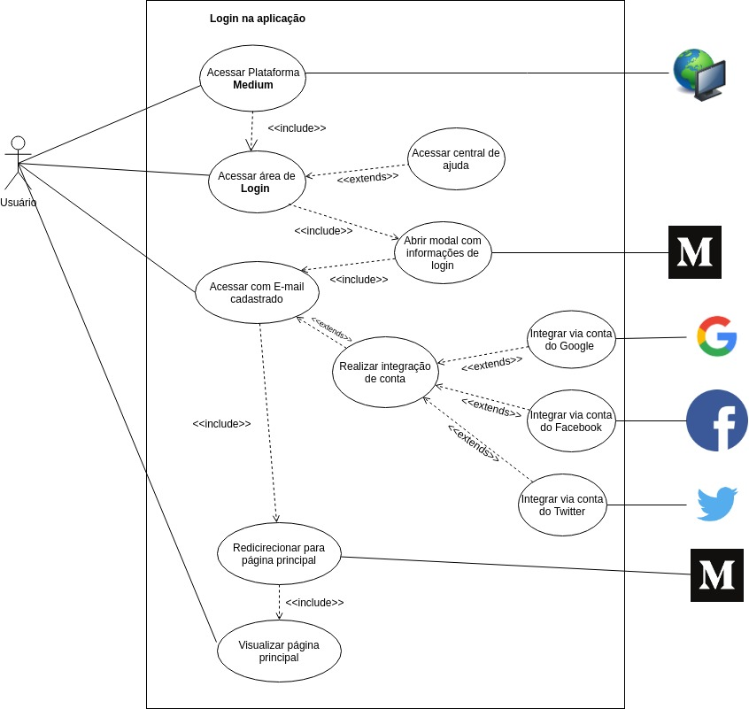

**Login - V2.0** (william elias alves)

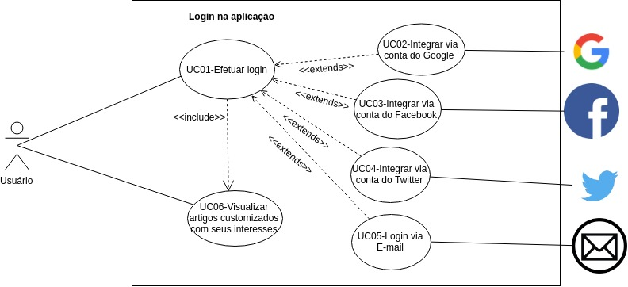

| Rastro | Origem |
| ------- | ------- |
|Rastro | Brainstorming 1 |
|Rastro | Introspecção Login |
|Rastro | Storyboard Login |

***

#### Cadastro de usuário 
**Cadastro de usuário - V1.0**(william elias alves)

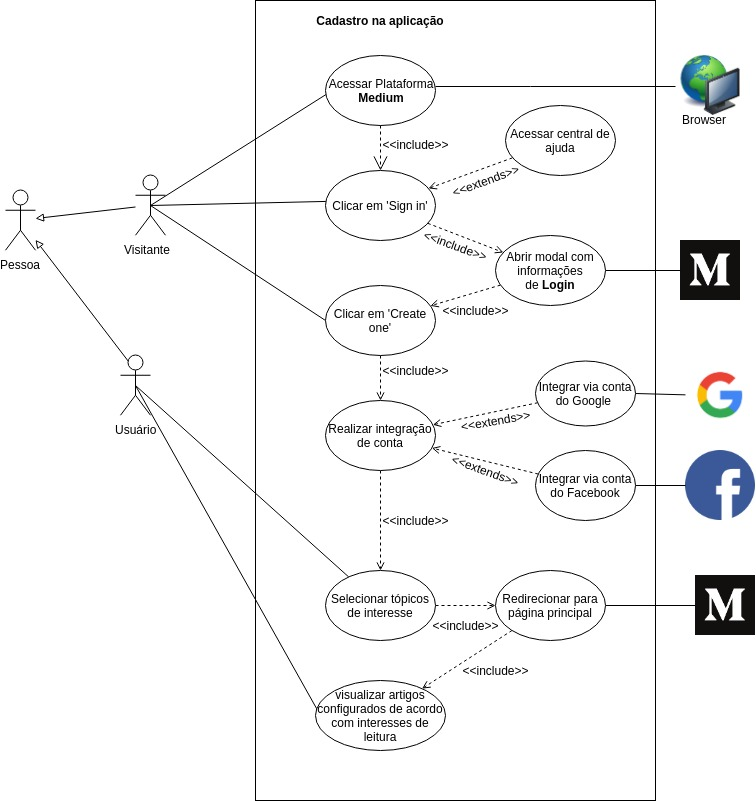

**Cadastro de usuário - V2.0**(william elias alves)

| Rastro | Origem |
| ------- | ------- |
|Rastro | Brainstorming 1 |
|Rastro | Introspecção Cadastro |
|Rastro | Storyboard Cadastro |

***

#### UC stories
**UC Stories - V1.0**
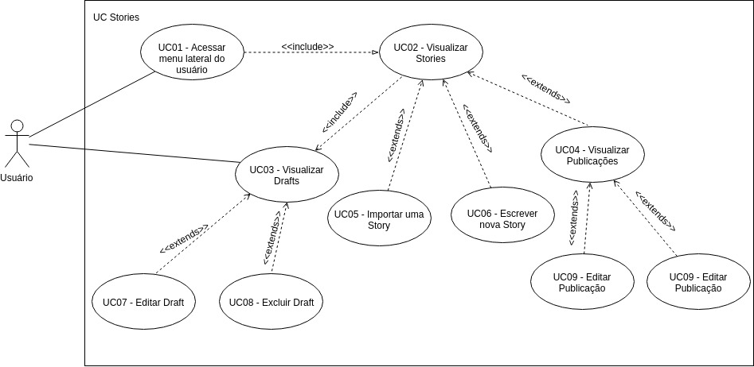

| Rastro | Origem |
| ------- | ------- |
|Rastro | Brainstorming 1 |
|Rastro | Introspecção Stories |

#### UC Series
**UC Series - V1.0**

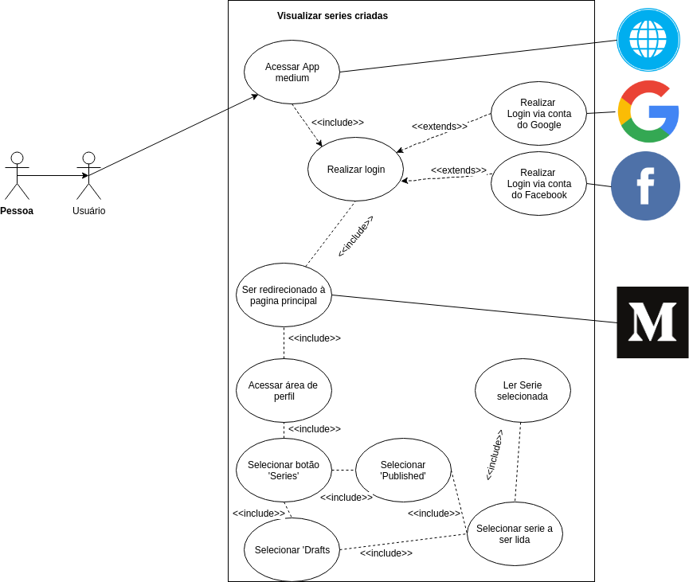

**UC Series - V2.0**

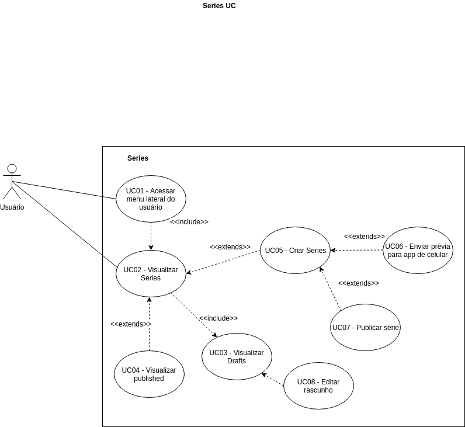

| Rastro | Origem |
| ------- | ------- |
| Rastro | Brainstorming 1 |
| Rastro | Introspecção Series |

#### UC Bookmark
**UC Bookmark - V1.0**

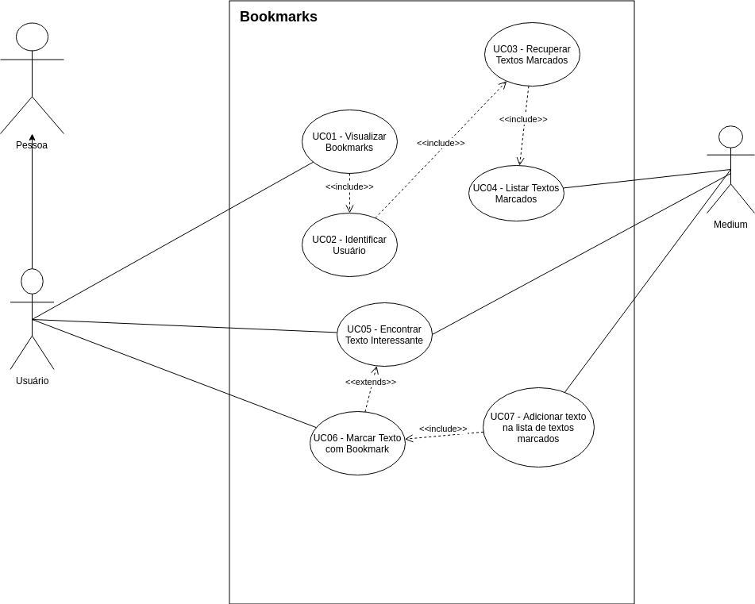

| Rastro | Origem |
| ------- | ------- |
|Rastro| Storyboard |
|Rastro| Introspecção Bookmark |

#### UC Configurar perfil
**UC Configurar perfil - V1.0**

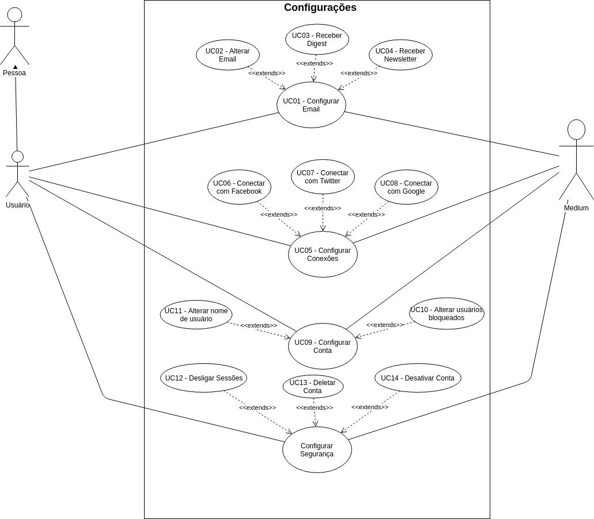

| Rastro | Origem |
| ------- | ------- |
|Rastro| Brainstorming 2 |