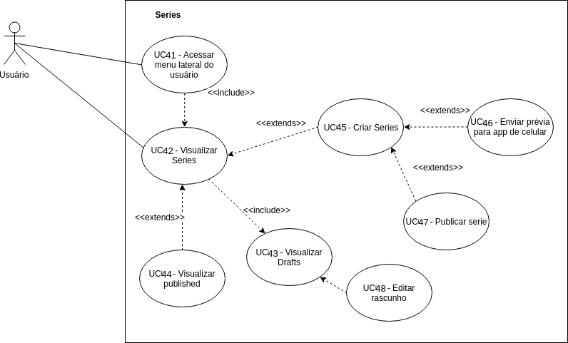

## Versionamento de edições
| Data           | autor                | Descrição                           |Versão|
|----------------|----------------------|-------------------------------------|------|
|   28/04/2019   | William Elias Alves  | Criação da página | 0.1  |
|   28/04/2019   | William Elias Alves  | Inserção dos casos de uso cadastro, login, membership| 0.2  |
|   28/04/2019   | William Elias Alves  | Inserção dos casos de uso cadastro, login, membership versão 2.0| 0.3  |
|28/04/2019| William Elias Alves  | Inserção dos casos de uso de stories| 0.4  |
|29/04/2019| Matheus Salles Blanco  | Inserção dos casos de uso de series e edição de perfil e bookmark| 0.4  |
|22/06/2019| Aline Laureano de A. Vilela  | Refatorando numeração dos UC's | 0.5 |
|24/06/2019| Aline Laureano de A. Vilela  | Inserção dos responsáveis pela criação de cada UC e adição dos link para o rastro dos UC's | 0.6 |

### Definição

Com o auxílio do desenvolvimento de cenários, ficou possível obter uma visão mais clara a respeito da concepção de casos de uso. Os casos de uso facilitam na obtenção de uma visão geral a respeito de dada funcionalidade de uma aplicação e poderá ser usada beneficamente por desenvolvedores, pois ela contém aspectos relevantes referentes a relacionamentos entre entidades.

***
#### Casos de Uso
***
**<a id="areacomum">Área comum V.1</a>**(William Elias Alves)

| Rastro | Origem |
| ------- | ------- |
|Rastro| <a href="../../elicitacao/brainstormings/#txtBrain2">Brainstorming 2</a> |
|Rastro| <a href="../../elicitacao/introspeccao/#intro1v2">Introspecção 1 - V2.0</a> |

***

***
#### Acesso ao Medium Membership
**Membership - V1.0** (William Elias Alves)

**Membership - V2.0** (William Elias Alves)

**Membership - V3.0** (William Elias Alves; Aline Laureano)

| Rastro | Origem |
| ------- | ------- |
|Rastro | <a href="../cenarios/#cenarioPremium">Cenário Premium</a> |

***

#### Login
**Login - V1.0** (William Elias Alves)

**Login - V2.0** (William Elias Alves)

**Login - V3.0** (William Elias Alves; Aline Laureano)

| Rastro | Origem |
| ------- | ------- |
|Rastro | <a href="../../elicitacao/brainstormings/#txtBrain1">Brainstorming 1</a> |
|Rastro | <a href="../../elicitacao/introspeccao/#introspec2">Introspecção Login</a> |
|Rastro | <a href="../../elicitacao/storyboards/#storybLogin">Storyboard Login</a> |

***

#### Cadastro de usuário
**Cadastro de usuário - V1.0**(William Elias Alves)

**Cadastro de usuário - V2.0**(William Elias Alves)

**Cadastro de usuário - V3.0**(William Elias Alves; Aline Laureano)

| Rastro | Origem |
| ------- | ------- |
|Rastro | <a href="../../elicitacao/brainstormings/#txtBrain1">Brainstorming 1</a> |
|Rastro | <a href="../../elicitacao/introspeccao/#introspec2">Introspecção Cadastro</a> |
|Rastro | <a href="../../elicitacao/storyboards/#storybLogin">Storyboard Cadastro</a> |

***

#### UC stories
**UC Stories - V1.0** (Aline Laureano)

**UC Stories - V2.0** (Aline Laureano)

| Rastro | Origem |
| ------- | ------- |
|Rastro | <a href="../../elicitacao/brainstormings/#txtBrain1">Brainstorming 1</a> |
|Rastro | <a href="../../elicitacao/introspeccao/#introspec3">Introspecção Stories</a> |

#### UC Series
**UC Series - V1.0** (Matheus Blanco)

**UC Series - V2.0** (Matheus Blanco)

**UC Series - V3.0** (Matheus Blanco; Aline Laureano)

| Rastro | Origem |
| ------- | ------- |
| Rastro | <a href="../../elicitacao/brainstormings/#txtBrain1">Brainstorming 1</a> |
| Rastro | <a href="../../elicitacao/introspeccao/">Introspecção Series</a> |

#### UC Bookmark
**UC Bookmark - V1.0** (Guilherme Marques)

**UC Bookmark - V2.0** (Guilherme Marques; Aline Laureano)

| Rastro | Origem |
| ------- | ------- |
|Rastro| <a href="../../elicitacao/storyboards/">Storyboard</a> |
|Rastro| <a href"../../elicitacao/introspeccao/#introspec4v2">Introspecção Bookmark</a> |

#### UC Configurar perfil
**UC Configurar perfil - V1.0** (Guilherme Marques; William Elias Alves)

**UC Configurar perfil - V2.0** (Guilherme Marques; William Elias Alves; Aline Laureano)

| Rastro | Origem |
| ------- | ------- |
|Rastro| <a href="../../elicitacao/brainstormings/#txtBrain2">Brainstorming 2</a> |
