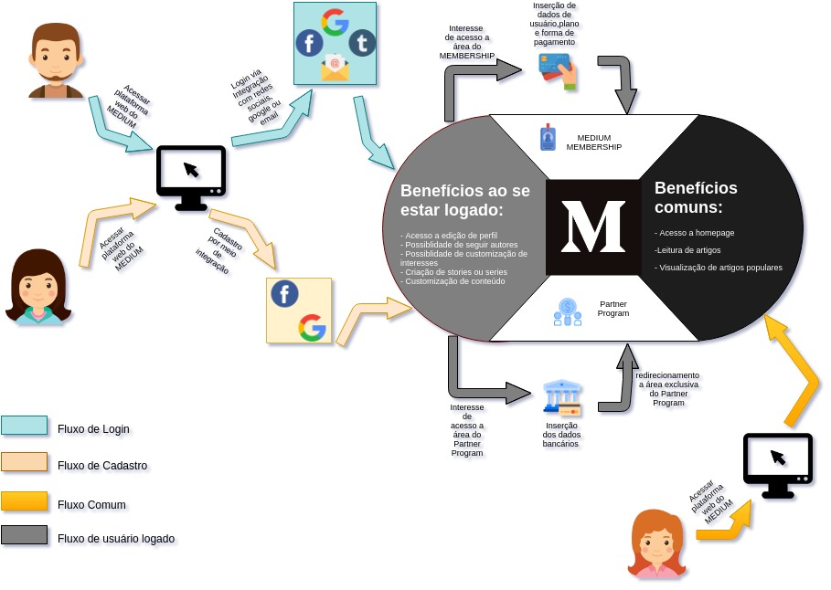

## Versionamento de edições
| Data           | autor                | Descrição                               |Versão|
|----------------|----------------------|-----------------------------------------|------|
| 30/03/2019     | Matheus Blanco e Pedro Rodrigues | Adição de texto base e richpictures v.1| 1.0  |
| 03/04/2019     | William Elias Alves  | Inserção do texto no mkdocs             |  1.1 |  
| 08/04/2019     | William Elias Alves  | Inserção da tabela de versionamento     |  1.2 | 
| 08/04/2019     | Gabriel Filie Manso Araujo  | Inserção de Richpicture          |  1.3 |  
| 24/06/2019     | William Elias Alves  | Inserção da metologia e richpicture premium     |  2.0 | 

### Definição
O Rich Picture é um modelo informal e fácil de se entender, podendo até ser contruído juntamente com o cliente. 
Auxilia na identificação de processos, atores envolvidos, e o relacionamento dos processos e atores. 

### Metodologia

Para o concebimento dos richpictures presentes foi necessário realizar um observação da plataforma Medium e dividir as tarefas individualmente entre os membros.
Em um primeiro momente foi dividido em richpictures com foco no leitor e richpictures com foco no escritor. Dentro dessa divisão ficou a critério dos membros escolherem uma área existente da aplicação. 

### Resultados

Foram confeccionados os seguintes richpictures:

* Ponto de vista do Leitor
    - [Modelo 1](#m1)
    - [Modelo 2](#m2)
* Ponto de vista do escritor
    - [Modelo 3](#m3)
    - [Modelo 4](#m4)
    - [Modelo 5](#m5)

* Programas Premium
    - [Modelo 6](#m6)

***

### Richpictures - Ponto de vista do Leitor

Para essa divisão surgiram dois richpictures que englobam os seguintes temas:

* Compartilhar artigos em redes sociais (Modelo 1)
* Leitura de artigos (Modelo 2)
***
#### Compartilhar artigos em redes sociais (Modelo 1)

\# **Modelo 1** (Versão 1 ) 

**Responsável**: Guilherme

***
\# **Modelo 1** (Versão 2)

**Responsável**: Guilherme

***
\# **Modelo 1** (Versão 3)

**Responsável**: Guilherme

***
\# **Modelo 1** (Versão final)

**Responsável**: Guilherme e Gabriel

***
#### Leitura de artigos (Modelo 2) 

\# **Modelo 2** (Versão 1)

**Responsável**: Gabriel

***

\# **Modelo 2** (Versão 2)

**Responsável**: Gabriel

***

\# **Modelo 2** (Versão final)

**Responsável**: Gabriel

***

### Richpictures - Ponto de vista do Escritor

Para essa divisão surgiram dois richpictures que englobam os seguintes temas:

* Ações possíveis a um escritor (Modelo 3)
* Importar story (Modelo 4)
* Criar nova Story (Modelo 5)

***

#### Ações possíveis a um escritor (Modelo 3) 

\# **Modelo 3** (Versão 1)

**Responsável:** Matheus Blanco

_MatheusSallesBlanco.jpg)

***

\# **Modelo 3** (Versão 2)

**Responsável:** Matheus Blanco
_MatheusSallesBlanco.jpg)

***

\# **Modelo 3** (Versão 3)

**Responsável:** Matheus Blanco

_MatheusSallesBlanco.jpg)

***

\# **Modelo 3** (Versão final)

**Responsável:** Matheus Blanco

***

#### Importar story (Modelo 4) 

\# **Modelo 4** (Versão 1)

**Responsável:** Pedro rodrigues

_Import-story_PedroRodrigues.jpg)

***
\# **Modelo 4** (Versão 1)

**Responsável:** Pedro rodrigues

_Import-story_PedroRodrigues.jpg)

***

\# **Modelo 4** (Versão 1)

**Responsável:** Pedro rodrigues

.jpg)

***

### Criar nova Story (Modelo 5) 

\# **Modelo 5** (Versão 1)

**Responsável:** Pedro rodrigues

_New-Story_PedroRodrigues.jpg)

***

\# **Modelo 5** (Versão 2)

**Responsável:** Pedro rodrigues

_New-Story_PedroRodrigues.jpg)

***
\# **Modelo 5** (Versão final)

**Responsável:** Pedro rodrigues

.jpg)

***
#### Programas Premium 

\# **Modelo 6** (Versão final)

**Responsável:** William Elias

