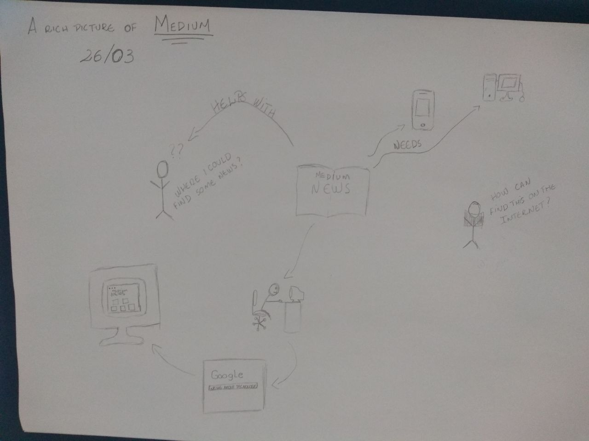

## Versionamento de edições
| Data           | autor                | Descrição                               |Versão|
|----------------|----------------------|-----------------------------------------|------|
| 30/03/2019     | Matheus Blanco e Pedro Rodrigues | Adição de texto base e richpictures v.1| 1.0  |
| 03/04/2019     | William Elias Alves  | Inserção do texto no mkdocs             |  1.1 |  
| 08/04/2019     | William Elias Alves  | Inserção da tabela de versionamento     |  1.2 | 
| 08/04/2019     | Gabriel Filie Manso Araujo  | Inserção de Richpicture          |  2.0 |  

# RichPictures

### Definição
O Rich Picture é um modelo informal e fácil de se entender, podendo até ser contruído juntamente com o cliente. 
Auxilia na identificação de processos, atores envolvidos, e o relacionamento dos processos e atores. 
## Modelos

Os modelos foram dividos em dois pontos de vista diferentes, o ponto de vista do autor e o ponto de vista do leitor.

### Ponto de vista do Leitor
***
**Modelo 1**
- Versão 1  

- Versão 2

- Versão 3

- Versão Final

**Modelo 2**

- Versão 1

- Versão 2

- Versão final

### Ponto de vista do Escritor

###Modelo 

- Versão 1  

_MatheusSallesBlanco.jpg)

- Versão 2  

_MatheusSallesBlanco.jpg)

- Versão 3

_MatheusSallesBlanco.jpg)

- Versão final

**Modelos 2**

- Versão 1
  
_Import-story_PedroRodrigues.jpg)

- Versão 2

_Import-story_PedroRodrigues.jpg)

- Versão Final

.jpg)

**Modelo 3**

- Versão 1

_New-Story_PedroRodrigues.jpg)

- Versão 2

_New-Story_PedroRodrigues.jpg)

- Versão Final

.jpg)

