|Data      |        Autor            |           Descrição           |Versão|
|----------|-------------------------|-------------------------------|------|
|24/06/2019| Guilherme Marques| Adição da página e questionário | 1.0  |
|24/06/2019| Guilherme Marques| Adição das imagens restantes | 1.1  |

### Descrição

A seguir está disponível a análise do questionário realizado e enviado no grupo da Universidade

Quantidade de respostas até o momento: 138  

***Responsáveis: Guilherme Marques e Gabriel Filipe***

### Dados Gerais do Usuários

- Média de Idade: 20 a 21 anos

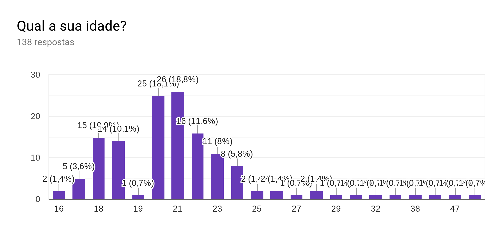

- Nível de Escolaridade: Superior Incompleto

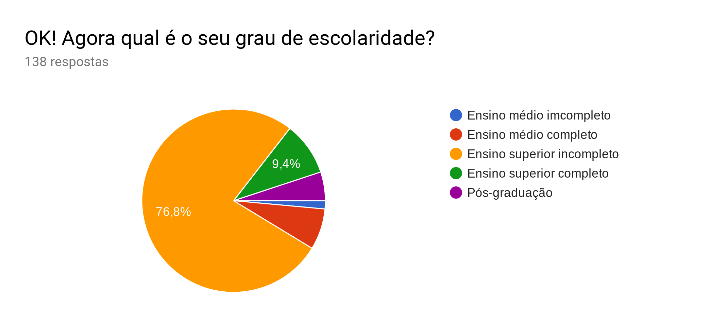

### Sobre a Experiência com a Aplicação

- Tipo de conteúdo mais buscado: Acadêmico

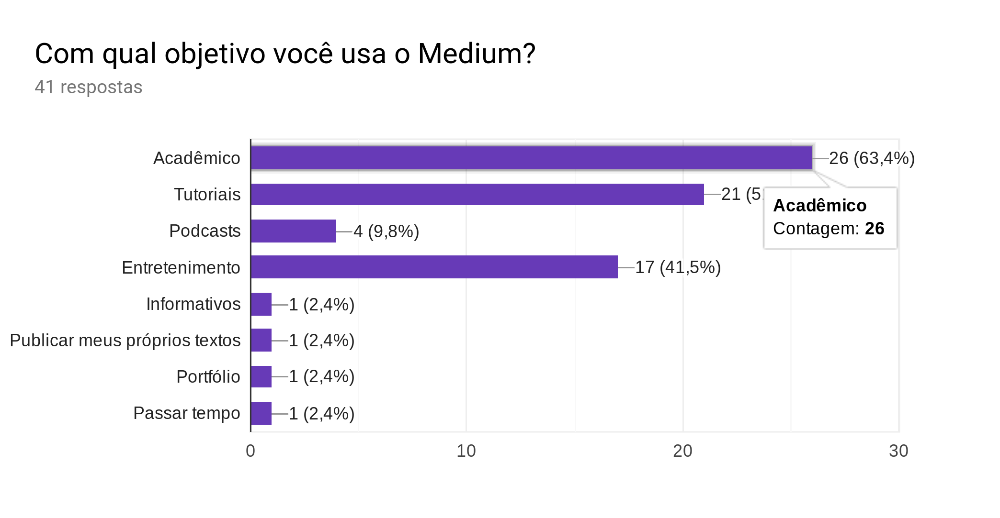

- Assuntos mais buscados: Tecnologia

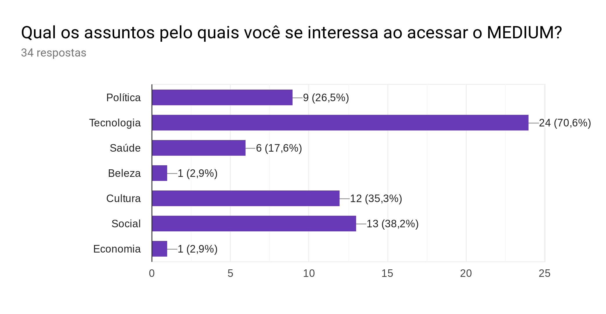

- Avaliação média dos usuários: "Bom"

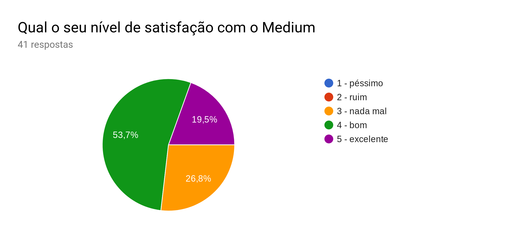

### Ponto de vista de um Leitor

- Classificação da interface: "Boa" a "Ótima"

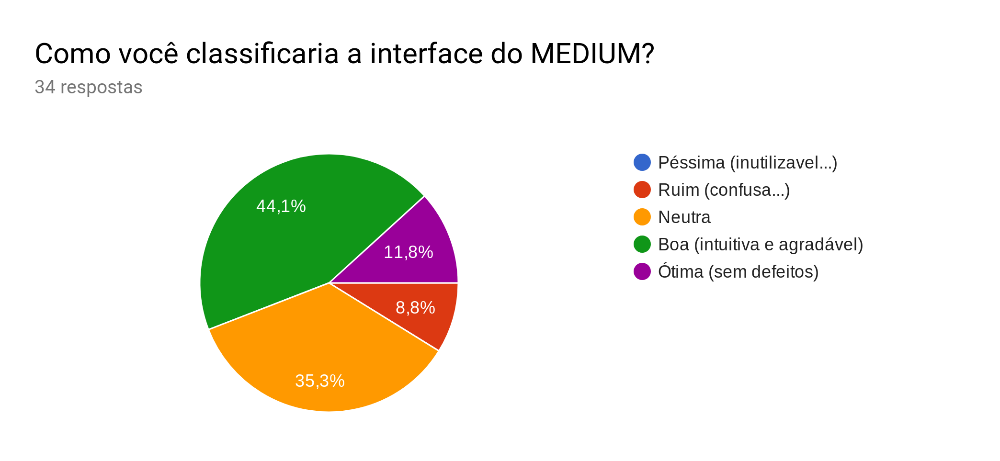

- Nível de Satisfação com conteúdo: "Neutra" a "Boa"

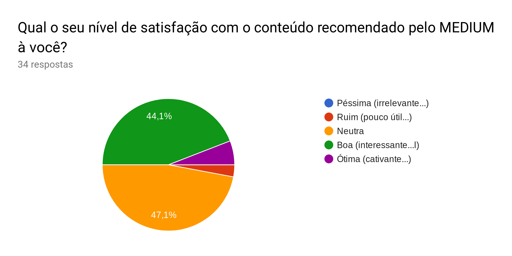

- Frequência de comentários: "Pouca"

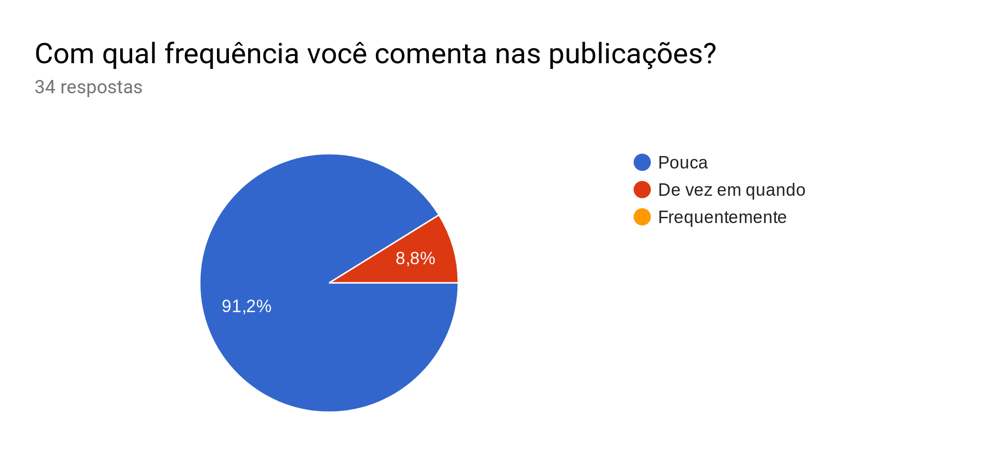

- Frequência de 'Aplausos': "Pouca"

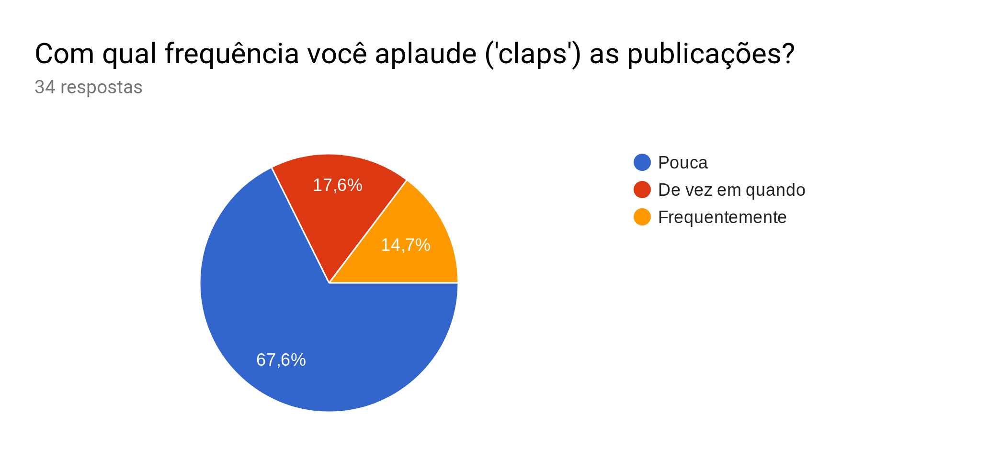

- Frequência de compartilhamento de publicações: "Pouca"

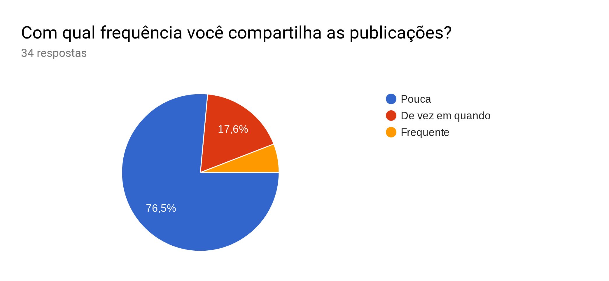

### Ponto de Vista do Autor

Ponto de Vista do Autor

- Assuntos geralmente abordados

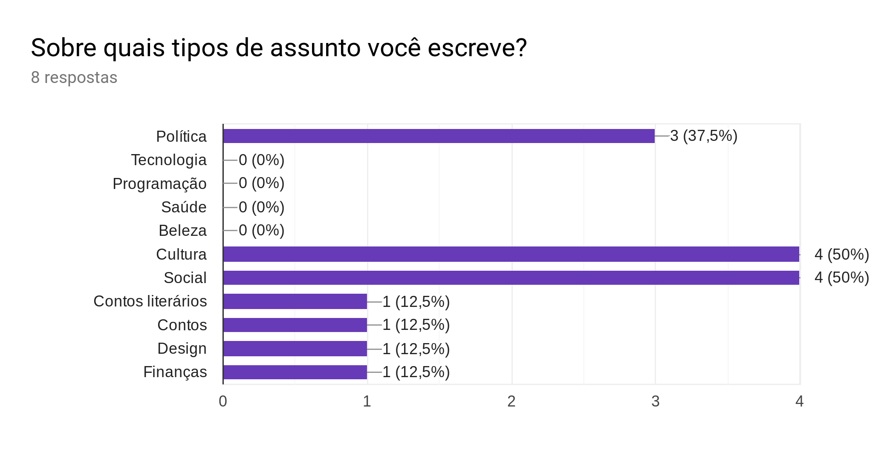

- Sobre o recurso de importar textos

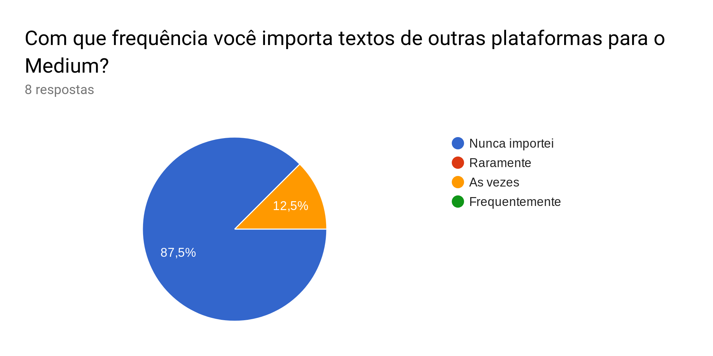

- O editor de textos agrada uma boa parte dos usuários

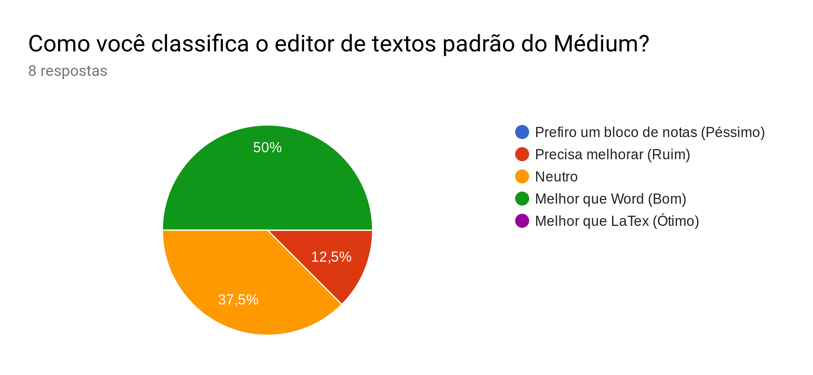

- O recurso de métricas acerca das publicações é pouco utilizado

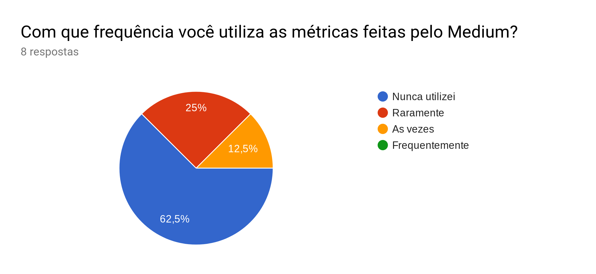

### Críticas, Sugestões e Elogios

Dos elogios feitos à plataforma por meio de pergunta dissertativa, se destacam:

-  “Fácil de encontrar bons artigos; leitura sem distrações; e estimativa de tempo de leitura”
-  “Gratuito e fácil para quem quer escrever mas não tem plataforma.”
-  “Interface limpa e normalmente sinto um padrão na forma de escrever, como pra deixar o assunto mais interessante. A questão da maioria dos textos ter uma estimativa de tempo pra ler o texto me agrada também. ”
-  “Compartilhamento de ideias e opiniões”

Das poucas críticas feitas se destacam:

-  “Depois de algumas publicações lidas, o Medium não deixa mais ler, ele começa a cobrar. As vezes eu uso até aba anônima pra abrir algum conteúdo, mas isso é um incomodo pra mim. Além disso, ainda não ficou evidente como posso contribuir com algum material no medium, poderia ser mais evidente. ”
- “Poucas opções de edição de textos, é necessário pagar para ter acesso aos conteúdos. “

E das sugestões:
-  “Continuar lendo de onde parei no PC, no celular”
- “Tradução dos textos”
- “Mais possibilidades de personalização de publicações, textos e perfil.”

Um fato interessante que foi notado durante a análise do formulário é que na área de sugestões uma parcela das respostas sugeria funcionalidades que já estão presentes na aplicação. Analisando isso podemos perceber que a aplicação não é muito efetiva em explicitar algumas de suas funcionalidade, e usuários que não interagem tão a fundo com a ferramenta acabam deixando passar desapercebido.

