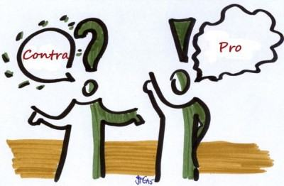

(https://www.coladaweb.com/wp-content/uploads/2015/12/20160111-argumentacao-e1452510813753.jpg)
***

## Definição
A argumentação é um processo no qual há a manipulação de pensamentos de forma organizada tendo como finalidade chegar a uma conclusão sobre dado assunto.

Dentro da disciplina de Engenharia de requisitos os principais modelos e frameworks para se construir uma Argumentação são:

* **Modelo de Toulmin**
* **Framework IBIS**
* **Framework de Dung**
* **Framework ACE**

O modelo adotado para a representação da argumentação da plataforma MEDIUM foi o ACE.

***

## Argumentações desenvolvidas

### Argumentação 1 - Aspectos gerais

**Proposições**

* **p1:** O MEDIUM apresenta uma interface intuitiva de um site de notícias com uma comunidade ativa
* **p2:** O usuário dificilmente se sentirá perdido em suas buscas
* **p3:** O escritor se sente motivado a publicar seus textos na plataforma
* **p4:** Mesmo com uma comunidade ativa, a plataforma não é tão conhecida por usuário comuns
* **p5:** Uma plataforma de publicação não é responsável exclusiva por motivar um escritor a publicar seus textos
* **p6:** Essa facilidade na busca por conteúdos é um ponto de vantagem na usabilidade geral da plataforma

***

**Rascunho:**

 

***
**Esquemático (Versão 1)**

.jpg)

***

**Esquemático (Versão 2)**:
.png)

***

### Argumentação 2 - Leitores
**Proposições**

* **p1:** As publicações do MEDIUM possuem um teor majoritariamente sério.
* **p2:** A plataforma é procurada por leitores de assuntos técnicos
* **p3:** O público-alvo de leitores é mais específico
* **p4:** A faixa etária dos leitores, em suma, é de jovens-adultos
* **p5:** O grau de escolaridade dos usuários/leitores é, em grande parte, de nível superior
* **p6:** A utilização do MEDIUM no Brasil ainda é pouco difundida, tendo menos adeptos do que em países desenvolvidos, pois a massa com grau de escolaridade superior é minoritária, por volta de 15% da população.(Dados:PNAD-IBGE 2017 - [biblioteca ibge](https://biblioteca.ibge.gov.br/visualizacao/livros/liv101576_informativo.pdf))

***

**Rascunho:**

 

***

**Esquemático (Versão 1)**:
.jpg)

***

**Esquemático (Versão 2)**:
.png)

***

### Argumentação 3 - Conteúdo
**Proposições**

* **p1:** A plataforma sugere artigos com base em suas leituras
* **p2:** Essas podem gerar uma bolha de conteúdo, para o usuário leitor
* **p3:** Essa bolha de conteúdo podem impedir o leitor de explorar outros e novos assuntos
* **p4:** Os criadores da plataforma tiveram uma preocupação em deixar o leitor em um ambiente confortável por meio de sugestões de conteúdo
* **p5:** Por conta do ambiente familiar, gera-se uma maior recorrência e fidelidade do leitor para com o site
***
**Rascunho**

 

***
**Esquemático (versão 1)**:

.jpg)
***
**Esquemático (versão 2)**:

.png)

